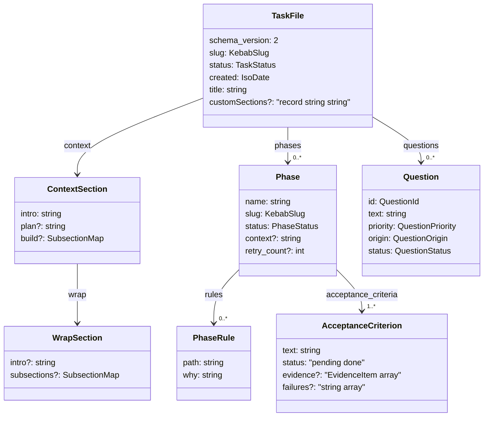

← [schema](_schema.md)

# Task-File-Schema

Vollständiger Nachschlage-Katalog des Zod-Schemas der Task-Datei (`.yml`, `schema_version: 2`): jeder Typ, jedes Feld mit Typ, jeder Enum-Wert, jede Optionalität und jede Refinement-Regel. Reine Referenz zum Nachschlagen.

## Geteilte Primitive

| Primitiv | Definition | Bedeutung |
|----------|------------|-----------|
| `KebabSlug` | `string`, `min(1)`, Regex `/^[a-z][a-z0-9-]*$/` | Kebab-Case: Kleinbuchstaben/Ziffern/Bindestriche, beginnt mit Buchstaben |
| `IsoDate` | `string`, Regex `/^\d{4}-\d{2}-\d{2}$/` | ISO-Datum `YYYY-MM-DD` |
| `EvidenceItem` | `string`, `min(1)`, `refine`: getrimmt `length > 0` und `!== '—'` | Nicht-leerer Evidenz-String; nicht nur Whitespace, nicht das Em-Dash-Sentinel `'—'` |
| `QuestionId` | `string`, Regex `/^q[0-9]+$/` | z. B. `q1`, `q2`, `q3` |
| `SubsectionMap` | `record(string, string)` | H4-Untersektionen: Name → Markdown-Inhalt |
| `SCHEMA_VERSION` | `2 as const` | Literal; gilt als Versions-Gate (Parser lehnt andere Werte ab) |

## Enums

| Enum | Werte | Bedeutung |
|------|-------|-----------|
| `TaskStatus` (6-State) | `plan`, `drafted`, `refined`, `build`, `wrap`, `done` | `plan`=Plan-Stage läuft · `drafted`=Plan fertig, Refinement-Gates ausstehend · `refined`=Gates bestanden, build-bereit · `build`=Implementierung läuft · `wrap`=alle Phasen terminal, Review/Summary · `done`=fertig |
| `PhaseStatus` (5-State) | `pending`, `in-progress`, `done`, `blocked`, `deferred` | Phasen-Lebenszyklus |
| `PhaseStatus` (AC) | `pending`, `done` | Status eines Acceptance-Criterion (`AcceptanceCriterion.status`) |
| `QuestionPriority` | `low`, `medium`, `high` | Priorität einer Frage |
| `QuestionStatus` | `open`, `resolved` | Frage-Lebenszyklus |
| `QuestionOrigin` | `plan-agent`, `plan-check`, `rules-check`, `task-validate`, `code-validate`, `stop-check`, `user` | Welche Rolle/Agent die Frage geschrieben hat |
| `QuestionSource` | `user`, `ai` | Wer die Frage aufgelöst hat; `ai` erfordert `reasoning` |

## `TaskFile` (Top-Level, `.passthrough()`)

| Feld | Typ | Optional | Bedeutung / Regel |
|------|-----|----------|-------------------|
| `schema_version` | `literal(2)` | nein | Versions-Gate |
| `slug` | `KebabSlug` | nein | Task-Identifier |
| `status` | `TaskStatus` | nein | 6-State-Lebenszyklus |
| `created` | `IsoDate` | nein | Erstelldatum `YYYY-MM-DD` |
| `title` | `string`, `min(1)` | nein | Titel |
| `context` | `ContextSection` | nein | Kontext-Sektion |
| `phases` | `array(Phase)` + `superRefine` | nein | Phasen; Slugs müssen task-weit eindeutig sein (sonst Issue mit Slug + Indizes) |
| `customSections` | `record(string, string)` | ja | Beliebige benannte Markdown-Sektionen |
| `questions` | `array(Question)` + `superRefine` | ja | Strukturierte Q&A; IDs müssen task-weit eindeutig sein (sonst Issue mit ID + Indizes) |
| (extra Keys) | passthrough | — | Zusätzliche Top-Level-Keys bleiben erhalten |

## `Phase` (`.passthrough()`)

| Feld | Typ | Optional | Bedeutung / Regel |
|------|-----|----------|-------------------|
| `name` | `string`, `min(1)` | nein | Phasenname |
| `slug` | `KebabSlug` | nein | Stabiler Phasen-Identifier |
| `status` | `PhaseStatus` | nein | 5-State |
| `context` | `string` | ja | Phasen-Kontext |
| `rules` | `array(PhaseRule)` | ja | Phasen-Regeln |
| `acceptance_criteria` | `array(AcceptanceCriterion)`, `min(1)` | nein | Mind. 1 AC pro Phase |
| `retry_count` | `number`, `int`, `nonnegative` | ja | Anzahl Build-Retries; verglichen mit `build.retry_limit` |
| (extra Keys) | passthrough | — | Extension-Felder (`commit`, `coverage_pct`, `pr_url`, …) als Top-Level-Phasen-Keys |

### `PhaseRule`

| Feld | Typ | Optional | Bedeutung |
|------|-----|----------|-----------|
| `path` | `string`, `min(1)` | nein | Pfad der Regel |
| `why` | `string`, `min(1)` | nein | Begründung |

## `AcceptanceCriterion`

| Feld | Typ | Optional | Bedeutung / Regel |
|------|-----|----------|-------------------|
| `text` | `string`, `min(1)` | nein | Aussage, was wahr sein muss |
| `status` | `enum('pending', 'done')` | nein | `pending`=unbewiesen, `done`=Evidenz vorhanden |
| `evidence` | `array(EvidenceItem)`, `min(1)` | ja | Konkrete Beweis-Strings (file:line, Test-Cmd+Ergebnis, Commit-SHA) |
| `failures` | `array(string min(1))`, `min(1)` | ja | Failure-Beschreibungen aus Validierungsläufen; treiben Build-Retry-Loop |

**Refinement:** `status === 'done'` erfordert `evidence !== undefined && evidence.length > 0` — Meldung: `"AC with status='done' must have non-empty evidence"`.

## `Question`

| Feld | Typ | Optional | Bedeutung |
|------|-----|----------|-----------|
| `id` | `QuestionId` (`/^q[0-9]+$/`) | nein | Eindeutige ID |
| `text` | `string`, `min(1)` | nein | Fragetext |
| `priority` | `QuestionPriority` | nein | low/medium/high |
| `origin` | `QuestionOrigin` | nein | Schreibende Rolle |
| `phase` | `KebabSlug` | ja | Phasen-Kontext (Slug) |
| `status` | `QuestionStatus` | nein | open/resolved |
| `answer` | `string`, `min(1)` | ja | Antwort |
| `source` | `QuestionSource` | ja | user/ai |
| `reasoning` | `string`, `min(1)` | ja | Audit-Trail (Pflicht bei `source='ai'`) |
| `created_at` | `string`, `min(1)` | nein | ISO-8601-Zeitstempel (mit Zeit + TZ) |
| `resolved_at` | `string`, `min(1)` | ja | Auflösungs-Zeitstempel |

**Refinement 1 (State-Konsistenz):**
- `status === 'resolved'` → `answer`, `source`, `resolved_at` müssen vorhanden sein.
- `status === 'open'` → `answer`, `source`, `reasoning`, `resolved_at` müssen alle fehlen.
- Meldung: `"question state mismatch: status='resolved' requires answer + source + resolved_at; status='open' must not carry any of those"`.

**Refinement 2 (AI-Begründung):** `source === 'ai'` erfordert nicht-leeres `reasoning` — Meldung: `"question with source='ai' must include non-empty reasoning"`.

## `ContextSection`

| Feld | Typ | Optional | Bedeutung |
|------|-----|----------|-----------|
| `intro` | `string` | nein | Einleitung |
| `plan` | `string` | ja | Plan-Inhalt |
| `build` | `SubsectionMap` (`record(string, string)`) | ja | H4-Untersektionen der Build-Stage |
| `wrap` | `WrapSection` | ja | Wrap-Sektion |

### `WrapSection`

| Feld | Typ | Optional | Bedeutung |
|------|-----|----------|-----------|
| `intro` | `string` | ja | Einleitung |
| `subsections` | `SubsectionMap` | ja | H4-Untersektionen der Wrap-Stage |

## Parse-Helfer

| Funktion | Signatur | Verhalten |
|----------|----------|-----------|
| `parseTaskFile` | `(raw: unknown) => TaskFile` | Strikt; wirft bei Validierungsfehler |
| `safeParseTaskFile` | `(raw: unknown) => { ok: true; value: TaskFile } \| { ok: false; error: z.ZodError }` | Diskriminierte Union statt Exception |

## Warum

Die Atomizitäts-Verträge sind im Schema-Kommentar dokumentiert, werden aber **auf der Op-Ebene erzwungen, nicht im Schema**: Beim Setzen von `evidence` wechselt der AC-`status` auf `done` und `failures` wird geleert — beide Felder bewegen sich gemeinsam, kein zerrissener Zustand auf der Platte. Das Schema selbst prüft nur die statische `done → evidence`-Bedingung. Das Em-Dash-Sentinel `'—'` wird in `evidence` aktiv abgelehnt (Legacy-Platzhalter); eine ausstehende AC lässt `evidence` schlicht weg, statt einen Sentinel-String zu speichern.

