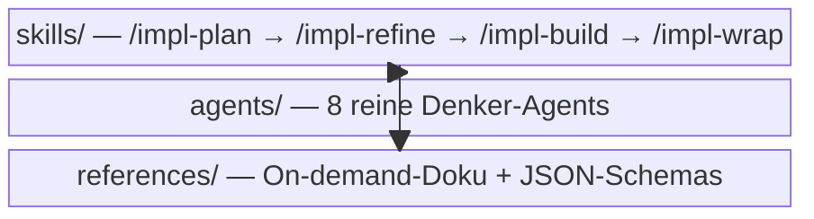

← [anchored](../_docs.md)

# plugin

Das **Claude-Code-Marketplace-Plugin** (`anchored`) — das User-Interface des
Frameworks. Liefert die Lifecycle-Skills (was der Nutzer aufruft), die spezialisierten
Agents (reine Denker, die das Skill spawnt) und On-demand-References. Das Plugin
**orchestriert** nur: Agents denken, Skills wenden deren strukturierten Output via MCP
aufs Task-File an.

| Bereich / Datei | Rolle | Verantwortung (Scope-Grenze) |
|---|---|---|
| [skills](skills/_skills.md) | macro | Die fünf Entry-Point-Skills, die den vier-stufigen Lifecycle komponieren (+ `/impl`-Autopilot). |
| [agents](agents/_agents.md) | macro | Die acht spezialisierten Agents — reine Reasoner ohne MCP/Code-Mutation, geben strukturierten Output zurück. |
| [references](references/_references.md) | macro | On-demand-Doku, die Skills/Agents laden: Style-Contract, Mutations-Referenz, Schema-Guides + die JSON-Schemas. |
| [overview](overview.md) | medio | Das Plugin-README: Lifecycle-Quickstart, resume-safe State-Machine, Konfiguration via `anchored.yml`. |
| [extending](extending.md) | medio | `EXTENDING.md`: die vier Erweiterungs-Pattern (custom Steps, custom Phase-Felder, Gate-Extension, Methodologie-Contracts). |
