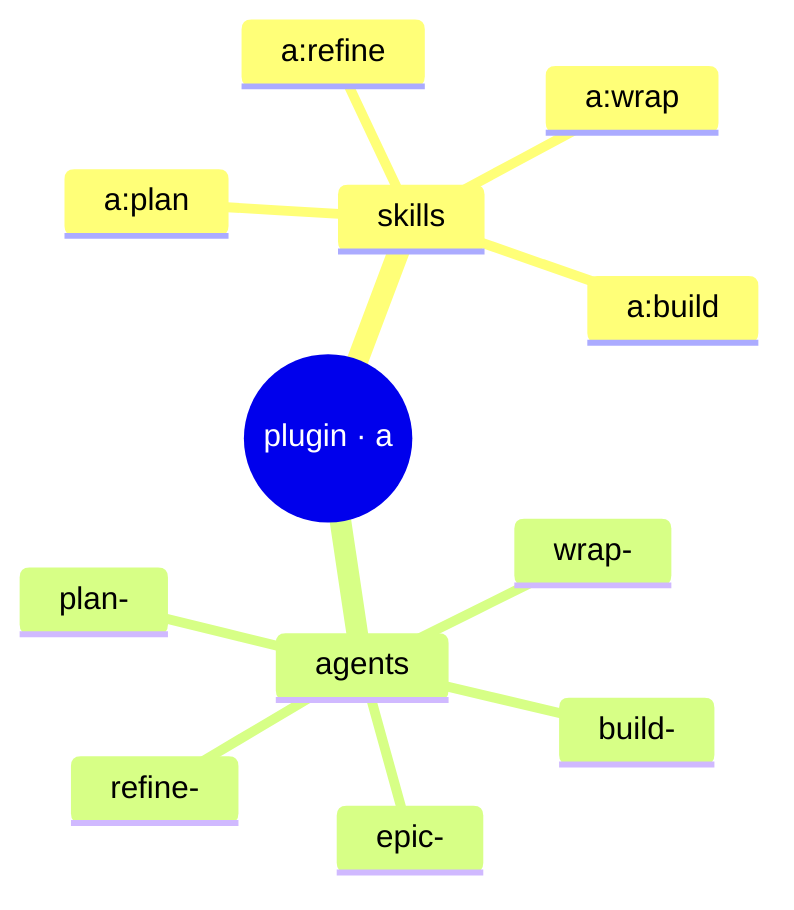

← [anchored](../_anchored.md)

# plugin

Die Claude-Code-Integration (Namespace **`a`**) — eine dünne Schicht über der
`anchored`-CLI. **Skills** sind die Slash-Commands (`/a:plan` …), **Agents** sind
die AI-Worker, die die Stages ausführen. Kein MCP — alle Mutationen laufen über
die CLI via Bash (funktioniert in Main-Session *und* Subagents/headless).

| Bereich | Verantwortung (Scope-Grenze) |
|---|---|
| [skills](skills/_skills.md) | Die vier Slash-Commands `/a:plan` `/a:refine` `/a:build` `/a:wrap`. Orchestrieren eine Stage, rufen `anchored …` via Bash. |
| [agents](agents/_agents.md) | Die AI-Worker in Stage-Präfix-Buckets. Distinkte Worker; geteilte sind tier-parametrisiert. Schreiben via CLI, **nie** MCP. Nie `plan`/`explore` benennen (reservierte Agent-Typen). |

> **YAGNI**: Detail in [docs/design/](../design/). Skill-/Agent-Seiten entstehen
> mit dem Code.
