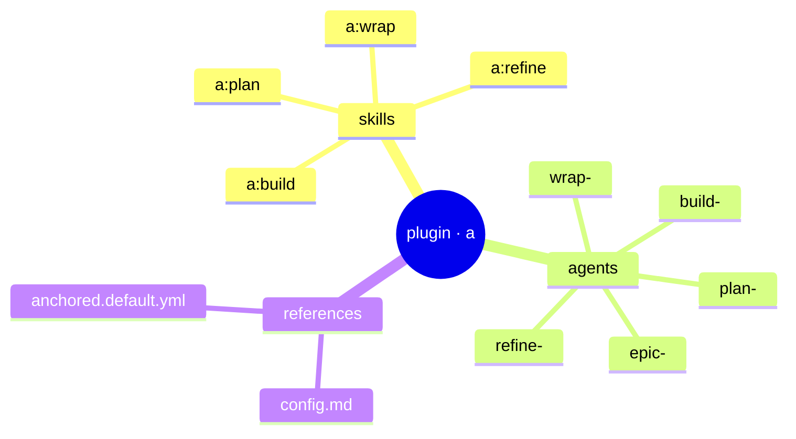

← [anchored](../_anchored.md)

# plugin

The Claude Code integration (namespace **`a`**) — a thin layer over the
`anchored` CLI. **Skills** are the slash commands (`/a:plan` …), **agents** are
the AI workers that run the stages. No MCP — all mutations go through the
CLI via Bash (works in the main session *and* subagents/headless).

| Area | Responsibility (scope boundary) |
|---|---|
| [skills](skills/_skills.md) | The four slash commands `/a:plan` `/a:refine` `/a:build` `/a:wrap`. Orchestrate one stage, call `anchored …` via Bash. |
| [agents](agents/_agents.md) | The AI workers in stage-prefix buckets. Distinct workers; shared ones are tier-parametrized. Write via CLI, **never** MCP. Never name them `plan`/`explore` (reserved agent types). |
| [references](references/_references.md) | Shipped reference artifacts: the `anchored.yml` format, the default config (framework base) + example nodes per tier. Lookup material, not code. |

> **YAGNI**: detail in [docs/design/](../design/). Skill/agent pages emerge
> with the code.
