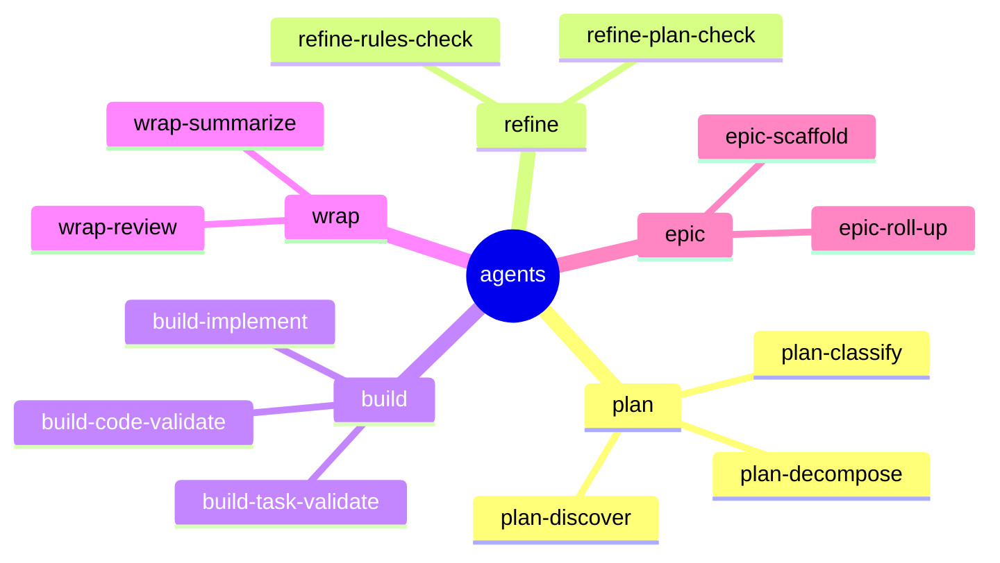

← [plugin](../_plugin.md)

# agents

The AI workers that execute the steps. Flat in `plugin/agents/` (CC does not scan
subfolders), **stage prefix** as the bucket. Distinct workers, named after what
they do; shared ones are **tier-parametrized** (one file serves multiple tiers).

| Worker | Kind | Role |
|---|---|---|
| `plan-discover` | shared | Probe the situation/scope (kick off plan). |
| `plan-decompose` | task | Decompose into phases + ACs. |
| `plan-classify` | — | Recommend epic\|task\|phase. |
| `refine-plan-check` | shared | Plan against current code. |
| `refine-rules-check` | shared | Rules coverage per child. |
| `build-implement` | phase (Leaf) | Implement the work. |
| `build-task-validate` | phase | Evidence-honesty (no acceptance criterion without evidence). |
| `build-code-validate` | phase | Rule adherence against `.claude/rules`. |
| `wrap-review` | shared | Review the completed unit. |
| `wrap-summarize` | shared | Summary. |
| `epic-scaffold` | epic | goal prose → coarse stubs. |
| `epic-roll-up` | epic | definition of done + retro. |

## Rules

- Write via the [`anchored` CLI](../../core/cli/_cli.md) (Bash), **never** MCP — so
  they also work in subagents/headless.
- **Never** name a worker `plan` or `explore` (CC-reserved agent types →
  shadowing).

> Per-worker pages (prompts/detailed behavior) follow with the code — not yet
> settled (YAGNI).
