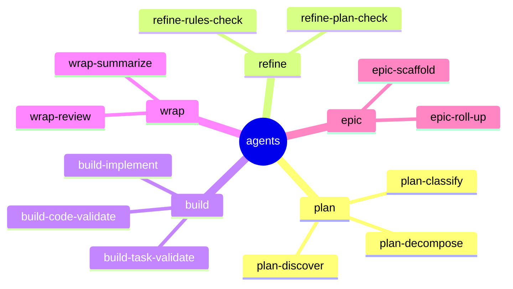

← [plugin](../_plugin.md)

# agents

Die AI-Worker, die die Steps ausführen. Flach in `plugin/agents/` (CC scannt keine
Unterordner), **Stage-Präfix** als Bucket. Distinkte Worker, benannt nach dem was
sie tun; geteilte sind **tier-parametrisiert** (ein File bedient mehrere Etagen).

| Worker | Art | Rolle |
|---|---|---|
| `plan-discover` | geteilt | Lage/Umfang sondieren (Auftakt plan). |
| `plan-decompose` | task | in Phasen + ACs zerlegen. |
| `plan-classify` | — | epic\|task\|phase empfehlen. |
| `refine-plan-check` | geteilt | Plan gegen aktuellen Code. |
| `refine-rules-check` | geteilt | Rules-Coverage pro Kind. |
| `build-implement` | phase (Leaf) | die Arbeit implementieren. |
| `build-task-validate` | phase | Evidence-Honesty (kein AC ohne Beweis). |
| `build-code-validate` | phase | Rule-Adherence gegen `.claude/rules`. |
| `wrap-review` | geteilt | abgeschlossene Einheit reviewen. |
| `wrap-summarize` | geteilt | TL;DR. |
| `epic-scaffold` | epic | goal-Prosa → coarse Stubs. |
| `epic-roll-up` | epic | DoD + Retro. |

## Regeln

- Schreiben via [`anchored`-CLI](../../core/cli/_cli.md) (Bash), **nie** MCP — so
  funktionieren sie auch in Subagents/headless.
- **Nie** einen Worker `plan` oder `explore` nennen (CC-reservierte Agent-Typen →
  Shadowing).

> Per-Worker-Seiten (Prompts/Detailverhalten) folgen mit dem Code — noch nicht
> festgelegt (YAGNI).
