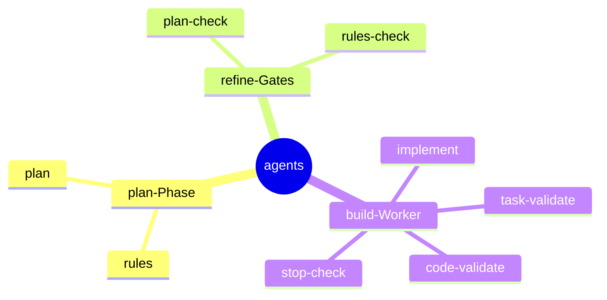

← [plugin](../_plugin.md)

# agents

Acht spezialisierte **Denker-Agents**, die das jeweilige Skill spawnt. Jeder ist ein
reiner Reasoner: liest Task-File, Codebase und Rules, **mutiert nichts selbst** (kein
MCP, kein Code-Write) und gibt strukturierten Output zurück, den das Skill via MCP
anwendet — der Workaround für die Plugin-Subagent-MCP-Limitierung (#13605).

| Agent | Rolle | Verantwortung (Scope-Grenze) |
|---|---|---|
| [plan](plan.md) | medio | Zerlegt Beschreibung+Discovery+Rules in 2–6 Phasen mit ACs; jede Ambiguität → priorisierte Question. Nie unilaterale Produktentscheidung. |
| [rules](rules.md) | medio | Scannt `.claude/rules/` + User-Quellen, matcht gegen Task, liefert must_follow vs. worth_knowing. Input für plan. |
| [implement](implement.md) | medio | Der einzige schreibende Agent: implementiert Code je Phase via Write/Edit/Bash, draftet konkrete Evidence pro AC, failures-aware. |
| [plan-check](plan-check.md) | medio | Pre-build-Gate: scannt Plan gegen aktuellen Code auf Drift (stale Pfade, fehlende Rules, versteckte Defaults). Mandatory. |
| [rules-check](rules-check.md) | medio | Post-plan-check-Gate: prüft, ob jede Phase die anwendbaren Rules deckt; fehlende → Auto-Fix, Konflikte → Question. Mandatory. |
| [task-validate](task-validate.md) | medio | Evidence-Honesty-Validator: öffnet jede AC-Evidence und prüft, ob sie den Claim wirklich belegt. Mandatory. |
| [code-validate](code-validate.md) | medio | Rule-Adherence-Validator: scannt berührte Files gegen die Phasen-Rules, meldet Verstöße mit file:line. Mandatory. |
| [stop-check](stop-check.md) | medio | Build-Zeit-Halt-Evaluator: entscheidet bei Build-Entscheidungen stop (eskalieren) vs. proceed (autonom dokumentieren). |
