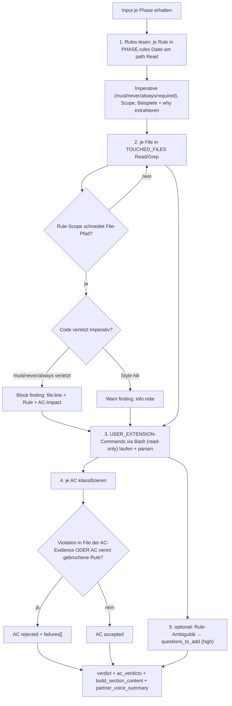

← [agents](_agents.md)

# code-validate

Das Rule-Adherence-Gate von anchored — der zweite der beiden parallelen Post-implement-Validatoren. `code-validate` scannt die von [implement](./implement.md) berührten Files (`TOUCHED_FILES`) gegen die Per-Phase-Rules aus `PHASE.rules[]`, meldet Verstöße mit `file:line` + welche Rule + AC-Impact und liefert ein strukturiertes Per-AC-Verdict. Läuft IMMER und ist nicht abschaltbar.

## Was

- Reiner Inspector: Tools `Read, Glob, Grep, Bash`, Modell `opus`. Schreibt **keinen** Quellcode (kein Write/Edit) und mutiert das Task-File **nicht** (kein MCP) — der Return wird von der [/impl-build](../skills/impl-build.md)-SKILL via MCP angewendet. Workaround für Bug #13605 (Plugin-Subagents haben keinen MCP-Zugriff).
- **Zweiter** der zwei parallelen Validatoren: läuft neben [task-validate](./task-validate.md) (das die Evidence-Ehrlichkeit prüft); `code-validate` fokussiert eng auf Rule-Adherence.
- Läuft **automatisch** nach dem implement-Step in /impl-build und **kann nicht deaktiviert werden** ("ALWAYS runs").
- Enforced **nur** Rules aus `PHASE.rules[]` — also die, die plan-agent oder [rules-check](./rules-check.md) explizit an DIESE Phase angehängt haben. Andere Rules in `.claude/rules/` sind NICHT seine Sache (Rule-Coverage entscheidet [rules-check](./rules-check.md) in /impl-refine). Verhindert "creeping rule enforcement".
- Eine Rule gilt für ein File **gdw.** ihr Scope sich mit dem File-Pfad schneidet.
- Block-vs-warn-Klassifikation:
  - **Block findings** → AC-Rejection: Rule sagt explizit "must"/"never"/"always" und der Code verletzt sie.
  - **Warn findings** → Info-Note, kein AC-Impact: Code-Style-Beobachtungen, unused imports, Formatting-Nits.
- Per-AC-Verdict je AC in `PHASE.acceptance_criteria`:
  - **`accepted`** — keine Rule-Violation in Files, auf die die Evidence dieser AC referenziert, UND der Geist der Rule ist gewahrt.
  - **`rejected`** — mindestens eine Violation in einem File, auf das die AC-Evidence zeigt, ODER die AC nennt explizit eine Rule und die Implementierung bricht sie.
- Phase-Level-Findings (Violations ohne Bezug zu einer konkreten AC) landen als informational notes in `build_section_content`, nicht als Rejection.
- `verdict: fail`, sobald **irgendeine** AC rejected ist; sonst `pass`.
- Spezifische Failure-Notizen statt generischer: jede Rejection-Note nennt `file:line` + Rule-Pfad + zitierten Imperativ + AC-Impact (sie wird zum Fix-Target von implement).
- `USER_EXTENSION` (Prosa aus `anchored.yml.build.code_validate`) **erweitert** die Default-Checks, ersetzt sie nie — die Defaults laufen immer.
- Bash ist **read-only**: Lint/Test-Commands, die State lesen und ein Verdict liefern, sind ok; Destruktives (`rm`, `git reset`, …) nicht.
- Optionale Mid-Build-Ambiguität: ist eine Rule-Interpretation im Phasen-Kontext mehrdeutig, wird sie als `high`-prio Frage in `questions_to_add` gemeldet (mid-build ist immer high).

## Wie

### Benutzung

`code-validate` wird von der [/impl-build](../skills/impl-build.md)-SKILL je Phase parallel zu [task-validate](./task-validate.md) gespawnt und erhält einen Textblock:

- `PROJECT_ROOT`, `TASK_SLUG` (Referenz)
- `PHASE`: `slug`, `name`, `rules[]` (`path` + `why`), `acceptance_criteria[]` (volle AC-Objekte fürs Cross-Referencing)
- `TASK_FILE_CONTENT` (volles YAML)
- `USER_EXTENSION` (Prosa aus `anchored.yml.build.code_validate`, ggf. leer)
- `RETRY_ATTEMPT: N` (1-basiert)
- `TOUCHED_FILES[]` (Files, die implement laut seinen `build_notes` berührt hat)

Rückgabe ist ein strukturierter YAML-Block (kein MCP-Call):

- `verdict: pass | fail` (`fail` wenn irgendeine AC rejected)
- `ac_verdicts[]`: `ac_index` + `status: accepted | rejected` + `failures[]` (nur bei `rejected`) → SKILL setzt die Failures via MCP
- `build_section_content` (Markdown) → SKILL wendet es auf `context.build.code-validate` an
- `questions_to_add[]`: `text` + `priority: high` + `phase` → SKILL ruft `mcp__task__question_add` je Eintrag
- `partner_voice_summary`: 1–2 Sätze Pair-Programmer-Stimme (Pass/Fail + Violation-Count + Rule-Namen in human terms); siehe `plugin/references/communication-style.md`

### Funktion

Nach dem Return wendet die SKILL die Mutationen via MCP an. Wird eine AC rejected, ist die Failure-Notiz das Fix-Target — die failure-driven Re-Do-Loop spawnt [implement](./implement.md) erneut mit gesetzten `failures[]`; der Inspector fixt nichts selbst.

## Warum

- **Reiner Inspector ohne MCP/Write**: explizit als Workaround für Bug #13605 dokumentiert — Plugin-Subagents erreichen MCP-Tools nicht, daher inspiziert der Agent nur und gibt strukturiert zurück; das Anwenden übernimmt die SKILL.
- **Nur `PHASE.rules[]` statt aller Rules**: verhindert "creeping rule enforcement", bei dem jede Phase sich um jede Rule kümmern müsste; die Rule-Coverage-Entscheidung gehört zu [rules-check](./rules-check.md) im /impl-refine.
- **Spezifische statt generischer Failures**: die Rejection-Note wird direkt zum Fix-Target von implement — vage Notizen ("rule violation", "see dom.md") sind unbrauchbar.

## Wann

- Getriggert **automatisch** nach dem implement-Step je Phase durch die [/impl-build](../skills/impl-build.md)-SKILL, parallel zu [task-validate](./task-validate.md). Nicht abschaltbar.
- Bei `RETRY_ATTEMPT > 1` läuft die Validierung auf einem Re-Do-Versuch von implement.
