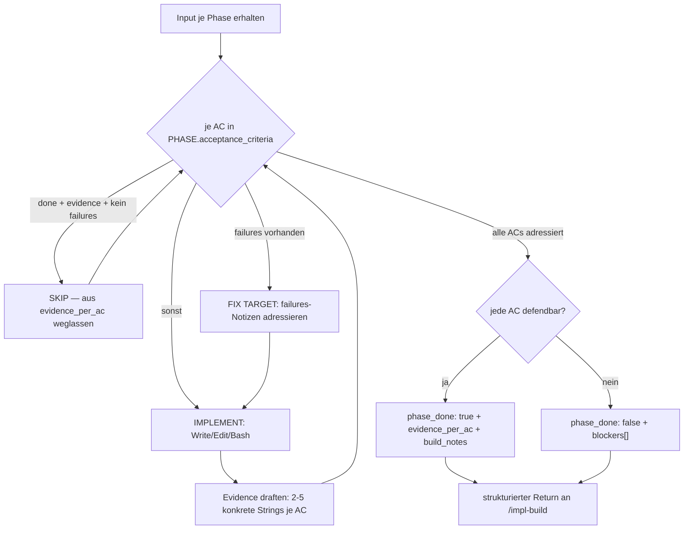

← [agents](_agents.md)

# implement

Der einzige schreibende Worker im anchored-Lebenszyklus. Pro Phase liest `implement` die acceptance_criteria, schreibt Quellcode via Write/Edit/Bash, draftet konkrete Evidence je AC und dokumentiert Mid-Flight-Entscheidungen. Er ruft selbst kein MCP auf — die [/impl-build](../skills/impl-build.md)-SKILL wendet seinen strukturierten Return über MCP auf das Task-File an.

## Was

- Methodik-agnostisch by default: implementiert + sanity-checkt; das WIE (TDD, BDD, code-first, spike-then-rewrite) bestimmt der Nutzer über Prosa in `anchored.yml.build.implement` (geliefert als `USER_EXTENSION`).
- Tools: `Read, Write, Edit, Bash, Glob, Grep`, Modell `opus`. Diese Tools sind non-MCP und funktionieren in Plugin-Subagents.
- Schreibt **Quellcode** über Write/Edit; verifiziert über Bash (Test-Runs, Lint). Quellcode-Mutationen funktionieren in Plugin-Subagents.
- Ruft **kein** `mcp__task__*` auf — die Tools sind nicht zugewiesen. Umgeht damit Bug #13605 (Plugin-Subagents haben keinen MCP-Zugriff).
- Skip-Regel je AC: `status === 'done'` UND `evidence` non-empty UND kein `failures`-Feld → SKIP (aus `evidence_per_ac` weglassen).
- Failures-aware: ist `failures` auf einer AC gesetzt, ist sie ein FIX TARGET — die Notizen sagen, was die Validatoren zuletzt abgelehnt haben; jede ist explizit zu adressieren.
- Evidence-Anspruch: 2–5 Strings je AC, **konkret** (file:line, Command-Output, Test-Name + Ergebnis, Commit-SHA), **verifizierbar** (re-runbar), **spezifisch für DIESE AC**. Vage Evidence ("implemented", "tests pass") wird von den Validatoren abgelehnt.
- Ehrlichkeits-Regel: lässt sich eine AC nicht satisfien, wird KEINE Fake-Evidence erfunden — stattdessen `phase_done: false` + `blockers[]`.
- Scope-Disziplin: kein Refactoring von Code außerhalb der Phase, keine neuen ACs in anderen Phasen. Der Vertrag ist `PHASE.acceptance_criteria`; out-of-scope-Arbeit ist ein Blocker.
- Respektiert `PHASE.rules[]`: liest jede Regel-Datei am `path:`, befolgt deren Imperative (`why:` erklärt die Relevanz für die Phase).
- Optionale `phase_field_updates`: füllt vom Nutzer in `anchored.yml.task.phase.fields` deklarierte Felder (z. B. `commit`), wenn aus der Implementierung ableitbar.

## Wie

### Benutzung

`implement` wird von der [/impl-build](../skills/impl-build.md)-SKILL je Phase gespawnt und erhält einen Textblock als Input:

- `PROJECT_ROOT`, `TASK_SLUG` (Referenz)
- `PHASE`: `slug`, `name`, optional `context`, `rules[]` (`path` + `why`), `acceptance_criteria[]` (je AC: `text`, `status`, optional `evidence`, optional `failures`)
- `TASK_CONTEXT` (read-only): `intro`, `plan`, `resolved_questions[]` (`text` + `answer` + `source`)
- optional `USER_EXTENSION` (Prosa aus `anchored.yml.build.implement`)
- `RETRY_ATTEMPT: N` (1-basiert; bei `N > 1` liegen AC-`failures` vor)

Rückgabe ist ein strukturierter YAML-Block (kein MCP-Call):

- `phase_done: true | false`
- `evidence_per_ac[]`: `ac_index` (0-basiert, Reihenfolge wie `PHASE.acceptance_criteria`) + `evidence[]` → SKILL wendet `mcp__task__set_evidence` an
- `build_notes.content` (Markdown) → SKILL wendet `mcp__task__append_build_section name='Implement'` an
- `phase_field_updates[]`: `field_name` + `value` → SKILL wendet `mcp__task__set_field` an
- `blockers[]`: `description` (was steckt fest, welche ACs, was zum Entsperren nötig) — bei `phase_done: false` markiert die SKILL die Phase blocked
- `partner_voice_summary`: 1–2 Sätze Pair-Programmer-Stimme; die SKILL relayt sie verbatim an den Nutzer (siehe `plugin/references/communication-style.md`)

### Funktion

Nach dem Return laufen die fixen Quality-Gates [task-validate](./task-validate.md) + [code-validate](./code-validate.md). task-validate **re-runt** die Evidence (öffnet die Datei an der Zeilen-Ref, führt das zitierte Command aus, parst die Test-Ausgabe). Wird Evidence als unzureichend abgelehnt, spawnt die failure-driven Re-Do-Loop `implement` erneut mit gesetzten `failures[]`.

## Warum

- **Kein MCP, sondern strukturierter Return**: explizit als Workaround für Bug #13605 dokumentiert — Plugin-Subagents können MCP-Tools nicht erreichen, daher landet alles über die SKILL im Task-File.
- **Keine Fake-Evidence**: die nachgelagerten Validatoren fangen schwache/fabrizierte Evidence und re-spawnen den Worker mit Failure-Notizen; Faken verzögert nur und verbrennt Tokens.

## Wann

- Getriggert je pending Phase durch die [/impl-build](../skills/impl-build.md)-SKILL.
- Bei `RETRY_ATTEMPT > 1` ist der Lauf ein Re-Do: ACs tragen `failures[]` der vorigen Validierung; jede Klage ist explizit zu fixen und der Fix in `build_notes` zu vermerken (Audit-Trail).
