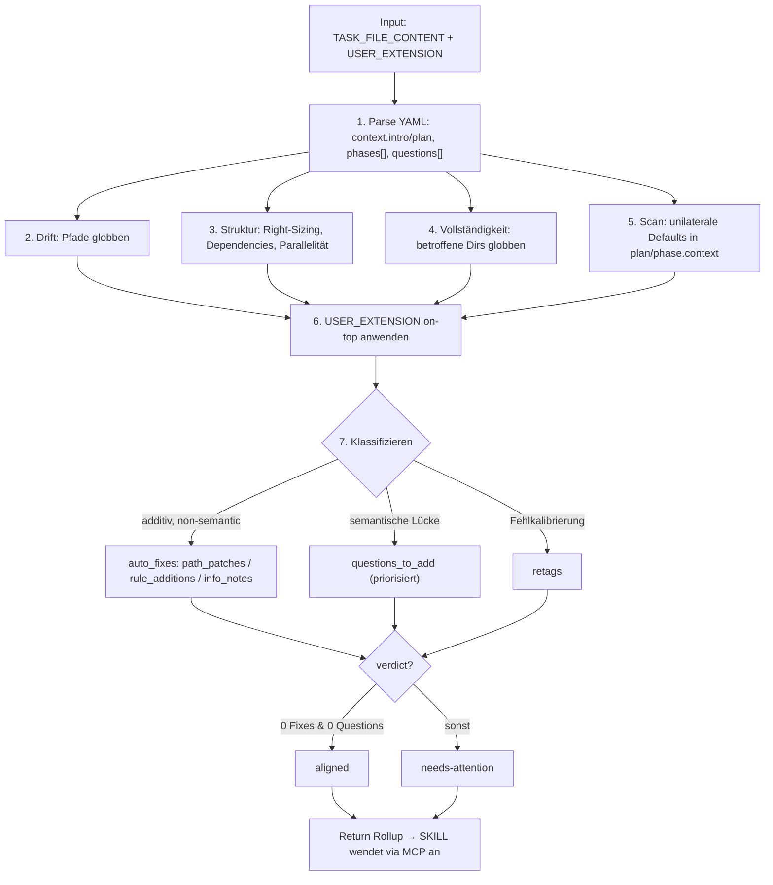

← [agents](_agents.md)

# plan-check

Pre-Build-Gate von `/impl-refine`: prüft den drafted Plan gegen den aktuellen Code auf Drift — stale Pfade, nicht-acknowledgte existierende Dateien, versteckte unilaterale Defaults des [plan](./plan.md)-Agenten. Liefert einen strukturierten Rollup aus additiven Auto-Fixes + priorisierten Questions zurück; die `/impl-refine` SKILL wendet ihn via MCP an. Fixed Agent — läuft immer, nicht abschaltbar.

## Was

- **Mandatorisches Gate in `/impl-refine`**, läuft VOR der Implementierung — nicht danach. Wo [task-validate](./task-validate.md) + [code-validate](./code-validate.md) Evidence post-implementation auditieren, auditiert plan-check den PLAN selbst (Front-Matter `name: plan-check`).
- **Pure Thinker**: Tools sind nur `Read, Glob, Grep`. Inspiziert, mutiert nicht. Kein Write, kein Edit, kein MCP.
- **Kein MCP-Zugriff**: ruft selbst kein MCP auf — Workaround für Bug #13605/#21560 (Plugin-Subagents können keine MCP-Tools nutzen). Die SKILL wendet alle Findings an.
- **Fixed Agent**: anchored shippt ihn und führt ihn immer aus. `model: opus`.
- **Nicht abschaltbar**: User-Prosa in `anchored.yml.refine.plan_check.instructions` (`USER_EXTENSION`) wird an den Default-Brief APPENDED — erweitert, ersetzt nie. Sagt der User "skip path drift checks", wird das ignoriert; Defaults laufen immer.
- **Liest die Task-Datei NICHT selbst** — die SKILL pre-liest sie und übergibt den Inhalt in `TASK_FILE_CONTENT`; `TASK_SLUG` ist nur Referenz.
- Prüft drei Concerns plus eine Sonderprüfung:
  - **Concern 1 — Plan-vs-Code-Drift**: jeder im Plan referenzierte Pfad wird geglobt. Resolviert er nicht, Suche per Basename; gefunden an neuem Ort → auto-fixbarer `path_patch`. Stale Line-Refs (`src/foo.ts:42`) gehen nur als FYI in `info_notes` — AC-Text wird NIE auto-editiert (intent-bearing). Mehrdeutige Renames (ähnlicher Name, close edit distance) → Question, kein Auto-Patch.
  - **Concern 2 — Phase-Struktur-Qualität**: Right-Sizing (1 triviale AC oder 12 sprawling ACs → Question), implizite Phasen-Dependencies → Question, disjunkte parallelisierbare Phasen → informationaler Note (keine Question).
  - **Concern 3 — Vollständigkeit aus Code-Sicht**: betroffene Verzeichnisse globben; existierende, vom Plan nicht acknowledgte Dateien → Question (kein Auto-Fix).
  - **Sonderprüfung — versteckte unilaterale Defaults**: scannt `context.plan` und jeden `phase.context` nach Prosa wie "Decision: …", "We use …", "We'll …", "I'll …", "Default: …", "For now we …". Produkt-/UX-Entscheidung (nicht durch Code gestützte technische Beobachtung) → `priority: high` Question. Prosa wird NIE umgeschrieben.
- **Rules-Coverage ist NICHT sein Concern** — das macht [rules-check](./rules-check.md) (läuft danach). plan-check bleibt eng architektonisch: Pfade, Struktur, Vollständigkeit vs. Code.
- **Auto-Fixes sind rein ADDITIV**: der Plan sagt danach mehr / den richtigen Pfad statt einem stale — kein Intent entfernt oder reinterpretiert. Lässt sich das nicht behaupten → Question.
- **Löst NIE Questions auf**: selbst bei mechanisch offensichtlicher Antwort wird nichts als resolved zurückgegeben. Auflösung ist Aufgabe von `/impl-refine` Stage 3 (Source-Attribution + Reasoning). Maximal als low-prio Question flaggen.
- **Im Zweifel immer Question** statt Auto-Fix ("silent intent-changes are expensive").
- **Path-Normalisierung** bei Patches/Rule-Additions: absolute Pfade ab `/` bis zum `.claude/`-Segment strippen; relative Pfade unverändert lassen.

## Wie

### Benutzung

Wird von der `/impl-refine` SKILL als Subagent gespawnt (parallel mit rules-check) und bekommt einen Text-Input:

```
PROJECT_ROOT: <absoluter Pfad>
TASK_SLUG: <slug — nur Referenz, Datei wird nicht gelesen>
TASK_FILE_CONTENT: <YAML-Inhalt der aktuellen Task-Datei>
USER_EXTENSION: <optionale Prosa aus anchored.yml.refine.plan_check.instructions, kann leer sein>
```

Rückgabe ist ein strukturierter YAML-Rollup. Kernfelder:

- `verdict`: `aligned` (null Auto-Fixes UND null neue Questions) oder `needs-attention` (mindestens ein Auto-Fix ODER eine Question).
- `auto_fixes.path_patches[]` → SKILL wendet via `mcp__task__set_phase_context` an (`phase_slug` + voller `new_context`).
- `auto_fixes.rule_additions[]` → via `mcp__task__set_phase_rules` (FULL LIST liefern: existing + neu, SKILL ersetzt wholesale).
- `auto_fixes.info_notes[]` → via `mcp__task__append_plan`.
- `questions_to_add[]` → via `mcp__task__question_add` (je Eintrag `text`, `priority` low/medium/high, optional `phase`). Priorität: `high` = betrifft Plan-Struktur (Split/Merge, Scope-Expansion), `medium` = betrifft Implementierung nicht Struktur, `low` = informational mit sinnvollem Default.
- `retags[]` → via `mcp__task__question_retag` (selten; nur bei klar fehlkalibrierter Priorität bestehender Questions).
- `questions_added_count` (high/medium/low) + `partner_voice_summary` (1–2 Sätze Pair-Programmer-Voice für den User; keine Tool-/MCP-Namen — siehe `plugin/references/communication-style.md`).

Die SKILL parst den Rollup, wendet ihn an und schreibt ihn in `context.build → plan-check` als Audit-Trail.

### Funktion



## Warum

- **Pure Thinker ohne MCP** ist kein Design-Ideal, sondern ein dokumentierter Workaround für Bug #13605/#21560: Plugin-Subagents können keine MCP-Tools erreichen. Deshalb inspiziert plan-check nur und gibt einen Rollup zurück, den die SKILL mit MCP-Zugriff anwendet.
- **Additiv-only + "im Zweifel Question"**: stille Intent-Änderungen sind teuer, Lesen und Über-Fragen sind billig — daher nur risikolose, additive Korrekturen automatisch, alles Semantische als Question.
- **Versteckte-Defaults-Scan** adressiert einen konkreten **V0.2-Dogfood-Failure-Mode**: der plan-agent formuliert unilaterale Produkt-/UX-Calls als "Decision: …" und tarnt sie als dokumentierte Entscheidung, die der User nie getroffen hat.

## Wann

- **Trigger**: gespawnt durch die `/impl-refine` SKILL als eines von zwei mandatorischen Gates, BEVOR Implementierung passiert (Task-Status `drafted`, vor dem Übergang nach `refined`).
- **Parallel** zu rules-check auf demselben pre-read Snapshot; rules-check deckt die Rules-Coverage ab, plan-check den Plan-vs-Code-Drift + die Phasen-Struktur.
- **Immer** — Lifecycle nicht überspringbar oder abschaltbar; `USER_EXTENSION` kann nur zusätzliche Checks ergänzen.
