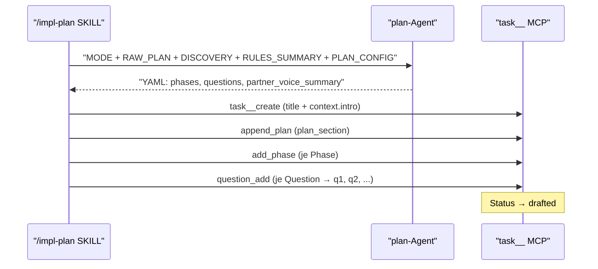
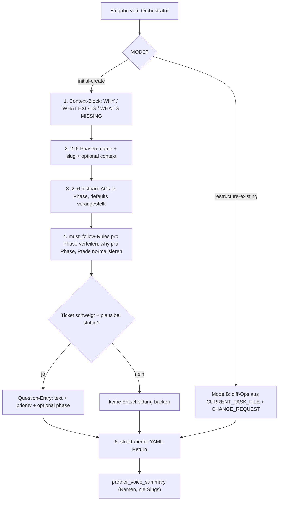

← [agents](_agents.md)

# plan

Brainstorm-Partner am Anfang einer anchored-Task: zerlegt `RAW_PLAN` + `DISCOVERY` + `RULES_SUMMARY` in 2–6 Phasen mit testbaren Acceptance Criteria, verteilt Rules pro Phase und macht jede Mehrdeutigkeit zu einer priorisierten Question — nie zu einer stillen Entscheidung. Reiner Denker ohne Disk-/MCP-Zugriff: er liefert strukturierten Output, den die `/impl-plan`-SKILL via MCP auf die Task-Datei anwendet.

## Was

- Agent-Name ist `plan`; Tools sind ausschließlich `Read, Glob, Grep`; Model `opus`.
- Hat **keine** Write-, Edit- oder MCP-Tools — per Design. Jede direkte Datei-Mutation würde Schema-Validierung, State-Machine und Atomic-Write der Factory umgehen.
- Läuft während `/impl-plan`, nachdem die Explore- und rules-Agents gelaufen sind.
- **Harte Regel:** Er schreibt Questions auf, nie Entscheidungen über Dinge, die das Ticket nicht spezifiziert hat. Keine Default-Annahme, keine im Phase-Context versteckte Entscheidung. Betrifft u.a. UX-Pattern, Sortierung, Error-Handling, Delete-Button, Storage-Key-Naming.
- Jede Question wird nach **Impact** (nicht Schwierigkeit) getaggt: `low` (kosmetisch, leicht reversibel), `medium` (UX/Struktur), `high` (Produkt-Scope/Richtung). Im Zweifel höher taggen — refine kann downgraden.
- Zwei Eingabe-Modi: **Mode A initial-create** (Default) und **Mode B restructure-existing**.
- Mode A erzeugt einen vollständigen Plan; Mode B erzeugt einen strukturierten **diff** (`add_phase`, `remove_phase`, `move_phase`, `set_phase_name`, `set_phase_context`, `add_ac`, `remove_ac`, `set_ac_text`).
- Im Mode B liest der Agent die Datei **nicht** selbst — die SKILL übergibt den Inhalt in `CURRENT_TASK_FILE`.
- Liefert `partner_voice_summary` — in **beiden** Modi REQUIRED; der Orchestrator gibt es verbatim an den User weiter.
- Phasen-Anzahl: 2–6. Eine Phase ist eine logische Arbeitseinheit, die als ein Commit (oder ein PR) ausliefert.
- Pro Phase: Title-Case-Name, kebab-case-Slug, optionaler Context, 2–6 testbare ACs. Mehr als 6 ACs → meist zwei Phasen.
- Phasen-Namen sind benutzerseitig sichtbar, müssen task-intern eindeutig und spezifisch sein ("Token Storage Layer", nicht "Misc"/"Setup"). Keine numerischen Suffixe zur Unterscheidung.
- ACs sind testbar (per Command/Datei-Zeile/Commit verifizierbar), konkret und je ein einzelner Satz.
- `PLAN_CONFIG.acceptance_criteria_defaults` werden jeder Phase **vorangestellt** (als erste AC). `PLAN_CONFIG.instructions` steuern Wording/Stil — bei Konflikt gewinnt der User.
- Rule-Verteilung pro Phase: jede `must_follow`-Rule, deren Scope sich mit der Phasen-Arbeit überschneidet, kommt mit phasenspezifischem `why:` in die `rules:`-Liste der Phase. Eine Rule kann auf mehrere Phasen gehen (distinkte `why:`); eine nirgends passende Rule wird aus der Verteilung entfernt (bleibt im `worth_knowing` des Users).
- Pfad-Normalisierung (defensiv): absolute Pfade werden ab dem `.claude/`-Segment auf projekt-relativ gekürzt; relative bleiben unangetastet. Absolute Pfade würden das Home-Verzeichnis eines Entwicklers ins Artefakt backen.
- Output-Felder Mode A: `slug`, `title`, `context` (3–8 Sätze), `plan_section[]`, `phases[]`, `questions[]`, `partner_voice_summary`.
- Question-Shape: `text` (Einzelsatz mit `?`), `priority`, optional `phase`. Kandidat-Antwort darf parenthetisch im `text` stehen, damit refine sie als Default vorschlägt.
- Question-IDs (q1, q2, …) trackt der Agent **nicht** — die SKILL vergibt sie sequentiell beim `question_add`-Aufruf.
- ACs im Return sind reine Text-Strings; `status: pending` und Phasen-Default-Status setzt die SKILL. Keine Evidence vorbefüllen — die kommt aus implement während `/impl-build`.
- In benutzerseitigem Text (z.B. `partner_voice_summary`) werden **Namen**, nie Slugs verwendet.

## Wie

### Benutzung

Der Orchestrator (`/impl-plan`-SKILL) ruft den Agent mit einem der beiden Eingabe-Blöcke auf und parst seinen YAML-Return.

- **Mode A** Eingabe: `MODE: initial-create`, `PROJECT_ROOT`, `TASK_SLUG`, `RAW_PLAN`, `DISCOVERY` (affected_paths/similar_code/patterns aus Explore), `RULES_SUMMARY` (must_follow/worth_knowing/sources aus rules-Agent), `PLAN_CONFIG` (aus `anchored.yml.plan`, darf leer sein). Jedes Feld darf leer sein — leere Eingabe ist normal.
- **Mode B** Eingabe: `MODE: restructure-existing`, `PROJECT_ROOT`, `TASK_SLUG`, `CURRENT_TASK_FILE`, `CHANGE_REQUEST`.

Nach Mode A nimmt die SKILL den Return und ruft `task__create` (title + context.intro), `append_plan` (plan_section), `add_phase` (je Phase), `question_add` (je Question). Status wird nach erfolgreichen Writes auf `drafted` geflippt — mit offenen Questions, die `/impl-refine` später mit dem User durchgeht.

### Funktion

Intern arbeitet der Agent eine feste Sequenz ab: Context synthetisieren → in Phasen zerlegen → ACs schreiben → Rules pro Phase verteilen → jede Mehrdeutigkeit als Question aufnehmen → strukturierten Output zurückgeben.

## Warum

- **Trennung WHAT vs. HOW:** Der Agent denkt über das WAS nach, die SKILL erledigt das WIE-es-landet. Direkte Datei-Mutation würde Schema-Validierung, State-Machine und Atomic-Write-Vertrag der Factory umgehen — daher bewusst keine Write-/MCP-Tools.
- **Questions statt stiller Entscheidungen:** Der V0.2-Dogfood (2026-05-27) hat den plan-Agent dabei erwischt, in einem Lauf sechs unilaterale Produktentscheidungen zu treffen. V0.3 schließt die Lücke strukturell, indem jede Mehrdeutigkeit zwingend in `questions[]` muss. Geratene Pläne sehen fertig aus, betten aber unvalidierte Annahmen ein.
- **Per-Phase-Rules statt Dump-auf-alle:** Alle Rules auf jede Phase zu kippen erzeugt mehr Lärm bei code-validate; das Auslassen passender Rules lässt code-validate echte Verstöße übersehen. Die phasenspezifischen `why:`-Strings ermöglichen später präzise Findings.
- **Namen statt Slugs in Chat:** sb-bot-Lektion — als Agents Phasen per Buchstaben-IDs (A, B, C) referenzierten, verloren User in langen Sessions den Bezug, weil Chat-Referenzen nichts in der Task-Datei mental Lokalisierbares trafen.
- **Pfad-Normalisierung:** Absolute Pfade in der Task-Datei backen das Home-Verzeichnis eines Entwicklers ins Artefakt — sie leaken maschinenspezifische Daten und brechen für alle anderen.

## Wann

- Trigger: läuft während `/impl-plan`, **nachdem** Explore (Discovery) und der rules-Agent gelaufen sind und ihre vor-verdauten Summaries vorliegen.
- Mode B (restructure-existing) wird ausgelöst, wenn `/impl-plan` auf einer Task-Datei jenseits von `status: plan` aufgerufen wird und der User strukturelle Änderungen verlangt ("nach Domäne statt nach Layer gruppieren", "Phase 2+3 mergen", "Phase 4 in A+B splitten").
- Exit-Zustand: sauberes Ende mit noch **offenen** Questions — das ist erwartet. Status flippt (SKILL-seitig) auf `drafted`. Die Questions werden erst in `/impl-refine` (Stage 3) mit dem User durchgegangen.

Querverweise: [rules](./rules.md), [implement](./implement.md), [plan-check](./plan-check.md), [code-validate](./code-validate.md).
