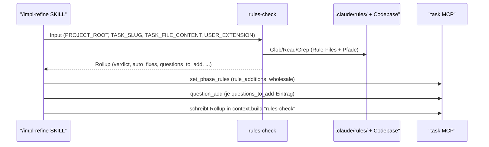
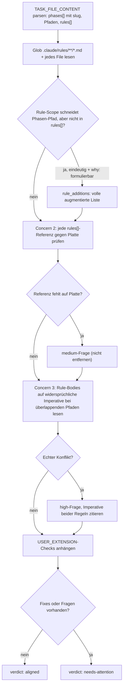

← [agents](_agents.md)

# rules-check

rules-check ist eines von zwei verpflichtenden Quality-Gates in `/impl-refine` und läuft **parallel** zu plan-check auf demselben pre-read Task-File-Snapshot. Es prüft, ob die `rules[]`-Arrays jeder Phase des entworfenen Task-Files die tatsächlich auf der Platte liegenden `.claude/rules/*.md`-Files abdecken. Fehlende Regeln werden als additive Auto-Fixes vorgeschlagen, Orphans und Cross-Phase-Konflikte als priorisierte Fragen. Der Agent ist ein reiner Denker und läuft immer; er lässt sich nicht abschalten.

## Was

- rules-check läuft als Subagent von `/impl-refine` **parallel** zu [plan-check](./plan-check.md) auf demselben **pre-read** Task-File-Snapshot — es sieht plan-checks Reshapes **nicht**. Die SKILL reconciled beide Gate-Befunde beim Anwenden via MCP (greift z. B. ein Rule-Add auf einen Phase-Slug, den plan-check umbenannt/gemergt hat, behandelt die SKILL das beim Apply).
- Tools sind ausschließlich `Read`, `Glob`, `Grep`; Model ist `opus`.
- Es ist ein **Pure Thinker**: kein `Write`, kein `Edit`, kein MCP. Es gibt nur einen strukturierten Rollup zurück; die `/impl-refine`-SKILL wendet die Befunde via MCP auf die Platte an (Workaround für Bug #13605 — Plugin-Subagents können kein MCP nutzen).
- Es prüft drei Failure-Modes:
  - **Concern 1 — fehlende Regeln**: Ein Rule-File auf der Platte gilt für einen Pfad, den eine Phase berührt, ist aber nicht in deren `rules[]` → additiver Auto-Fix in `rule_additions`.
  - **Concern 2 — orphaned Rule-Referenzen**: Eine in `rules[]` referenzierte Rule existiert nicht mehr auf der Platte → `medium`-Frage. Die Referenz wird **nie** still entfernt.
  - **Concern 3 — Cross-Phase-Konflikte**: Zwei Phasen referenzieren Regeln, deren **Inhalt** sich für einen überlappenden Pfad widerspricht → `high`-Frage.
- Auto-Fix ist **strikt additiv**: Es darf niemals eine Rule-Referenz entfernen, ein bestehendes `why:` umschreiben, Rule-Files ändern, `phase.context` anfassen (Domäne von plan-check), oder ACs/Phasen-Struktur verändern. Alles darüber hinaus → Frage.
- Auto-Fix nur, wenn das Rule-File auf der Platte existiert (gelesen wurde), der Pfad-/Pattern-Match eindeutig ist (nicht „könnte passen") und ein phasenspezifisches `why:` formuliert werden kann.
- `rule_additions` liefert immer die **vollständige** augmentierte Liste (bestehende + neue), da die SKILL die `rules[]` der Phase per `mcp__task__set_phase_rules` als Ganzes ersetzt.
- rules-check **löst nie Fragen** auf — es legt nur neue an; die Auflösung erfolgt in `/impl-refine` Stage 3.
- Pfade werden projekt-relativ normalisiert: absolute `/`-Pfade werden bis zum `.claude/`-Segment gekürzt, bereits relative Pfade bleiben unverändert.
- **Leeres Ergebnis ist gültig**: Existiert kein `.claude/rules/`-Ordner und referenziert der Plan keine Regeln, ist `aligned` mit null Fixes/Fragen das korrekte Resultat — kein Fehler.
- Verdict: `aligned`, wenn null Auto-Fixes **und** null neue Fragen; sonst `needs-attention`.
- Nutzer-Prosa aus `anchored.yml.refine.rules_check.instructions` wird über `USER_EXTENSION` an die Default-Instruktionen **angehängt**; Defaults lassen sich nicht abschalten.

## Wie

### Benutzung

rules-check wird von der `/impl-refine`-SKILL aufgerufen und erhält im Input vier Felder:

- `PROJECT_ROOT` — absoluter Pfad
- `TASK_SLUG` — nur zur Referenz
- `TASK_FILE_CONTENT` — YAML des pre-read Task-Files — derselbe Snapshot wie für plan-check, **nicht** post-reshape
- `USER_EXTENSION` — optionale Prosa aus `anchored.yml.refine.rules_check.instructions`

Zurück kommt ein YAML-Rollup mit `verdict`, `auto_fixes.rule_additions`, `questions_to_add`, `retags`, `questions_added_count` und `partner_voice_summary`. Die SKILL übersetzt diesen Rollup in MCP-Aufrufe:

Der `partner_voice_summary` ist eine 1-2-Satz-Zusammenfassung in Pair-Programmer-Stimme (Auto-Fix-Zahlen + Fragen-Prioritäten in menschlichen Worten). Maschinenvokabular (Tool-Namen, MCP-Begriffe) bleibt laut `plugin/references/communication-style.md` aus diesem Feld heraus.

### Funktion

## Warum

- **Pure Thinker statt MCP-Anwender**: Die Trennung „Agent denkt, SKILL schreibt" ist explizit als Workaround für Bug #13605 dokumentiert (Plugin-Subagents haben keinen MCP-Zugriff).
- **Additiv-only und „nie still entfernen"**: Eine orphaned Referenz zu löschen würde die Intent des Drafters verlieren — deshalb wird sie als Frage ausgespielt statt automatisch bereinigt. Aus demselben Grund wird bestehendes `why:` nie umgeschrieben (gehört dem Drafter).
- **Konflikte sind selten**: Der Agent wird angewiesen, dass die meisten Fälle Fehlalarme sind (Regeln ergänzen sich oder gelten für disjunkte Subscopes), und Konflikte nur mit zitierten, tatsächlich widersprüchlichen Imperativen zu melden — gegen Over-Flagging.

## Wann

- Trigger: Aufruf durch die `/impl-refine`-SKILL als eines von zwei verpflichtenden Gates, **parallel** zu [plan-check](./plan-check.md) auf demselben pre-read Snapshot, auf dem Task-Status `drafted`, bevor der Übergang nach `refined` erfolgt.
- Läuft **immer** und kann nicht deaktiviert werden; einzige Konfiguration ist die additive `USER_EXTENSION`.
