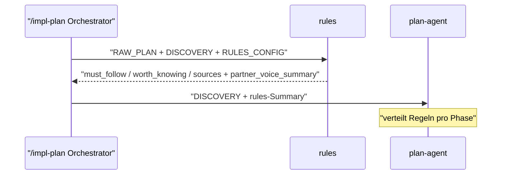
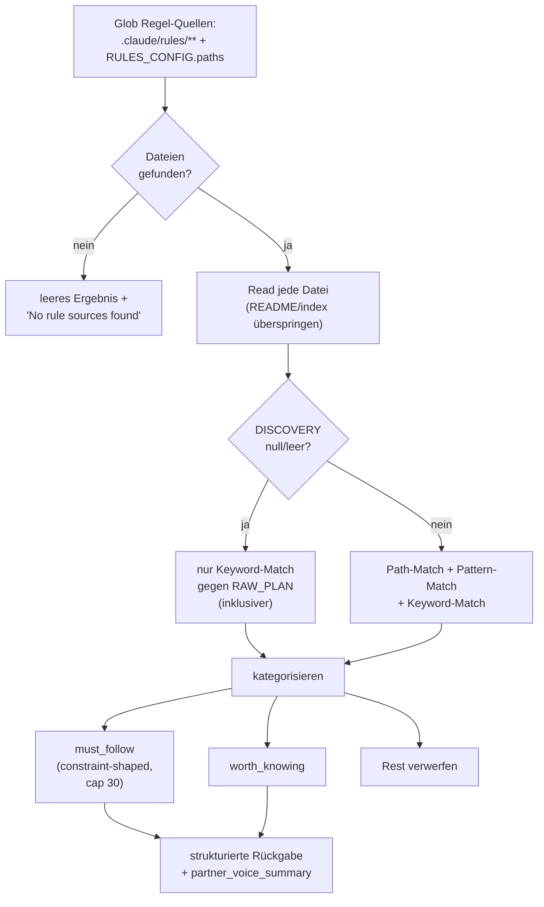

← [agents](_agents.md)

# rules

Read-only Filter-Agent: scannt `.claude/rules/**` plus die in `anchored.yml` (`plan.rules`) konfigurierten Quellpfade, matcht jede gefundene Regel gegen die Task (RAW_PLAN + DISCOVERY) und liefert eine kategorisierte Liste `must_follow` vs. `worth_knowing` zurück. Reiner Denker — er trifft keine Planungsentscheidungen, sondern liefert dem [plan](./plan.md)-Agenten das Material für die Verteilung von Regeln pro Phase. Läuft während `/impl-plan`.

## Was

- Der Agent heißt `rules`, läuft auf `model: opus` und hat ausschließlich die Tools `Read`, `Glob`, `Grep` — kein `Write`/`Edit`, also strikt read-only by design.
- Er liest Source-Code NICHT erneut — Discovery (Explore) hat das bereits getan; das relevante Signal steckt in `DISCOVERY.affected_paths` und `DISCOVERY.patterns`.
- Input ist eine einzige Orchestrator-Nachricht mit den Feldern `RAW_PLAN`, `DISCOVERY` (`affected_paths`, `similar_code`, `patterns`) und `RULES_CONFIG` (`paths`, `additional_keywords`).
- Jedes Input-Feld darf leer sein (`null`, `[]`, abwesend) — leerer Input ist normal, kein Fehler.
- Regel-Quellen sind `.claude/rules/**` (Default, falls der Ordner existiert) plus jeder Pfad aus `RULES_CONFIG.paths`.
- Nicht-Regel-Dateien (`README.md`, `index.md`, reine Inhaltsverzeichnisse ohne Regelinhalt) werden beim Lesen übersprungen.
- Relevanz wird über drei Match-Arten beurteilt: **Path-Match** (Regel-`paths:`-Frontmatter oder -Body trifft `DISCOVERY.affected_paths`), **Pattern-Match** (Regel nennt ein `DISCOVERY.patterns`-Muster), **Keyword-Match** (Regel-Body/-Pfad nennt ein Keyword aus `RAW_PLAN` oder `RULES_CONFIG.additional_keywords` UND die Regel ist constraint-förmig: "must", "never", "always", "required").
- Ist `DISCOVERY` null/leer (Default seit V0.3: rules läuft parallel zu Explore), werden Path- und Pattern-Match übersprungen; es zählt nur Keyword-Match gegen `RAW_PLAN`. In diesem Fall wird bewusst etwas inklusiver gefiltert (rules-check verschärft das Mapping später in `/impl-refine`).
- `must_follow`: Regel, die diese Task aktiv einschränkt — Default-Verhalten würde sie verletzen, wenn nicht beachtet.
- `worth_knowing`: kontext-angrenzend relevant, aber nicht aktiv ausgelöst.
- Regeln ohne plausiblen Bezug werden verworfen (kein Padding).
- `must_follow` ist bei **30** Einträgen gedeckelt; bei Überschreitung wird priorisiert (was verletzt der Implementer am ehesten by default?), Rest wandert nach `worth_knowing` oder wird gedroppt.
- Jeder `rule:`-Eintrag MUSS auf eine real gelesene Datei zurückführbar sein — keine erfundenen Regeln.
- `why:` muss den Bezug zur konkreten Task nennen (z. B. "task adds new middleware"), nicht die Regel allgemein beschreiben.
- Alle Pfade in der Rückgabe MÜSSEN projekt-relativ sein (z. B. `.claude/rules/_pattern/foo.md`) — NIE absolut. Glob liefert absolute Pfade; der Projekt-Root-Prefix wird vorher abgeschnitten.
- Das Feld `partner_voice_summary` ist **REQUIRED** — der Orchestrator gibt es verbatim an den User weiter; plan-agent nutzt es als Schnell-Signal.
- Leeres Ergebnis ist gültig und häufig: ohne Quellen `"No rule sources found in expected locations."`, mit Quellen aber ohne Treffer `"No rules matched this task scope."` — niemals erroren.

## Wie

### Benutzung

Der Agent wird vom `/impl-plan`-Orchestrator aufgerufen — nach Discovery, vor dem [plan](./plan.md)-Agenten (bzw. seit V0.3 parallel zu Explore). Er erhält eine Nachricht mit `RAW_PLAN` / `DISCOVERY` / `RULES_CONFIG` und antwortet mit einem strukturierten YAML-Block:

```yaml
must_follow:
  - rule: "<Ein-Zeilen-Zusammenfassung, was die Regel erzwingt>"
    path: <projekt-relativer Regel-Dateipfad>
    why: "<eine Zeile: warum gilt sie für DIESE Task>"
worth_knowing:
  - rule: "<Ein-Zeilen-Zusammenfassung>"
    path: <projekt-relativer Regel-Dateipfad>
sources:
  - <projekt-relativer gescannter Pfad>
partner_voice_summary: |
  <1-2 Sätze Pair-Programmer-Stimme; Regel-Zähler in menschlichen
  Begriffen, nicht Tool-Zähler>
```

`must_follow` / `worth_knowing` / `sources` speisen plan-agents Verteilung pro Phase; `partner_voice_summary` wird an den User relayt.



### Funktion



## Warum

- **Strikt read-only (kein Write/Edit):** Der Output ist rein informativ; würde rules selbst Regeln editieren, kollabierte die Separation of Concerns, auf die der Orchestrator baut.
- **Kein erneutes Lesen von Source-Code:** Discovery hat Source bereits gemappt; Tokens für Source-Dateien sind Tokens, die nicht für mehr Regel-Dateien zur Verfügung stehen.
- **Projekt-relative Pfade Pflicht:** absolute Pfade backen das Home-Verzeichnis eines Entwicklers in die Task-Datei und machen sie nicht-portabel.
- **`must_follow`-Cap bei 30:** mehr als 30 Regeln kann der Planner nicht sinnvoll verarbeiten — der Output wird Rauschen.
- **Keine erfundenen Regeln:** eine erfundene Regel wird vom Planner kodiert, vom Implementer erzwungen und verwirrt den User, der den Standard nie geschrieben hat.
- **Inklusiver filtern ohne DISCOVERY:** Über-Inkludieren kostet nichts (rules-check verschärft später), Unter-Inkludieren würde echte Constraints verpassen.

## Wann

- Aufruf während `/impl-plan`, nach Discovery und vor dem plan-agent — bzw. seit V0.3 parallel zu Explore aus Performance-Gründen, wodurch `DISCOVERY` zum Zeitpunkt des rules-Laufs null sein kann.
- Einmaliger Filter-Lauf pro Plan-Erstellung; die spätere Verschärfung des Regel-pro-Phase-Mappings übernimmt [rules-check](./rules-check.md) in `/impl-refine`.
