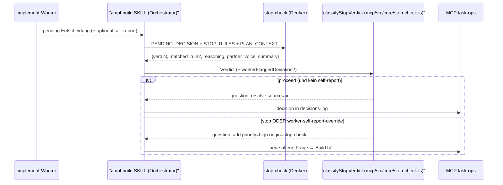
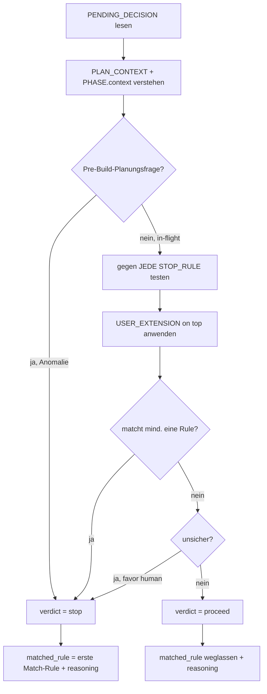

← [agents](_agents.md)

# stop-check

Build-Zeit-Halt-Richter und zweites Sicherheitsnetz: gegeben EINE pending Build-Entscheidung (eine Wahl, die der implement-Worker autonom treffen will) plus die globalen `anchored.yml.build.stop`-Rules, entscheidet stop-check pro Aufruf das Verdict `stop` (→ Eskalation an den User) oder `proceed` (→ autonome Dokumentation der Entscheidung). Reiner Denker ohne Write/Edit/MCP — er gibt nur ein strukturiertes Verdict zurück, das die [implement](./implement.md)-Pipeline bzw. die /impl-build-SKILL über `classifyStopVerdict` auf MCP-Ops abbildet. BUILD-TIME ONLY.

## Was

- Rolle: `name: stop-check`, `model: opus`, Tools nur `Read, Glob, Grep` (Frontmatter) — reiner Denker, kein Write, kein Edit, kein MCP.
- Bewertet GENAU EINE `PENDING_DECISION` pro Invocation gegen die VOLLE `STOP_RULES`-Liste (one decision per invocation).
- `STOP_RULES` ist das globale Array `anchored.yml.build.stop`. Semantik: leer/abwesend → Build voll autonom, stop-check wird normalerweise nie aufgerufen; falls doch → `proceed`. Non-empty → Build hält beim ERSTEN matchenden Rule.
- Shipped default trägt genau eine Rule: `'a decision deviates from the plan'` (in `mcp/src/core/stop-check.ts` als `DEFAULT_STOP_RULE`, single source of truth für Prompt, Schema-Default und Tests).
- Default-Rule matcht, wenn die Entscheidung etwas wählt, das der Plan NICHT spezifiziert hat, ODER dem widerspricht, was der Plan spezifiziert hat. Reines Ausführen des Plans → kein Match.
- User-added Rules werden wörtlich gegen ihre Prosa beurteilt.
- Verdict `stop` → Entscheidung matcht MINDESTENS eine Rule; `matched_rule` MUSS die exakte (erste matchende) Rule-Zeichenkette sein. Verdict `proceed` → KEINE Rule matcht; `matched_rule` wird weggelassen.
- `reasoning` ist für BEIDE Verdicts PFLICHT und nie leer — ein `proceed` mit leerem reasoning würde die downstream-Invariante `source='ai'`-braucht-reasoning (`mcp/src/core/ops/question.ts`) verletzen; `classifyStopVerdict` weist ein leeres Verdict zurück (`InvalidStopVerdict`).
- Bei echter Unsicherheit lehnt stop-check Richtung `stop` (asymmetrische Kosten: ein unnötiger Stop = eine billige Frage; ein falsches proceed = eine ungeprüfte Entscheidung wird einzementiert).
- Scope: BUILD-TIME ONLY. Pre-Build-Planungsfragen werden NICHT bewertet (die werden in /impl-refines Q&A-Walk geklärt). Sieht der Input wie eine Planungsfrage aus → das ist eine Anomalie → default `stop` (eskalieren).
- Doppeltes Sicherheitsnetz: der implement-Worker self-reportet ebenfalls Plan-Abweichungen; stop-check ist die unabhängige zweite Prüfung und läuft auf jede pending Entscheidung, egal ob der Worker geflaggt hat.
- Wenn der Worker eine Abweichung self-reportet hat, erzwingt die SKILL über `classifyStopVerdicts` second-eye-override (`workerFlaggedDeviation`, synthetische `SECOND_EYE_RULE`) deterministisch einen Stop — UNABHÄNGIG vom Verdict. stop-check beurteilt die Entscheidung trotzdem auf eigene Faust und gibt sein ehrliches Verdict zurück.
- Optionales `USER_EXTENSION` aus `anchored.yml.build.stop_check.instructions` erweitert die Kriterien ON TOP der Defaults — es ersetzt nie; alle `STOP_RULES` werden weiterhin getestet.

## Wie

### Benutzung

stop-check ist ein reiner Denker: der Orchestrator (die /impl-build-SKILL bzw. Phase-5 dynamic-workflow-executor) ruft ihn einmal pro Build-Entscheidung auf, füttert den unten genannten Input und wendet das zurückgegebene Verdict über `classifyStopVerdict` (`mcp/src/core/stop-check.ts`) auf MCP-Ops an.

Input-Felder: `PROJECT_ROOT`, `TASK_SLUG`, `PHASE` (`slug`, `name`, `context`, `acceptance_criteria`), `PENDING_DECISION` (`description`, optional `options`, optional `worker_self_report`), `STOP_RULES`, `PLAN_CONTEXT`, optional `USER_EXTENSION`.

Return-Contract (strukturiert):

```yaml
verdict: stop | proceed
matched_rule: "<exakte STOP_RULES-Zeichenkette>"   # PFLICHT iff verdict==stop; bei proceed weglassen
reasoning: |
  <WARUM dieses Verdict. Bei proceed: wird zur question_resolve-reasoning,
   die der /impl-wrap-Reviewer liest → audit-grade. Bei stop: welche Rule
   matchte und wie. PFLICHT für BEIDE, nie leer.>
partner_voice_summary: |
  <1-2 Sätze Pair-Programmer-Stimme, die der Orchestrator dem User relayt.>
```

`partner_voice_summary` ist reine Kommunikation, kein Routing — `classifyStopVerdict` ignoriert es; die SKILL liest es direkt vom Return ab und zeigt es im Chat. Machinery-Voice (Tool-/MCP-Namen) bleibt draußen (siehe `plugin/references/communication-style.md`).



### Funktion



Read/Glob/Grep werden genutzt, um das Urteil im echten Plan + Code zu erden, wenn das Match einer Rule von Fakten abhängt (z. B. "gibt es einen bestehenden Handler, den der Plan nicht erwähnte?").

## Warum

- Reiner Denker ohne MCP-Zugriff, weil plugin-subagents kein MCP erreichen können (Bug #13605); die deterministische Seam `classifyStopVerdict` trennt Urteil (LLM) von Plumbing (unit-testbar ohne Live-LLM).
- Doppeltes Sicherheitsnetz mit deterministischem second-eye-override: ein self-reportetes Deviation hält IMMER an, weil die Kosten asymmetrisch sind — eine billige Frage gegen eine ungeprüft einzementierte Entscheidung.

## Wann

- BUILD-TIME, pro Build-Entscheidungspunkt: während der implement-Worker eine Phase abarbeitet und auf eine vom Plan nicht voll festgelegte Wahl trifft. Einmal pro Entscheidung aufgerufen.
- Dieselbe `classifyStopVerdict`-Seam wird auch vom Phase-5 dynamic-workflow-executor-Phasenend-Gate konsumiert — derselbe Contract routet bei beiden.
- NIE pre-build: Planungsfragen sind in /impl-refine längst geklärt, bevor stop-check läuft.
