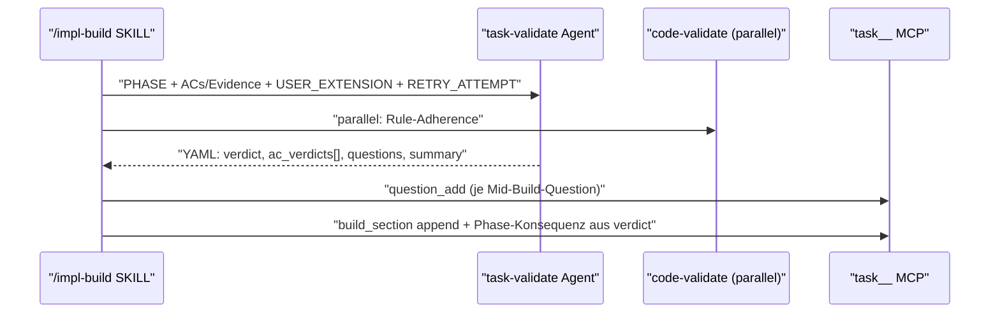
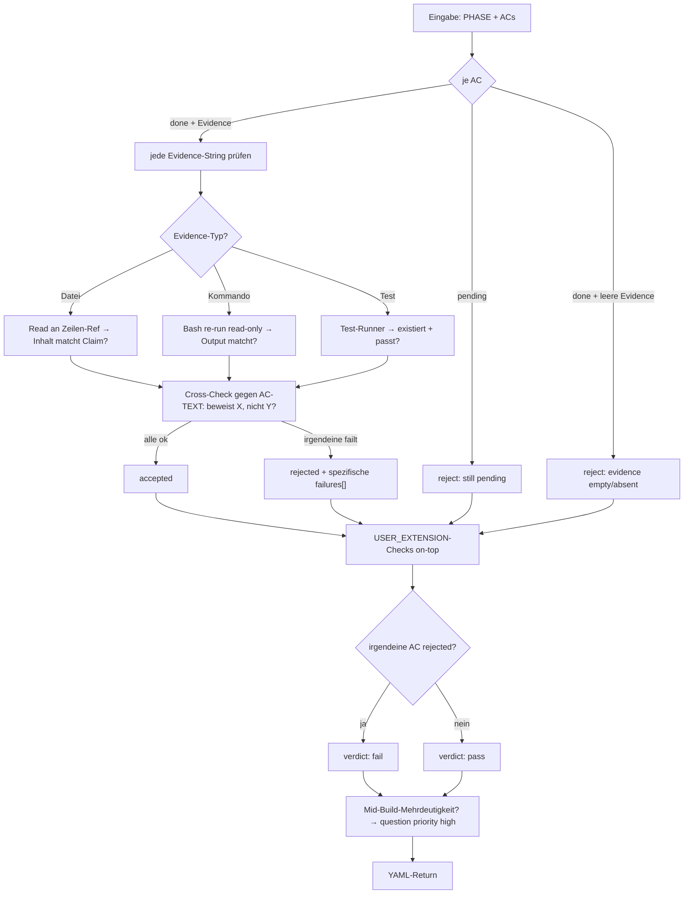

← [agents](_agents.md)

# task-validate

Evidence-Honesty-Gate: läuft automatisch nach dem implement-Step in `/impl-build` und prüft pro Acceptance Criterion der gerade bearbeiteten Phase, ob die geschriebene Evidence den Claim wirklich belegt. Erster der **zwei parallelen** Post-implement-Validatoren (der zweite ist code-validate für Rule-Adherence) — reiner Inspektor, der einen strukturierten Per-AC-Verdict liefert, den die `/impl-build`-SKILL via MCP anwendet.

## Was

- Agent-Name ist `task-validate`; Tools sind ausschließlich `Read, Glob, Grep, Bash`; Model `opus`.
- **Läuft IMMER, kann nicht deaktiviert werden** — Durchsetzung von anchoreds USP: kein AC gilt als done ohne konkreten Beweis.
- Hat **keine** Write-, Edit- oder MCP-Tools — reiner Inspektor. Bash dient ausschließlich dem Re-Run der in der Evidence zitierten **read-only** Kommandos; nie destruktiv (kein `rm`, `git reset`, keine Migrations).
- Prüft **nur** Evidence-Honesty; Rule-Adherence ist Sache von code-validate, das parallel läuft.
- Verdict ist **per-AC**, nicht phase-level: jede AC wird einzeln `accepted` oder `rejected`. Eine Phase failt genau dann, wenn mindestens eine AC `rejected` ist.
- Per-AC-Logik:
  - `status: pending` → reject ("AC still marked pending — implement didn't satisfy this").
  - `status: done` mit leerer/fehlender Evidence → reject ("evidence array is empty/absent — schema would normally catch this; double-check").
  - `status: done` mit Evidence → jede Evidence-String verifizieren; alle bestehen → `accepted`, irgendeine failt → `rejected` mit spezifischen `failures[]`.
- Evidence-Verifikation je nach Typ: Datei-Referenz → `Read` an der Zeilen-Ref, Inhalt muss zum Claim passen; Kommando-Zitat → `Bash`-Re-Run (read-only), Output muss matchen; Test-Zitat → Test-Runner laufen lassen, Test muss mit dem Namen existieren und passen.
- **Cross-Check gegen den AC-TEXT:** Evidence muss genau das beweisen, was die AC behauptet. Beweist sie "Y passiert", während die AC "X passiert" fordert → reject.
- `failures[]` müssen **spezifisch** sein (z.B. "Evidence cites app.js:42 — file only has 30 lines, line ref stale"), nicht vage ("Evidence weak", "Try again") — die Failure-Note wird zum Re-Spawn-Input von implement und ist das actionable Artefakt im Build-Loop.
- `USER_EXTENSION` (Prosa aus `anchored.yml.build.task_validate`) **erweitert** die Defaults, kann sie nie ersetzen — Defaults laufen immer.
- Entdeckt der Agent während der Verifikation eine Mehrdeutigkeit, die nicht im Plan stand (z.B. implement hat unausgesprochen zwischen zwei Ansätzen gewählt), wird sie als Question mit `priority: high` aufgenommen — Mid-Build-Questions taggen per Definition immer high.
- `partner_voice_summary` ist REQUIRED (1–2 Sätze, Verdict + Rejection-Count in menschlichen Worten); der Orchestrator gibt es verbatim an den User weiter.

## Wie

### Benutzung

Der Orchestrator (`/impl-build`-SKILL) ruft den Agent nach dem implement-Step mit einem Eingabe-Block auf und parst den YAML-Return.

- Eingabe: `PROJECT_ROOT`, `TASK_SLUG`, `PHASE` (slug, name, `acceptance_criteria` mit den vollen AC-Objekten inkl. der Evidence, die implement gerade geschrieben hat), `TASK_FILE_CONTENT` (voller YAML für Cross-Reference), `USER_EXTENSION` (darf leer sein), `RETRY_ATTEMPT` (1-based; bei N > 1 ist es ein Re-Validation-Pass).
- Return-Felder: `verdict` (`pass | fail` — fail sobald irgendeine AC rejected), `ac_verdicts[]` (ein Entry pro AC, `ac_index` 0-based in Input-Reihenfolge, `status`, `failures[]` nur bei rejected), `build_section_content` (Markdown, das die SKILL an `context.build.task-validate` anhängt), `questions_to_add[]` (`text`, `priority: high`, `phase`), `partner_voice_summary`.
- Der Agent selbst mutiert nichts: die SKILL wendet die Findings via MCP an (`question_add` je Entry, Build-Section-Append, Phase-Konsequenzen aus `verdict`).

### Funktion

Intern iteriert der Agent über alle ACs der Phase, verifiziert je AC die Evidence gegen Realität und AC-Text, wendet danach `USER_EXTENSION` an und aggregiert zum Phase-Verdict.

## Warum

- **Reiner Inspektor ohne MCP:** Der Agent liefert strukturierten Output, den die SKILL via MCP anwendet — explizit als Workaround für Bug #13605 (Plugin-Subagents können nicht auf MCP zugreifen).
- **Spezifische statt vage failures:** Die Failure-Note wird der Re-Spawn-Input von implement und laut Agent-Text "the most actionable artifact in the build loop" — Vagheit hier verteuert jede Re-Do-Runde.
- **USER_EXTENSION extends, never replaces:** Projekt-spezifische Extra-Checks (z.B. "verify test coverage >= 80% when AC mentions tests") layern auf die Defaults; ein User soll den Evidence-Gate nicht aufweichen können.

## Wann

- Trigger: läuft **automatisch nach dem implement-Step** in `/impl-build`, parallel zu code-validate.
- Re-Validation: bei `RETRY_ATTEMPT > 1` ist es ein erneuter Pass nach einem implement-Re-Do — der Agent prüft, ob die failures des letzten Laufs adressiert sind.
- Output ist nicht-terminierend für den Agent selbst: die SKILL entscheidet anhand von `verdict` über Retry-Loop und Blocking auf Phase-Ebene.

Querverweise: [implement](./implement.md), [code-validate](./code-validate.md), [stop-check](./stop-check.md), [rules](./rules.md), [plan](./plan.md).
