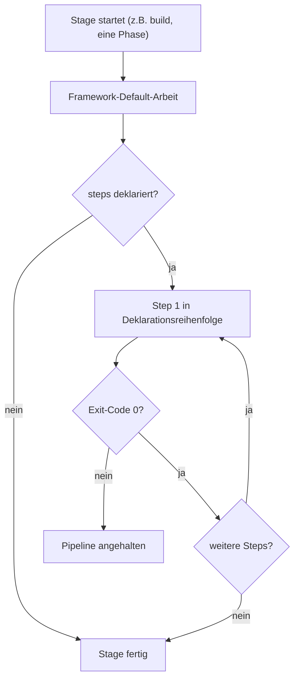
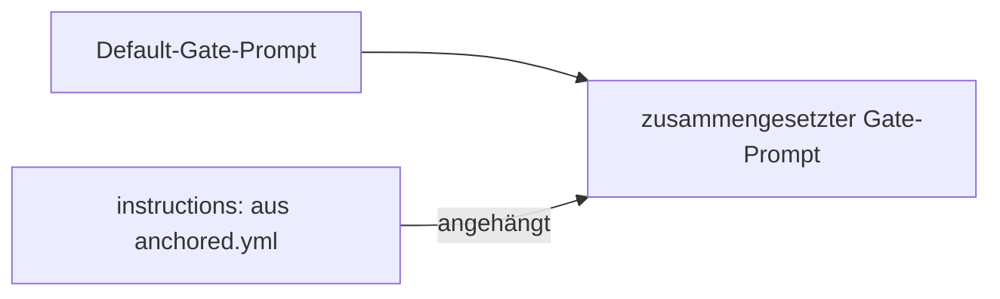

← [plugin](_plugin.md)

# Erweitern von anchored

Die gesamte Konfiguration liegt in einer einzigen Datei: `anchored.yml` im Projekt-Root. Das Framework bringt Defaults mit — du schreibst nur die Slots, die du ändern willst. Vier Erweiterungs-Pattern bauen auf derselben Konfigurationsfläche auf und reichen von einzelnen Shell-Steps bis zu durchgesetzten Methodologie-Contracts. Siehe auch die [Plugin-Übersicht](./overview.md).

## Was

- Alle Konfiguration lebt in `anchored.yml` im Projekt-Root; jeder Wert dort hat einen Default, nur abweichende Slots werden geschrieben.
- Die Top-Level-Bereiche sind `task`, `plan`, `refine`, `build`, `wrap` — sie entsprechen den Lebenszyklus-Stages.
- **Pattern 1 — Custom Step:** Ein Step ist `{ name, run: '<shell command>' }`. Steps laufen in Deklarationsreihenfolge, *nachdem* die Default-Arbeit der Stage abgeschlossen ist.
- Steps sind in `plan.steps`, `refine.steps`, `build.steps` und `wrap.steps` deklarierbar; `build.steps` laufen nach *jeder* Phase.
- Verfügbare Env-Vars hängen von der Stage ab — nur `build.steps` läuft in einer Per-Phase-Schleife und hat damit Phasen-Kontext:

  | Stage | Verfügbare Env-Vars |
  | --- | --- |
  | `plan.steps` | `${TASK_SLUG}`, `${TASK_TITLE}` |
  | `refine.steps` | `${TASK_SLUG}`, `${TASK_TITLE}` |
  | `build.steps` | `${TASK_SLUG}`, `${TASK_TITLE}`, `${PHASE_SLUG}`, `${PHASE_NAME}` |
  | `wrap.steps` | `${TASK_SLUG}`, `${TASK_TITLE}` |
- Ein Exit-Code ungleich Null in einem Step hält die Pipeline an.
- **Pattern 2 — Custom Phase-Feld:** Ein Feld ist ein typisierter Slot, den jede Phase trägt, deklariert unter `task.phase.fields` als `{ name, type }`.
- Unterstützte Typen: `string`, `number`, `boolean`, `enum` (mit `values:`).
- Felder werden über `anchored field set` / `field get` aus Steps gelesen/geschrieben.
- **Pattern 3 — Quality-Gate-Extension:** Die vier verpflichtenden Gates `plan_check`, `rules_check` (unter `refine`), `task_validate`, `code_validate` (unter `build`) nehmen eine `instructions:`-Prosa.
- Der `instructions:`-Text wird an den Default-Prompt des Gates **angehängt**, ersetzt ihn nie.
- Gates können nicht deaktiviert werden — das ist der Framework-Contract; Erweitern ist der einzige Knopf.
- **Pattern 4 — Eigene Methodologie:** Kombination der Pattern 1–3, um Architektur-Prinzipien durchzusetzen (Beispiel: TDD + Functional Core / Imperative Shell über `plan_check`- und `code_validate`-Instructions).
- `build.retry_limit` (Default `3`) begrenzt die failure-getriebenen Retries pro Phase.

## Wie

### Benutzung

Pattern 1 — Custom Step in einer beliebigen Stage:

```yaml
build:
  steps:
    - name: commit
      run: 'git add -A && git commit -m "phase: ${PHASE_SLUG}"'
```

Pattern 2 — Custom Phase-Feld deklarieren und aus einem Step beschreiben:

```yaml
task:
  phase:
    fields:
      - name: commit
        type: string
      - name: coverage_pct
        type: number

build:
  steps:
    - name: commit-and-record
      run: |
        git add -A && git commit -m "phase: ${PHASE_SLUG}"
        SHA=$(git rev-parse HEAD)
        anchored field set ${TASK_SLUG} ${PHASE_SLUG} commit "${SHA}"
```

Pattern 3 — Gate mit `instructions:` erweitern:

```yaml
refine:
  plan_check:
    instructions: |
      Every AC must reference its paired test-file before implementation.
      Flag any phase that leads with implementation code instead of tests.
```

Pattern 4 — Methodologie durch Kombination von Gate-Instructions durchsetzen:

```yaml
refine:
  plan_check:
    instructions: |
      TDD: every AC paired with a test-file reference.
      FC/IS: pure functions in `core/`, IO/DOM/storage in `shell/`.
build:
  code_validate:
    instructions: |
      Verify Functional Core / Imperative Shell separation: no DOM/
      localStorage/Date/crypto calls inside `core/` files.
```

### Funktion

Custom Steps und Default-Arbeit verhalten sich innerhalb einer Stage so:



Quality-Gate-Prompts werden additiv zusammengesetzt — die `instructions:` ergänzen den Default, statt ihn zu ersetzen:



## Warum

- Quality-Gates lassen sich bewusst nicht deaktivieren: Die vier Gates sind der Framework-Contract, und `instructions:` wird ausschließlich angehängt — so bleibt die Mindestprüfung erhalten, während Projekte sie nur verschärfen können.

## Referenz

- Annotierte Default-`anchored.yml`: `plugin/references/default-config.yml`
- JSON-Schema (IDE-Autocomplete + Validierung): `plugin/references/schema/anchored-yml.schema.json`
- Task-File-Shape: `plugin/references/task-file-schema.md`
