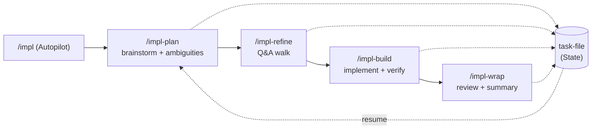
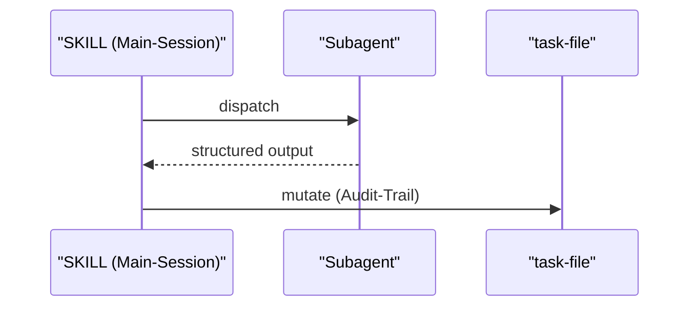

← [plugin](_plugin.md)

# Plugin-Überblick (README)

anchored ist ein konfigurierbares Orchestrierungs-Framework für autonome KI-Coding-Läufe: Die KI schreibt, anchored verifiziert. Das README beschreibt den Lebenszyklus aus vier Befehlen (`/impl-plan` → `/impl-refine` → `/impl-build` → `/impl-wrap`), den Quickstart, die Konfiguration über `anchored.yml` sowie eine bekannte Einschränkung bei Plugin-Subagents.

## Was

- anchored ist ein **konfigurierbares Orchestrierungs-Framework** für KI-Coding-Läufe; es zielt darauf, ganze Epics autonom mit eingebauter Engineering-Disziplin auszuliefern.
- Das Grundprinzip ist der Zyklus **implement → verify → proof**, der in jede Phase des Laufs eingebaut ist; ein selbst-dokumentierender Pipeline-Lauf erfasst Pläne, Entscheidungen und Ergebnisse in einem Dokument.
- Erklärtes Ziel: Halluzinationen auf langen Läufen minimieren, Output-Qualität und Geschwindigkeit maximieren ("setup. run. ship.").
- Der Lebenszyklus besteht aus vier Befehlen:
  - `/impl-plan <description>` — Brainstorming + Aufdecken von Mehrdeutigkeiten.
  - `/impl-refine` — Q&A-Walk (mit wählbarem walk-style).
  - `/impl-build` — Implementieren + Verifizieren pro Phase.
  - `/impl-wrap` — Review + Zusammenfassung.
- `/impl <describe a complex feature>` ist der **Autopilot**, der den vollständigen Lebenszyklus plan → refine → build → wrap am Stück durchläuft.
- Der Lauf ist **resume-safe**: Man kann an jeder Stufe anhalten und später weitermachen; das task-file hält den State, sodass das erneute Ausführen eines Befehls dort fortsetzt, wo man aufgehört hat.
- **Installation**: in Claude Code `/plugin install anchored` und `/reload-plugins`; danach in einer beliebigen Projekt-Session aufrufbar.
- **Konfiguration** über `anchored.yml` im Projekt-Root. Die Datei wird leer ausgeliefert (Defaults inline dokumentiert); man kommentiert + editiert nur die gewünschten Slots ein.
- Jede Stufe (plan / refine / build / wrap) bringt **Default-Agents** mit, ist aber über eigene Steps oder Agents voll erweiterbar (z. B. Per-Phase-Commits, Lint-/Test-Läufe, PR-Erstellung, Slack-Notify, Deploy-Trigger, eigene Validatoren).
- **Bekannte Einschränkung**: Plugin-Subagents können MCP-Tools derzeit nicht direkt aufrufen (bestätigt in claude-code Issues #13605 und #21560). anchored behandelt das transparent: SKILLs (Main-Session) besitzen alle task-file-Mutationen, nachdem Agents ihren structured output zurückgegeben haben — gleicher Audit-Trail, gleiches Ergebnis.
- **Lizenz**: MIT.

## Wie

### Benutzung

Der Einstieg läuft über Slash-Befehle in Claude Code. Nach einmaliger Installation startet entweder der Autopilot oder ein einzelner Schritt:

```
/impl <describe a complex feature>   # Autopilot: plan → refine → build → wrap

/impl-plan <description>   # brainstorm + surface ambiguities
/impl-refine               # Q&A walk (pick a walk-style)
/impl-build                # implement + verify per phase
/impl-wrap                 # review + summary
```

Die Konfiguration erfolgt deklarativ über `anchored.yml` im Projekt-Root. Erweiterungen (eigene Steps/Agents) sind in `EXTENDING.md` mit Beispielen beschrieben — siehe dazu [extending](./extending.md); die vollständige Slot-Liste mit inline-Dokumentation liegt in `references/default-config.yml`.

### Funktion

Die vier Befehle bilden eine Pipeline; jeder Befehl liest und schreibt den State im task-file, wodurch ein erneuter Aufruf am hinterlegten Stand fortsetzt.



Bei den eingebauten Default-Agents fließt das Ergebnis nicht direkt vom Subagent ins task-file: Wegen der bekannten MCP-Einschränkung geben Agents structured output zurück, und die SKILLs der Main-Session führen die task-file-Mutationen aus.



## Warum

Die README begründet die SKILL-eigene Mutation der task-files explizit mit der bestätigten Einschränkung, dass Plugin-Subagents MCP-Tools nicht direkt aufrufen können (Issues #13605 / #21560). Der gewählte Weg erhält denselben Audit-Trail und dasselbe Ergebnis; sobald upstream behoben, sollen Agents MCP direkt nutzen — ohne Code-Änderungen hier.

## Wann

Alle Befehle sind explicit-only: Sie greifen, wenn der Nutzer sie in einer Claude-Code-Session eingibt. Der typische Verlauf ist `/impl-plan` → `/impl-refine` → `/impl-build` → `/impl-wrap` (oder `/impl` als Autopilot über alle vier). Da der State im task-file liegt, kann an jeder Stufe gestoppt und durch erneutes Ausführen des jeweiligen Befehls fortgesetzt werden.
