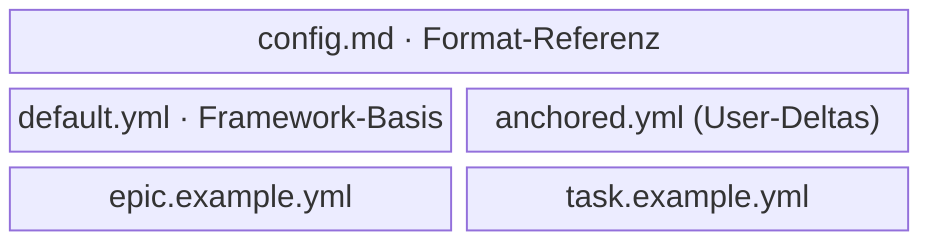

← [plugin](../_plugin.md)

# references

Die **mitgelieferten Referenz-Artefakte** des Plugins — die SSOT für das
`anchored.yml`-Format, die vollständige Default-Config und je ein annotiertes
Beispiel-Node pro Tier. Reine Nachschlage-Materialien: kein Code, keine Mutation —
die Dateien, auf die `init`/`bootstrap` und die Skills verweisen.

| Unit | Verantwortung (Scope-Grenze) |
|---|---|
| [config.md](../../../plugin/references/config.md) | Die Format-Referenz: Tiers × Stages × Steps, Built-in-Steps, `fields`, `each`/`stop`, `_lib`. Erklärt *wie man `anchored.yml` schreibt* — alles Format-Wissen gehört hierher. Selbst schon Prosa-Doku → direkt das Artefakt. |
| [default.yml](../../../plugin/references/default.yml) | Die vollständige Default-Config (Framework-Basis). `bootstrap` merged sie mit den User-Deltas; `init` verweist nur darauf (kopiert sie nie). Daten-Artefakt — die erschöpfende Feld-/Step-Liste pro Tier ist micro. |
| [epic.example.yml](../../../plugin/references/epic.example.yml) | Annotiertes `_epic.yml`-Beispiel: PM-Tier mit `tasks`-Stubs als Loop-Queue, ohne Phasen. Belegungs-Vorlage. |
| [task.example.yml](../../../plugin/references/task.example.yml) | Annotiertes Task-File-Beispiel: die `context`-WWWW-Trails pro Stage, Phasen als Kinder, `each: phase`. Belegungs-Vorlage. |

> `default.yml` ist **Daten**, kein Prosa-Dokument — sie wird gegen das
> [config-Schema](../../core/schema/config.md) validiert und ist die Quelle, aus der
> [bootstrap](../../core/config/bootstrap.md) die `effectiveConfig` baut.
