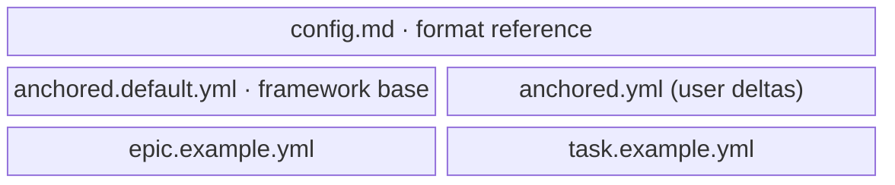

← [plugin](../_plugin.md)

# references

The **bundled reference artifacts** of the plugin — the SSOT for the
`anchored.yml` format, the complete default config, and one annotated
example node per tier. Pure lookup materials: no code, no mutation —
the files that `init`/`bootstrap` and the skills point to.

| Unit | Responsibility (scope boundary) |
|---|---|
| [config.md](../../../plugin/references/config.md) | The format reference: tiers × stages × steps, built-in steps, `fields`, `each`/`stop`, `_lib`. Explains *how to write `anchored.yml`* — all format knowledge belongs here. Itself already prose docs → directly the artifact. |
| [anchored.default.yml](../../../plugin/references/anchored.default.yml) | The complete default config (framework base). `bootstrap` merges it with the user deltas; `init` only points to it (never copies it). Data artifact — the exhaustive field/step list per tier is micro. |
| [epic.example.yml](../../../plugin/references/epic.example.yml) | Annotated `_epic.yml` example: PM tier with `tasks` stubs as loop queue, without phases. Population template. |
| [task.example.yml](../../../plugin/references/task.example.yml) | Annotated task-file example: the `context` WWWW trails per stage, phases as children, `each: phase`. Population template. |

> `anchored.default.yml` is **data**, not a prose document — it is validated against the
> [config schema](../../core/schema/config.md) and is the source from which
> [bootstrap](../../core/config/bootstrap.md) builds the `effectiveConfig`.
