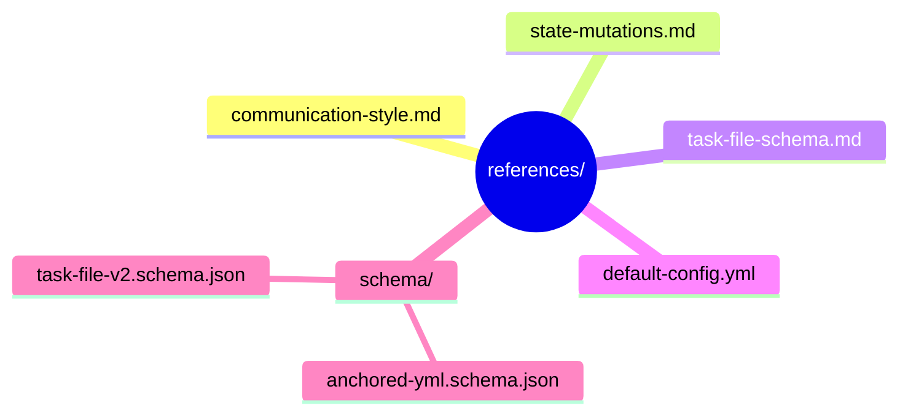

← [plugin](../_plugin.md)

# references

On-demand-**Referenzmaterial**, das Skills und Agents bei Bedarf laden: der
Voice/Style-Contract, die MCP-Mutations-Referenz, der Task-File-Struktur-Guide und die
zwei publizierten JSON-Schemas (für IDE-Validierung + Autocomplete).

| Bereich / Datei | Rolle | Verantwortung (Scope-Grenze) |
|---|---|---|
| [schema](schema/_schema.md) | macro | Die zwei publizierten JSON-Schemas, gegen die IDEs Task-File und `anchored.yml` validieren. |
| [communication-style](communication-style.md) | medio | Der Voice-Contract: Partner-Stimme im Dialog, Maschinen-Stimme nur in Audit-Trails. Gilt für alle Skills/Agents. |
| [state-mutations](state-mutations.md) | medio | Vollständige Referenz der MCP-Mutations-Fläche, die Skills nutzen, um Agent-Output anzuwenden + Status zu verwalten. |
| [task-file-schema](task-file-schema.md) | medio | Menschenlesbare Erklärung der Task-File-YAML-Struktur — Brücke zwischen JSON-Schema (micro) und Skill/Agent-Praxis. |
| [default-config](default-config.md) | micro | Annotiertes `anchored.yml`: jeder Config-Slot mit Inline-Kommentar + Default. |
