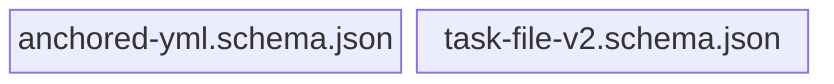

← [references](../_references.md)

# schema (published JSON)

Die zwei **publizierten JSON-Schemas**, gegen die IDEs via `yaml-language-server`-
Direktive automatisch validieren. Sie sind aus den Zod-Definitionen in
[`mcp/src/schema`](../../../mcp/src/schema/_schema.md) abgeleitet; ihre GitHub-raw-URLs
sind Teil des Vertrags (verschieben bricht User-Validierung).

| Datei | Rolle | Verantwortung (Scope-Grenze) |
|---|---|---|
| [anchored-yml-schema-json](anchored-yml-schema-json.md) | micro | Erschöpfende Feld-Definition der User-Config für IDE-Validierung + Autocomplete. |
| [task-file-v2-schema-json](task-file-v2-schema-json.md) | micro | Erschöpfende Feld-Definition der `.claude/tasks/<slug>.yml`-Struktur. |
