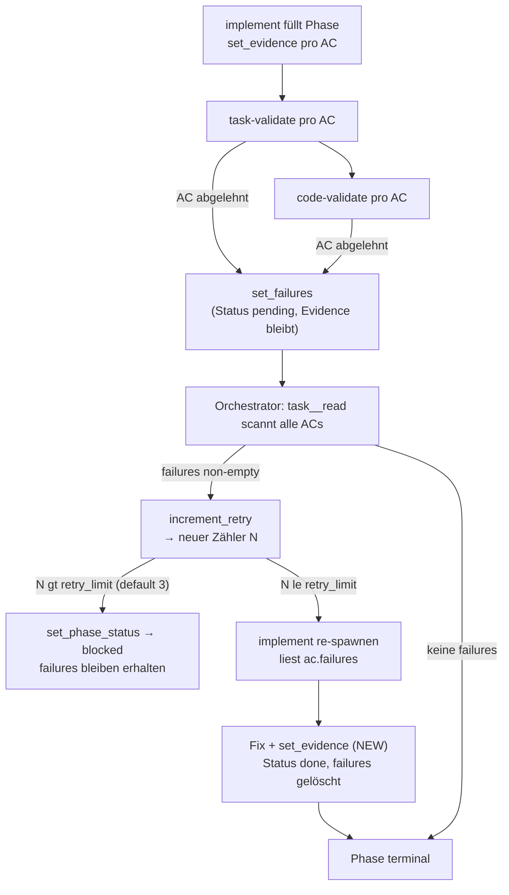

← [references](_references.md)

# State-Mutations: wer schreibt was in die Task-Datei

Vollständige Referenz der Mutations-Fläche, über die ausschließlich SKILLs (im Haupt-Claude-Session) die Task-Datei `.claude/tasks/<slug>.yml` verändern: alle `mcp__task__*`-Calls mit ihren atomaren Pre-/Post-Conditions, der Routing-Seam für Build-Stop-Entscheidungen und das Concurrency-Modell. Diese Seite erklärt die Schreib-Architektur, die hinter der für Skills sichtbaren [communication-style](./communication-style.md) und dem [task-file-schema](./task-file-schema.md) liegt.

## Was

- **Alle Mutationen** der Task-Datei laufen über die MCP-Factory-Tools (`mcp__task__*`); diese werden **ausschließlich von SKILLs** im Haupt-Session aufgerufen.
- **Kein Agent** (`plan`, `plan-check`, `rules-check`, `implement`, `task-validate`, `code-validate`, `rules`, `stop-check`) ruft jemals MCP. Agents liefern strukturierten Output zurück; der SKILL parst ihn und wendet ihn an.
- **Kein direktes `Write`/`Edit`** der Task-Datei durch irgendeinen Aktor — weder Agent noch SKILL. `mcp/tests/agent-frontmatter.test.ts` erzwingt, dass kein Agent in `plugin/agents/*` `Write`/`Edit` in seiner `tools:`-Liste hat; eine Reintroduktion bricht CI.
- Grund für „Agents rufen nie MCP": Anthropic-Bug **#13605** (sowie #21560, #33689, #15810) — plugin-definierte Custom-Subagents können MCP-Tools nicht erreichen, unabhängig von der Konfiguration (V0.3.1-Architektur).
- Die Factory (`mcp/src/core/factory.ts`) validiert Schema, erzwingt State-Machine-Übergänge und schreibt atomar bei jedem Call. Der Renderer injiziert auf jedem Write die `yaml-language-server: $schema=...`-Direktive.
- **Read-only-Pfade** (`task__read`, `task__list_phases`, `task__list_fields`, `task__get_field`, `task__next_phase`, `task__question_list`) mutieren nie und stehen jedem Aktor offen. SKILLs lesen die Task-Datei typischerweise vor und reichen den Inhalt an Agents weiter (Agents haben keinen MCP-Zugang).
- Die State-Machine ist **forward-only** — mit **genau einer** dokumentierten Ausnahme: Update-Mode in `/impl-plan` darf jeden Post-Plan-Status zurück auf `drafted` flippen. Nur `/impl-plan` übt diese Backward-Kante aus; `assertTaskTransition` (`mcp/src/core/ops/task.ts`) erlaubt sie.
- `phase.remove` wirft `DonePhaseImmutable` (`mcp/src/core/ops/phase.ts:174`), wenn nicht `{ force: true }` übergeben wird — Schutz erledigter Phasen auf dem Backward-Pfad.
- Es gibt **zwei Frontends, eine Service-Schicht**: MCP (typisierte JSON-In/Outputs für Subagent-/SKILL-Calls) und CLI (`anchored <noun> <verb> <args...>` für Shell-Hooks und Menschen). Beide wrappen dieselbe `factory.ts`-Fläche und divergieren nur an der I/O-Grenze.
- Was MCP **nicht** tut: keine Bulk-Operationen, keine transaktionalen Batches über mehrere Ops, kein Diff-against-History (Git ist die History), keine Cross-Op-Transaktionen (jede Op ist read → mutate → write; bei gleichem Ziel gewinnt der letzte Write).

### Mutations-Pfade pro SKILL

| SKILL | MCP-Calls | Ausgelöst durch |
|-------|-----------|-----------------|
| `/impl-plan` | `task__create`, `append_plan`, `add_phase` (×N), `question_add` (×M), `set_task_status` (`plan→drafted`) | plan-agent Struktur-Return (Mode A) |
| `/impl-plan` | `add_phase`, `remove_phase`, `move_phase`, `set_phase_name`, `set_phase_context`, `add_ac`, `remove_ac`, `set_ac_text` | plan-agent `diff[]`-Return (Mode B Restructure) |
| `/impl-refine` | `set_phase_rules`, `set_phase_context`, `append_plan`, `question_add`, `question_retag`, `append_build_section` | plan-check + rules-check Returns |
| `/impl-refine` | `question_resolve` (×N), `set_task_status` (`drafted→refined`) | Stage-3 Q&A-Walk + Stage-5 Transition |
| `/impl-build` | `set_phase_status`, `set_evidence`, `set_field`, `set_failures`, `append_build_section`, `increment_retry`, `set_task_status` (`build→wrap`) | implement + task-validate + code-validate Returns + Retry-Loop |
| `/impl-build` | `question_resolve` (`source='ai'`) ODER `question_add` (`origin='stop-check'`) | stop-check-Verdict über `classifyStopVerdict` |
| `/impl-wrap` | `append_wrap_section`, `set_wrap_intro`, `set_task_status` (`wrap→done`) | `/review`-Output + Summarize-Step |

## Wie

### Benutzung — der Per-AC-Schreib-Contract der Factory

Jede Mutation ist ein einzelner atomarer Write. Die fünf Per-AC-Primitiven:

- `evidence.set(...)` — setzt Evidence, flippt Status → `done`, **löscht** failures. Ein Write.
- `evidence.add(...)` — hängt Evidence-Zeile an, flippt Status → `done`, **löscht** failures. Ein Write.
- `failures.set(...)` — setzt failures, flippt Status zurück → `pending`, **behält** Evidence als History. Ein Write.
- `failures.clear(...)` — entfernt failures-Feld; Status unverändert. Ein Write.
- `status.set('pending')` — voller Reset: löscht Evidence **und** failures. Ein Write.

`question_resolve` erzwingt eine Invariante (`mcp/src/core/ops/question.ts`, Zeilen 199–217): `source='ai'` verlangt nicht-leeres `reasoning` (sonst `InvalidQuestionResolution`); `source='user'` verbietet `reasoning`.

Der `classifyStopVerdict`-Seam (`mcp/src/core/stop-check.ts`) ist eine **reine Funktion** ohne I/O und ohne MCP-Wissen. Er nimmt den `StopCheckVerdict` des stop-check-Agents `{verdict, matched_rule?, reasoning, partner_voice_summary?}` und gibt deterministisch die anzuwendende Task-Op zurück:

| verdict | geroutete Op | Bedeutung |
|---------|--------------|-----------|
| `proceed` | `question_resolve(source='ai', reasoning=<verdict.reasoning>)` | Entscheidung matchte KEINE Stop-Regel → autonom im Decisions-Log dokumentiert (das `/impl-wrap` reviewt). Nicht-leeres reasoning erfüllt die `source='ai'`-Invariante. |
| `stop` | `question_add(priority='high', origin='stop-check', …)` | Entscheidung matchte mind. eine Stop-Regel → NEUE offene Frage für den User, mit `matched_rule` + reasoning. Nicht auto-resolved; Build hält an. |

`classifyStopVerdict` validiert die Verdict-eigenen Invarianten (proceed muss reasoning tragen; stop muss `matched_rule` tragen), sodass ein fehlerhafter Agent-Return am Seam schnell scheitert statt eine still-falsche Task-Op zu erzeugen. Derselbe Seam wird vom Phase-5-dynamic-workflow-executor-Gate konsumiert — ein Contract, zwei Caller.

### Funktion — der Failures-driven Re-Do-Loop

Nach Abschluss einer Phase durch implement feuert task-validate pro AC; für jeden abgelehnten AC ruft es `set_failures` (setzt failures, flippt Status → `pending`, behält Evidence). code-validate läuft danach mit demselben Atomicity-Contract; lehnt es einen bereits abgelehnten AC ab, supersedieren seine failures (der AC spiegelt die Befunde des LATEST Validators).

Der einzelne `set_evidence`-Write ist die Recovery-Primitive — im Happy-Path braucht es keinen separaten `clear_failures`-Call. `retry_limit` (default 3) deckt: 1 Erst-Versuch + 2 Retries = 3 Gesamtversuche vor Erschöpfung; danach `blocked` mit erhaltenen failures, User-Intervention nötig.

### Funktion — Concurrency-Modell (3 Schichten)

Jeder Write geht durch `core/io.ts:atomicWrite`:

1. **Event-Loop-Atomicity** (intra-process): jede Factory-Op ist eine async-Funktion; sequentielle `await`s (`await op1; await op2;`) garantieren, dass read → mutate → write von op1 vor dem Read von op2 abschließt. `Promise.all` auf derselben Task interleaved die Reads — der Lock hält die Datei intakt, aber der spätere Write kann den früheren überschreiben (RMW-Race).
2. **Atomic File Writes** (Filesystem): Write in einen per-pid + Random-Suffix-Temp-Pfad, dann `rename(2)` auf das Ziel (atomar auf POSIX). Crashes mitten im Write lassen das Original intakt; Reader sehen alte oder neue Datei, nie eine partielle.
3. **Cross-Process-Locking** (multi-process): `proper-lockfile` akquiriert ein `<path>.lock`-Verzeichnis vor jedem Write. Hält ein anderer Prozess den Lock, retried der Caller 3× mit 100 ms Backoff (~400 ms Budget), dann `WriteContention`. Stale Locks (>10 s alt, kein mtime-Refresh) werden beim nächsten Acquire auto-reklamiert.

Empfohlenes Muster: **1 Task = 1 Worktree = 1 Session**. Multi-Session-Arbeit an derselben Task ist unterstützt (kein File-Corruption), erzeugt aber vermeidbare Contention und Lost-Update-Bugs.

`/impl-build` spawnt task-validate + code-validate **parallel** (sie schreiben verschiedene ACs; der Lock serialisiert die Writes). `/impl-refine` läuft plan-check + rules-check **sequenziell** — rules-check muss strukturelle Reshaping von plan-check sehen (Pipeline, keine unabhängigen Reviewer).

## Warum

- **Keine torn-state-Bug-Klasse auf Disk möglich**: jede Mutation gelingt voll oder es passiert kein Write — Folge des atomic-rename + Per-Op-Schreib-Contracts.
- **`classifyStopVerdict` als reine Funktion**: unit-testbar ohne Live-LLM — Verdict-Payload rein, geroutete Action raus. Die Plumbing wird getrennt von der Agent-Judgment getestet.
- **Asymmetrische Stop-Kosten** (`stop-check.ts`, `SECOND_EYE_RULE`): das Double-Safety-Net (stop-check-Evaluator + implement-Selbstreport) ist deterministisch, nicht advisory — eine selbst-gemeldete Plan-Abweichung hält IMMER an, weil ein unnötiger Stop nur eine billige Frage kostet, ein falsches `proceed` aber einen ungeprüften Call einbäckt.
- **Update-Mode flippt immer zurück auf `drafted`**: erzwingt erneutes `/impl-refine` (plan-check + rules-check) vor dem nächsten Build, sodass keine stale „already refined"-Annahme Post-Edit-Drift maskiert.
- **Round-Trip-Safety**: der Renderer bewahrt unbekannte Top-Level- und Phase-Keys (Zod `.passthrough()`, Forward-Compat), `customSections` und Block-Scalar-Formatierung. Hand-Edits des Users werden bei Folge-Mutationen nicht gefressen. Per-Phase-Extension-Felder aus `anchored.yml.task.phase.fields` landen hier; siehe [default-config](./default-config.md).

## Wann

- **Bootstrap-Ausnahmen: null.** V0.1 hatte eine Write- (plan-agent Task-Datei-Erstellung) und eine Edit-Ausnahme (Orchestrator-Q&A-Replacement); V0.2 retirierte beide (`task__create`/`append_plan`/`add_phase` bzw. `task__resolve_question`).
- **Build-time Stop-Conditions** greifen nur während eines autonomen Build-Runs. Der stop-check-Agent urteilt ausschließlich über Build-time-Entscheidungen gegen `anchored.yml.build.stop` (default: genau eine Regel, `'a decision deviates from the plan'`) — nie über Pre-Build-Plan-Fragen.
- **Backward-Transition** nach `drafted` ist nur über Update-Mode in `/impl-plan` möglich — zu keinem anderen Lifecycle-Zeitpunkt und durch keinen anderen SKILL/Agent.
