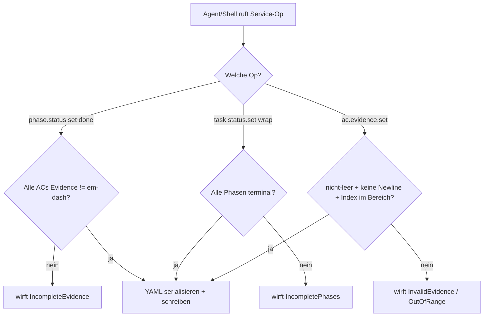
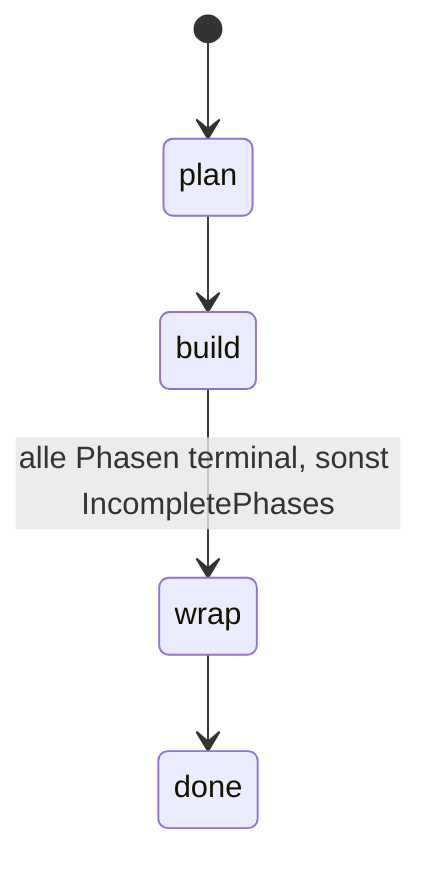
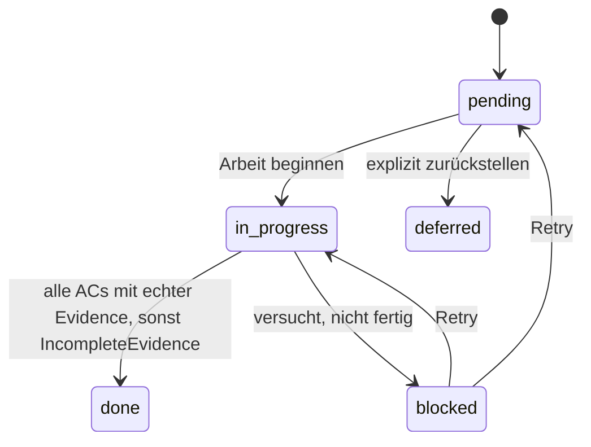

← [references](_references.md)

# Task-File-Schema (v2, YAML)

Menschenlesbare Erklärung des On-Disk-Formats `.claude/tasks/<slug>.yml`: was jedes Feld bedeutet, wie die Status-Maschine von Task und Phasen läuft, und wie Evidence sowie Sub-Sections gespeichert werden. Diese Seite ist die Brücke zwischen der maschinenlesbaren Zod-Spezifikation (`mcp/src/schema/task-file-v2.ts`, abgeleitetes JSON-Schema in `dist/schema/task-file-v2.schema.json`) und der Skill-/Agent-Praxis. Bei Widerspruch gewinnt das Zod-Schema.

## Was

- Das Task-File ist YAML, abgelegt unter `.claude/tasks/<slug>.yml`; der Dateiname-Slug ist gleich dem Feld `slug`.
- `schema_version` ist das Literal `2`. Der v2-Parser verweigert jeden anderen Wert (Format-Gate).
- Pflichtfelder auf Top-Level: `schema_version`, `slug`, `status`, `created`, `title`, `context`, `phases`. Optional: `customSections`.
- `slug` ist kebab-case und immutable; `created` ist ein ISO-Datum `YYYY-MM-DD`, auf Erstellung gesetzt und immutable.
- `status` ist der Next-Action-Lifecycle-Marker mit Werten `plan | build | wrap | done`; Übergänge sind ausschließlich vorwärts.
- `title` ist ein nicht-leerer, menschenlesbarer String und darf frei editiert werden.
- `context` hält `intro` (Pflicht), `plan` (optional), `build` (optional) und `wrap` (optional).
  - `intro`: 3-8 Sätze typisch, mehrzeilig über `|`; geschrieben vom plan-agent während `/impl-plan`.
  - `plan`: Entscheidungen + Q&A-Trace; geschrieben vom plan-agent und vom Orchestrator (Q&A-Resolutions).
  - `build`: Record aus Sub-Section-Name → String, offen verschlüsselt. Konventionelle Keys: `Implement`, `task-validate`, `code-validate`; jeder beliebige user-custom Agent darf eine eigene Sub-Section anhängen.
  - `wrap`: `{ intro?, subsections? }`; geschrieben vom `/impl-wrap`-Orchestrator.
- `phases` ist ein Array (2-6 typisch). Jede Phase ist eine commit-/ship-bare Arbeitseinheit.
- Phase-Pflichtfelder: `name`, `slug`, `status`, `acceptance_criteria` (mind. 1). Optional: `context`, `rules`.
  - `name`: Title Case, eindeutig im Task, user-facing in Chat + Commits.
  - `slug`: kebab-case, nur internes Addressing der Service-Layer, nie user-facing.
  - `status`: `pending | in-progress | done | blocked | deferred`.
  - `rules`: Array von `{ path, why }`, vom plan-agent aus rules-agent-Output verteilt.
- `acceptance_criteria[]` ist `{ text, evidence }`.
  - `text`: ein testbarer Satz, konkretes Subjekt + Verhalten, keine Verbund-ANDs.
  - `evidence`: entweder das Em-Dash-Sentinel `"—"` (ungefüllt) oder eine konkrete Referenz (file:line, Befehl + Ergebnis, Testname + Resultat, Commit-SHA).
- Extension-Felder auf Phasen sind Passthrough: in `anchored.yml.task.phase.fields` deklarierte Felder landen als flache Top-Level-Keys auf der Phase (kein `extensions:`-Envelope), z. B. `commit`, `coverage_pct`.
- `customSections` ist ein Record Name → Markdown-String; vom Nutzer per Hand gepflegt, von anchored verbatim erhalten und nie modifiziert.

## Wie

### Benutzung

Das On-Disk-File wird ausschließlich über Service-Layer-Ops mutiert — MCP-Tools `mcp__task__*` für Agenten, die `anchored`-CLI für Shells. Es gibt keine Bootstrap-Ausnahme: auch die initiale Erstellung durch den plan-agent und die Q&A-Resolutions während `/impl-plan` laufen über die MCP-Factory. Kein Agent in `plugin/agents/*` hat `Write` oder `Edit` in seinem Frontmatter (durchgesetzt vom Test `mcp/tests/agent-frontmatter.test.ts`). Siehe [state-mutations](./state-mutations.md).

Die Service-Layer setzt diese Gates durch:

| Gate | Op | Wirft |
|------|----|-------|
| Forward-only Task-Lifecycle | `task.status.set` | `InvalidTransition` |
| Gültiges Phase-Lifecycle | `phase.status.set` | `InvalidTransition` |
| Phase done ⇔ alle ACs mit echter Evidence | `phase.status.set("done")` | `IncompleteEvidence` |
| Task wrap ⇔ alle Phasen terminal | `task.status.set("wrap")` | `IncompletePhases` |
| Evidence nicht-leer, keine Newlines | `ac.evidence.set` | `InvalidEvidence` |
| AC-Index im Bereich | `ac.evidence.set` | `OutOfRange` |
| Phase-Extension in anchored.yml deklariert | `phase.field.set` | `UnknownField` |
| Extension-Wert passt zum deklarierten Typ | `phase.field.set` | `InvalidFieldType` |

Für IDE-Validierung beim Editieren von Hand zeigt man den `yaml-language-server` auf das publizierte JSON-Schema:

```yaml
# yaml-language-server: $schema=./dist/schema/task-file-v2.schema.json
```

### Funktion

Eine `phase.status.set("done")`-Mutation prüft vor dem Schreiben jede AC auf Nicht-Sentinel-Evidence; eine `task.status.set("wrap")`-Mutation prüft, dass jede Phase terminal ist.



## Warum

YAML löste v0.1 ab: dort wurde Custom-Markdown per zeilenbasiertem Regex geparst, was zwei Bug-Klassen produzierte (fehlender H1 → manuelle Recovery; mehrzeilige Evidence → stiller AC-Verlust). Beide sind in v2 strukturell unmöglich, weil das `yaml`-Package die Edge-Cases übernimmt, die der Regex-Parser verfehlte. Das mentale Modell ist dasselbe wie bei Kubernetes-Manifesten, GitHub-Actions-Workflows, Ansible-Playbooks und docker-compose: strukturierte Workflow-Definition mit eingebetteter Prosa. Markdown-Inhalt lebt weiter — innerhalb von YAML-String-Werten, wobei `|`-Block-Scalars mehrzeiligen Inhalt verbatim erhalten.

## Wann

Task-Status und Phase-Status sind beide state-getrieben.

Task-Status (forward-only; Stay-in-place X → X ist ein idempotenter No-op):



Phase-Status (`done` und `deferred` sind terminal):



Migration: `anchored migrate <slug>` konvertiert ein v1-`.md`-Task-File in ein v2-`.yml`; der Befehl ist idempotent (Re-Runs auf bereits konvertierten Dateien sind sichere No-ops). `anchored migrate --all` konvertiert alle `.md`-Dateien unter `.claude/tasks/` in einem Durchgang. Erhalten bleiben Frontmatter, Title, Context-Sub-Sections, Phasen mit ACs sowie Extension-Felder (diese flachen vom v1-`extensions:`-Envelope auf v2-Top-Level-Keys ab).
