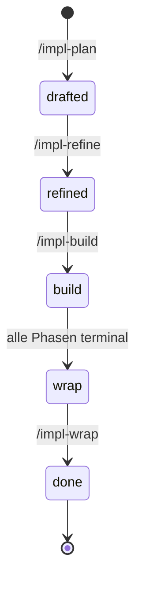

← [plugin](../_plugin.md)

# skills

Fünf nutzer-getriggerte **Orchestrator-Skills**, die den anchored-Lifecycle bilden.
Jeder Skill ist eine dünne Orchestrierungs-Schicht: spawnt Agents, wendet deren
strukturierte Returns via MCP an, verwaltet Status-Übergänge. Der Lifecycle läuft
`plan → refine → build → wrap`; `/impl` fasst alle vier zusammen.

| Skill | Rolle | Verantwortung (Scope-Grenze) |
|---|---|---|
| [impl-plan](impl-plan.md) | medio | Rohe Beschreibung → drafted Task-File: 2–6 Phasen + prüfbare ACs + alle Ambiguitäten als priorisierte Questions. |
| [impl-refine](impl-refine.md) | medio | Engineering-Review: plan-check + rules-check, dann jede offene Question mit dem Nutzer durchgehen → refined. |
| [impl-build](impl-build.md) | medio | Autonome Phasen-Ausführung: implement + task-validate + code-validate im Failures-Loop, stop-check als Safety-Net → wrap. |
| [impl-wrap](impl-wrap.md) | medio | Finalisierung: Wrap-Pipeline (Review + TL;DR), alle Phasen terminal prüfen, autonome Entscheidungen vorlegen → done. |
| [impl](impl.md) | medio | Autopilot: komponiert plan→refine→build→wrap end-to-end auf einen Aufruf, hält nur bei blockierenden Questions/Failures. |
