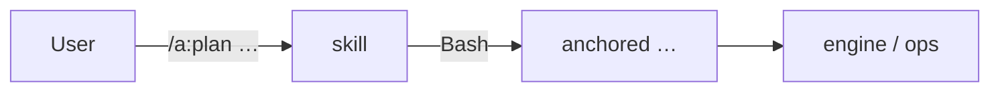

← [plugin](../_plugin.md)

# skills

The four slash commands of the `a` plugin. Each orchestrates **one stage** and
calls the [`anchored` CLI](../../core/cli/_cli.md) via Bash for it — the skills hold
no mutation logic of their own, they are the thin control layer.

| Command | Responsibility |
|---|---|
| [/a:plan](plan.md) | Structures a unit. `<tier?> <prose\|path>`; without tier → discover + classify. |
| [/a:refine](refine.md) | `<slug>` — plan-check + rules-check + Q&A walk. |
| [/a:build](build.md) | `<slug>` — fractal build (loop or leaf work). |
| [/a:wrap](wrap.md) | `<slug>` — review + summarize or roll-up. |
