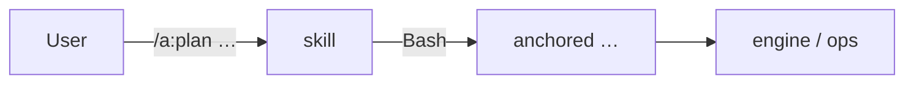

← [plugin](../_plugin.md)

# skills

Die vier Slash-Commands des Plugins `a`. Jeder orchestriert **eine Stage** und ruft
dafür die [`anchored`-CLI](../../core/cli/_cli.md) via Bash — die Skills halten
keine eigene Mutations-Logik, sie sind die dünne Bedien-Schicht.

| Command | Verantwortung |
|---|---|
| [/a:plan](plan.md) | Strukturiert eine Einheit. `<tier?> <prosa\|path>`; ohne Tier → discover + classify. |
| [/a:refine](refine.md) | `<slug>` — plan-check + rules-check + Q&A-walk. |
| [/a:build](build.md) | `<slug>` — fraktaler build (Loop bzw. Leaf-Arbeit). |
| [/a:wrap](wrap.md) | `<slug>` — review + summarize bzw. roll-up. |
