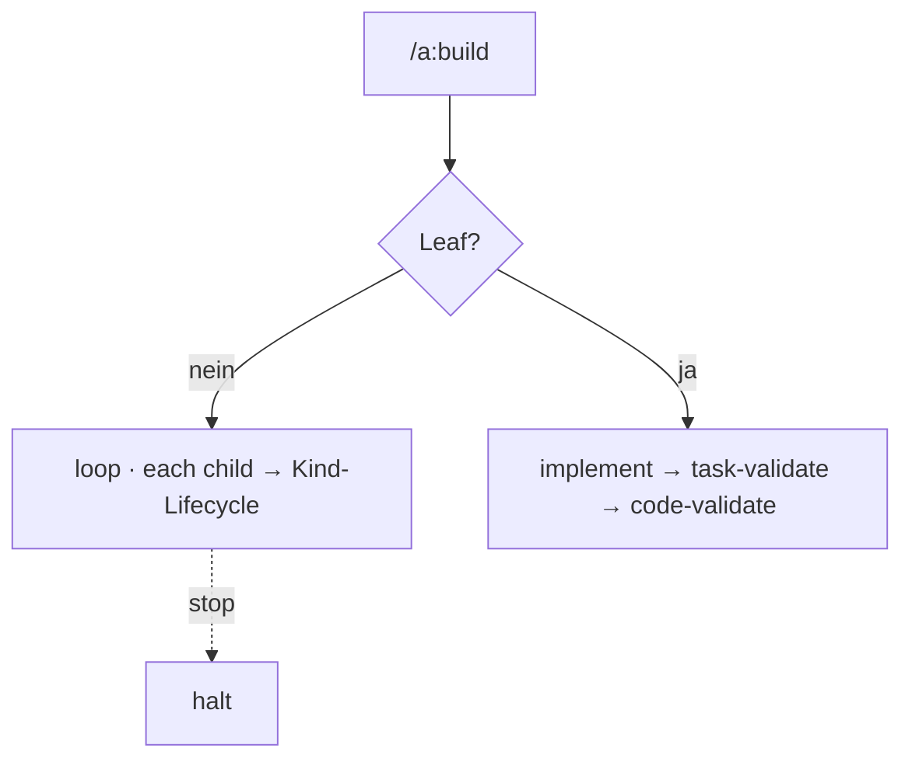

← [skills](_skills.md)

# /a:build

Führt die `build`-Stage eines Nodes aus. `/a:build <slug>` — Tier aus dem Node.

## Was

- **Non-Leaf** (task/epic): der `loop` iteriert die Kinder (`each`), fährt pro Kind
  die Kind-Lifecycle; `stop`/`retry_limit` greifen.
- **Leaf** (phase): `implement` → `task-validate` → `code-validate`.
- Ruft `anchored build <slug>`; läuft maximal autonom, hält nur bei `stop`-Match.

## Wie

