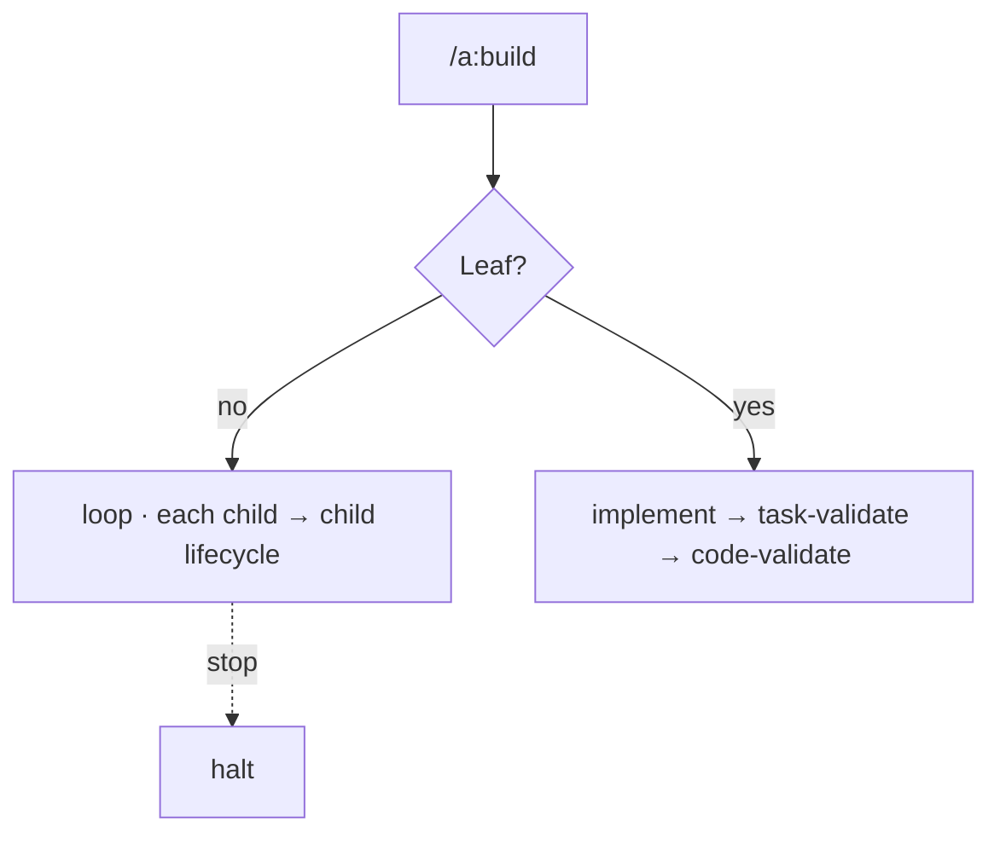

← [skills](_skills.md)

# /a:build

Runs the `build` stage of a node. `/a:build <slug>` — tier from the node.

## What

- **Non-Leaf** (task/epic): the `loop` iterates the children (`each`), runs the
  child lifecycle per child; `stop`/`retry_limit` apply.
- **Leaf** (phase): `implement` → `task-validate` → `code-validate`.
- Calls `anchored build <slug>`; runs as autonomously as possible, only stops on a `stop` match.

## How

