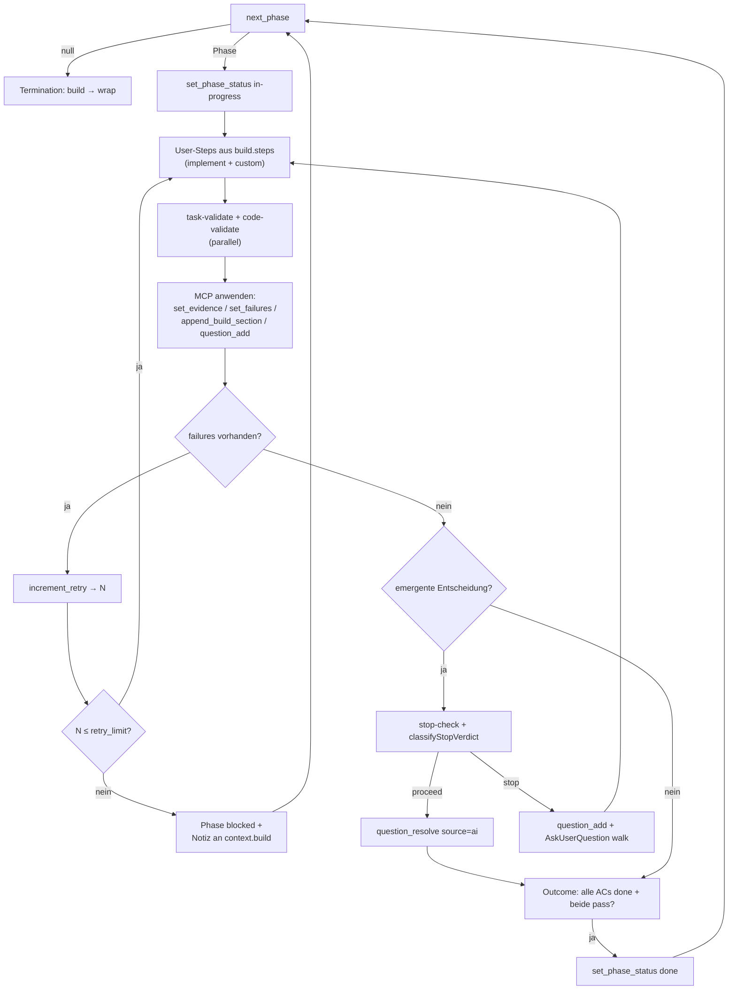
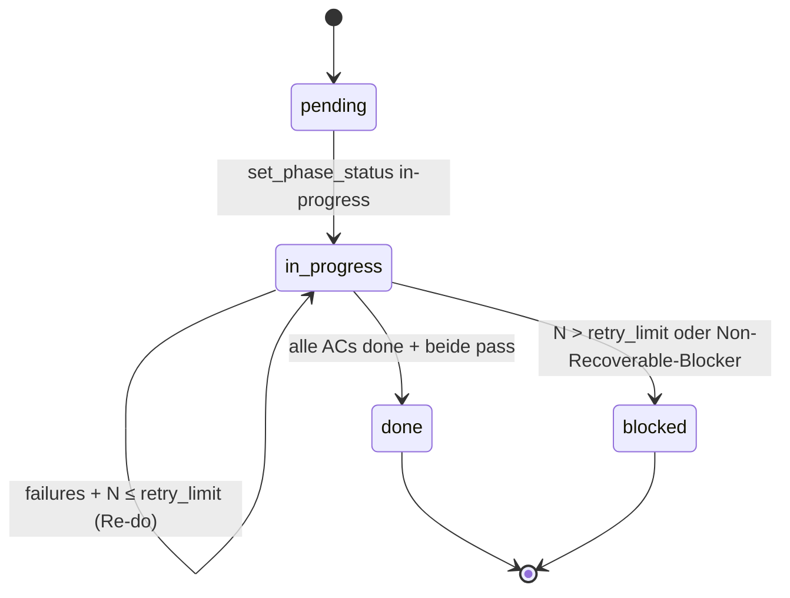

← [skills](_skills.md)

# /impl-build

Die Build-Phase eines anchored-Tasks: der Orchestrator iteriert über alle nicht-terminalen Phasen, treibt jede durch die User-Pipeline plus die festen Quality-Gates `task-validate` + `code-validate`, fährt einen failures-getriebenen Re-do-Loop (begrenzt durch `anchored.yml.build.retry_limit`) und schaltet den Task von `build → wrap`, sobald alle Phasen einen terminalen Zustand erreicht haben. Maximal autonom: gestoppt wird nur, wenn eine emergente Entscheidung gegen eine `build.stop`-Regel trifft. Vorheriger Schritt: [impl-refine](./impl-refine.md); nachfolgender: [impl-wrap](./impl-wrap.md); aufgerufen auch als Teil von [impl](./impl.md).

## Was

- **Explicit-only Trigger.** Läuft nur, wenn der User `/impl-build` tippt (optional mit Task-Slug). Kein impliziter Aufruf.
- **State-Gate (Pre-flight).** `status: refined` → normaler Einstieg; `status: build` → Resume; `status: drafted` → nur über dokumentierte Abkürzung (Warnung + `AskUserQuestion`, dann `set_task_status(... "build")`); `status: plan | wrap | done` → Verweigerung mit Hinweis.
- **anchored.yml ist Pflicht.** Fehlt sie, verweigert der Skill mit Hinweis auf `/impl-plan`.
- **Pre-build walk.** Vor dem langen Lauf werden alle noch offenen Fragen (`question_list(filter: { status: 'open' })`) im selben ephemeren Walk wie `/impl-refine` mit dem User abgearbeitet. Bei `open.length === 0` (Normalfall `refined`) wird der Schritt still übersprungen.
- **Phasenauswahl über `next_phase`.** Liefert die erste Phase in Deklarationsreihenfolge mit nicht-terminalem Status; `in-progress` hat Vorrang vor `pending` (Resume-Sicherheit).
- **Pro Phase: User-Steps → Validatoren → Re-do-Loop → Outcome.** Erst `anchored.yml.build.steps` in Reihenfolge, dann immer `task-validate` + `code-validate` parallel, dann der failures-getriebene Loop, dann die Outcome-Bewertung.
- **Mutationskontrakt.** Alle Task-File-Mutationen laufen ausschließlich über `mcp__task__*` aus dem SKILL-Kontext. Die Subagenten (`implement`, `task-validate`, `code-validate`, `stop-check`) sind reine Denker bzgl. Task-File und liefern strukturierte Ausgabe; der Orchestrator wendet sie via MCP an. Quellcode-Mutationen (`*.js` etc.) laufen über Write/Edit/Bash — die nutzt der `implement`-Agent frei.
- **Validatoren sind nie abschaltbar.** `task-validate` UND `code-validate` laufen immer nach den User-Steps.
- **`task-validate`** prüft Evidence-gegen-AC; **`code-validate`** prüft Code-gegen-rules. Beide sind reine Inspektoren (Read/Glob/Grep/Bash, kein MCP) und liefern `verdict`, `ac_verdicts[]`, `build_section_content`, `questions_to_add[]`, `partner_voice_summary`.
- **Retry ist autonom, ohne Nachfrage.** Bei vorhandenen `failures`: `increment_retry` → neues `retry_count` `N`. `N ≤ retry_limit` (Default 3) → erneutes implement + Validatoren; `N > retry_limit` → Phase `blocked`, Notiz nach `context.build → Implement`, weiter mit `next_phase`. Retry-Erschöpfung ist KEIN `build.stop`-Match.
- **Emergente Entscheidungen durchlaufen ein doppeltes Safety-Net:** den `stop-check`-Evaluator (gegen `anchored.yml.build.stop`) und den deterministischen Self-Report des Workers. Geroutet wird über `classifyStopVerdict(verdict, { workerFlaggedDeviation })` (`mcp/src/core/stop-check.ts`).
- **`proceed`** (und Worker hat keine Abweichung geflaggt) → `question_resolve` mit `source='ai'` + Reasoning (autonom dokumentiert, Lauf geht weiter). **`stop`** → `question_add` (priority `high`, origin `stop-check`), Loop anhalten, Frage(n) mit User via `AskUserQuestion` walken (`source='user'`), danach implement erneut spawnen.
- **Worker-Self-Report ist deterministisch.** Eine vom Worker geflaggte Plan-Abweichung erzwingt auf einem `proceed`-Verdict einen Stop (synthetische Regel "worker self-reported a plan-deviation (second-eye override)").
- **Phase `done`** nur, wenn alle ACs `status: 'done'` UND beide Validatoren `pass`. Die Factory's `set_phase_status('done')` erzwingt die AC-Bedingung; eine separate Prüfung ist nicht nötig.
- **Resume-sicher.** `retry_count` persistiert über Läufe; ein zweiter `/impl-build`-Aufruf nimmt eine `in-progress`-Phase auf, implement überspringt bereits fertige ACs.
- **Termination.** `next_phase` → null: terminale Phasen zählen (`done`/`blocked`/`deferred`); bei mindestens einer `done` und keiner `in-progress` → `set_task_status(... "wrap")`. Sind ALLE Phasen `blocked`, trotzdem nach `wrap` (für Review der Teilarbeit).

## Wie

### Benutzung

Aufruf: `/impl-build [<task-slug>]`. Der Orchestrator (das SKILL) hält den State; die vier Subagenten werden per `Task`-Tool gespawnt und geben strukturierte Ausgabe zurück, die der Orchestrator per MCP anwendet.

Schlüssel-Übergaben an die Agenten:

- **`implement`**: `PROJECT_ROOT`, `TASK_SLUG`, `PHASE` (voller Block inkl. ACs mit Evidence + failures), `TASK_CONTEXT` (`{ intro, plan, resolved_questions[] }`), `USER_EXTENSION` = `anchored.yml.build.implement`, `RETRY_ATTEMPT` = `phase.retry_count + 1`. Rückgabe: `evidence_per_ac`, `phase_field_updates`, `build_notes`, `blockers`, `phase_done`, `partner_voice_summary`.
- **`task-validate`**: `PHASE` (Post-implement-State mit Evidence), `TASK_FILE_CONTENT`, `RETRY_ATTEMPT`, `USER_EXTENSION` = `anchored.yml.build.task_validate`.
- **`code-validate`**: `PHASE` (inkl. **rules** + `acceptance_criteria`), `TASK_FILE_CONTENT`, `TOUCHED_FILES`, `RETRY_ATTEMPT`, `USER_EXTENSION` = `anchored.yml.build.code_validate`.
- **`stop-check`**: `PENDING_DECISION` (`{ description, options?, worker_self_report? }`), `STOP_RULES` = `anchored.yml.build.stop`, `PLAN_CONTEXT`, `USER_EXTENSION` = `anchored.yml.build.stop_check.instructions`. Rückgabe: `{ verdict: stop | proceed, matched_rule?, reasoning, partner_voice_summary? }`.

MCP-Anwendung durch den Orchestrator nach den Rückgaben: `set_evidence` (flippt AC atomar auf `done` + löscht failures), `set_failures` (flippt AC zurück auf `pending`, behält Evidence als History), `append_build_section`, `set_field`, `question_add`, `question_resolve`, `increment_retry`, `set_phase_status`, `set_task_status`.

### Funktion

Der Per-Phase-Ablauf als Prozess mit Verzweigungen:

Wichtig zum Loop: Der Re-do-Loop für `failures` läuft autonom (kein Autonomie-Knopf). Emergente Entscheidungen sind separat: sie surfacen über den Worker-Self-Report (`build_notes`/blockers) ODER über validator-erzeugte offene Fragen, und jede einzelne läuft durch das doppelte Safety-Net. Bei `proceed` ohne Worker-Flag wird die Entscheidung autonom dokumentiert; bei `stop` (oder geflaggter Abweichung) wird eskaliert und mit dem User gewalkt.

## Warum

- **Parallele Validatoren.** `task-validate` + `code-validate` sind die langsamsten Schritte (LLM-reasoning-bound); parallel halbiert das die Wall-Clock-Zeit ohne Sicherheitsverlust. Der Cross-Process-Lock in `core/io.ts:atomicWrite` serialisiert ihre Writes — bei kollidierendem `set_failures` auf derselben AC gewinnt der spätere Write, kein torn write. Überlappung ist selten, da beide ACs aus unterschiedlichen Gründen ablehnen.
- **Maximal autonom, minimal stoppen.** Der USP ist der lange ununterbrochene Lauf; jeder Stop kostet eine User-Unterbrechung. Deshalb retried, entscheidet und dokumentiert der Orchestrator selbst und stoppt nur bei einem echten `build.stop`-Match (Shipped-Default: genau eine Regel — *"a decision deviates from the plan"*).
- **Worker-Self-Report bevorzugt den Menschen.** Eine geflaggte Plan-Abweichung wird auf einem `proceed`-Verdict zum Stop eskaliert und nicht aufgeweicht — asymmetrische Kosten-Regel von `stop-check`.
- **Entscheidungslogik beim Orchestrator.** Die Agenten zählen nie `increment_retry`, lösen nie eigene Entscheidungen auf und lesen kein persistiertes Autonomie-Feld (es gibt keins). So bleibt das Retry-Accounting + Stop-Routing an einer Stelle.
- **Pre-build walk statt autonomer Auflösung.** Plan-Stage-Ambiguitäten werden vor dem Lauf mit dem User gewalkt (wie in refine), nicht autonom aufgelöst — Build's eigene Autonomie gilt nur für EMERGENTE Build-Zeit-Entscheidungen.

## Wann

- **Trigger:** User tippt `/impl-build` auf einem Task im Status `refined` (normal), `build` (Resume) oder `drafted` (Abkürzung mit Bestätigung).
- **Resume/Compaction:** Ein zweiter Aufruf nach Crash oder Compaction findet `status: build`, `next_phase` liefert die `in-progress`-Phase, implement nimmt anhand des Task-File-States den Faden wieder auf. Kein eigenes Resume-Kommando.
- **Manueller Reset (Escape Hatch):** ACs und Phasen-Status per `anchored ac status set` / `anchored phase status set` auf `pending` zurücksetzen, dann `/impl-build` neu starten — der Orchestrator behandelt die Phase als frisch.

Phasen-Lifecycle:

