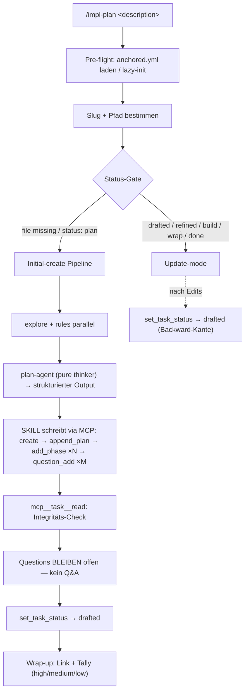
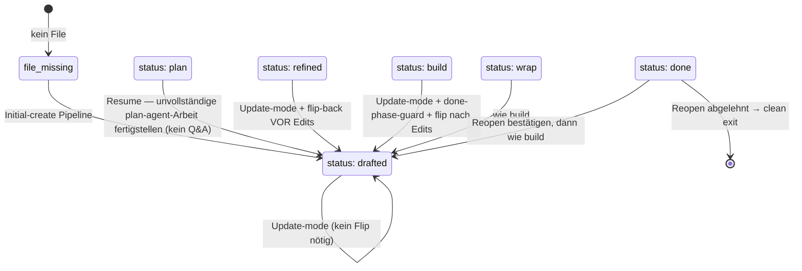

← [skills](_skills.md)

# /impl-plan

Brainstorm-Skill: verwandelt eine rohe Task-Beschreibung in ein gedraftetes Task-File mit Phasen, prüfbaren Acceptance-Criteria und ALLEN Ambiguitäten als priorisierten strukturierten Questions. Erste Phase des Lifecycles ([impl](./impl.md)); endet mit `status: drafted` und offenen Questions — das Durchgehen der Questions übernimmt [impl-refine](./impl-refine.md).

## Was

- Explicit-only-Trigger: läuft nur, wenn der User `/impl-plan <description>` (oder einen Pfad auf ein bestehendes Draft-File) tippt — kein Auto-Triggering.
- Lädt `anchored.yml` aus dem Projekt-Root. Fehlt sie, fragt der Skill (Y/n) und kopiert `<plugin-root>/references/default-config.yml` nach `<user-project>/anchored.yml` (lazy-init). Bei Parse-Fehler: Fehler + Zeilennummer melden, beenden.
- Bestimmt Slug + Pfad: aus dem Dateinamen eines bestehenden Drafts, sonst kebab-case aus der Beschreibung. Ziel-Pfad: `<user-project>/.claude/tasks/<slug>.yml`.
- State-Gate: `/impl-plan` ist der einzige Entry-Point, der einen bestehenden Task wieder anfassen darf — verzweigt auf den aktuellen `status` (sieben Fälle, siehe Wann).
- Die Backward-Kanten `{refined, build, wrap, done} → drafted` sind die EINZIGEN Rückwärts-Transitionen, die Anchored erlaubt; sie existieren ausschließlich für diesen Skill.
- Default-Pipeline bei file-missing / `status: plan`: `explore` + `rules` parallel → `refine` (plan-agent).
- `explore` spawnt Claude Codes eingebauten `Explore`-Agent mit der rohen Beschreibung; liefert affected_paths, similar_code, patterns. Optionale `plan.steps.explore.instructions` werden an den Brief angehängt.
- `rules` spawnt den `rules`-Agent mit RAW_PLAN, DISCOVERY = **null** (parallel → keyword-match-only-Fallback) und RULES_CONFIG aus `anchored.yml.plan.rules`; liefert must_follow + worth_knowing + sources.
- `refine` spawnt den `plan`-Agent (`plugin/agents/plan.md`) mit PROJECT_ROOT, TASK_SLUG, RAW_PLAN, DISCOVERY, RULES_SUMMARY und PLAN_CONFIG.
- Der plan-agent ist ein **pure thinker** — er gibt strukturierten Output zurück und ruft NIE selbst MCP auf (Workaround für den plugin-subagent-MCP-bug #13605/#21560/#33689).
- Der SKILL (mit vollem MCP-Zugriff) schreibt den Agent-Output auf Disk: `mcp__task__create` → `append_plan` → `add_phase` (×N) → `question_add` (×M).
- Alle Task-File-Mutationen laufen über MCP — KEIN `Edit`/`Write` auf das Task-File (V0.3.1-Contract). Der Renderer injiziert die `yaml-language-server: $schema=...`-Directive auf Zeile 1 automatisch.
- Jede Phase hat ≥1 Acceptance-Criterion; eine Phase ohne AC ist ein Fehler → reject + re-plan. Jede AC startet mit `status: 'pending'` und ohne `evidence`.
- Questions bleiben offen: der Skill führt KEINEN Q&A-Loop, keine `AskUserQuestion`, keine `question_resolve`-Calls. Das ist der erwartete Zustand für `drafted`.
- Verifiziert vor dem finalen Status-Flip die Integrität via `mcp__task__read`; schlägt das fehl, wird der Fehler + der strukturierte Agent-Return an den User gemeldet.
- Beendet mit `mcp__task__set_task_status(..., "drafted")` und einer Wrap-up-Message mit klickbarem Link auf das Task-File.

## Wie

### Benutzung

Aufruf: `/impl-plan <task description>` oder `/impl-plan <pfad-zum-draft>`.

Schlüssel-MCP-Calls, die der SKILL nach dem plan-agent-Return (Mode A) absetzt:

- `mcp__task__create(project_root, slug, { title, intro })` — `title` aus Agent-`title`, `intro` aus Agent-`context`.
- `mcp__task__append_plan(project_root, slug, content)` — joined Bullet-Liste aus `plan_section`.
- `mcp__task__add_phase(project_root, slug, { phase_slug, name, context?, rules?, acceptance_criteria })` — ACs als `{ text, status: 'pending' }`; der SKILL synthetisiert das aus der Plaintext-AC-Liste des Agents.
- `mcp__task__question_add(project_root, slug, { text, priority, origin: 'plan-agent', phase? })` — sequentielle IDs vergibt die Factory.
- `mcp__task__read(project_root, slug)` — Integritäts-Check; bei Mode B (restructure) liefert der Agent ein `diff:`-Array, das op-weise über die passenden MCP-Calls angewendet wird.

Schlägt ein Write fehl (DuplicateSlug, Schema-Reject), wird der fehlschlagende Call + der volle Agent-Return gemeldet — **kein stilles Retry**, da der Agent-Output die Source-of-Truth ist.

### Funktion

## Warum

- Q&A wurde bewusst aus `/impl-plan` herausgenommen: der V0.2-Dogfood (2026-05-27) zeigte, dass ein gemeinsamer Brainstorm-+-Q&A-Lauf den plan-agent dazu verleitet, Ambiguitäten selbst zu *entscheiden* (damit der Loop weniger durchgehen muss) — der falsche Anreiz. V0.3 trennt: `/impl-plan` = brainstorm-only, `/impl-refine` = decision-only, jeder Schritt mit genau einem Job.
- `rules` läuft parallel zu `explore` (DISCOVERY = null), weil beide keine Abhängigkeit teilen; das senkt die Wall-Clock auf `max(explore, rules)` (~25–40s gespart). Braucht ein Setup explores Output für rules (sehr große Rules-Library), kann der User die Steps sequenziell in `anchored.yml.plan.steps` deklarieren.
- Der plan-agent ruft kein MCP, weil custom Plugin-Subagents wegen des Anthropic-Bugs #13605/#21560/#33689 keinen MCP-Zugriff haben — daher die Aufteilung „Agent denkt, SKILL schreibt".
- Die Done-Phase-Preservation-Guard (Update-mode) hat zwei Ebenen: der Skill stellt den freundlichen Prompt, die Factory wirft `DonePhaseImmutable` als Service-Layer-Safety-Net — selbst wenn der Skill den Prompt vergisst, schlägt `remove_phase` ohne `{ force: true }` auf einer done-Phase fehl.
- Der Backward-Flip auf `drafted` nach jedem Update sorgt dafür, dass `/impl-refine` den geänderten Plan gegen aktuellen Code + Rules neu validiert, bevor `/impl-build` läuft; ohne den Flip würde stale `refined` Planungsänderungen verstecken.

## Wann

Der Skill verzweigt im Pre-flight auf den aktuellen Task-Status:

- Initial-create (file missing / `status: plan`) läuft die volle Pipeline; jeder andere Status geht in Update-mode (nie die Initial-create-Pipeline auf einem befüllten File).
- Update-mode bietet via `AskUserQuestion` an: Discuss only / Tweak text or ACs / Restructure phases / Cancel; danach optional ein Audit-Eintrag via `append_plan` und der Status-Flip zurück auf `drafted`.
