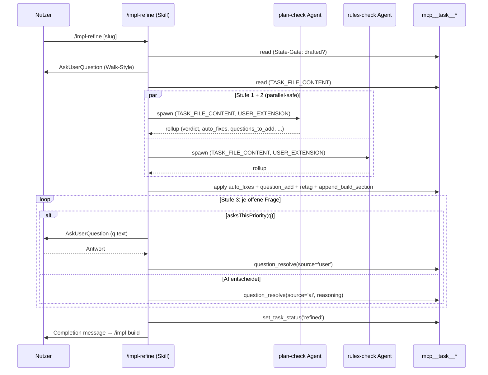
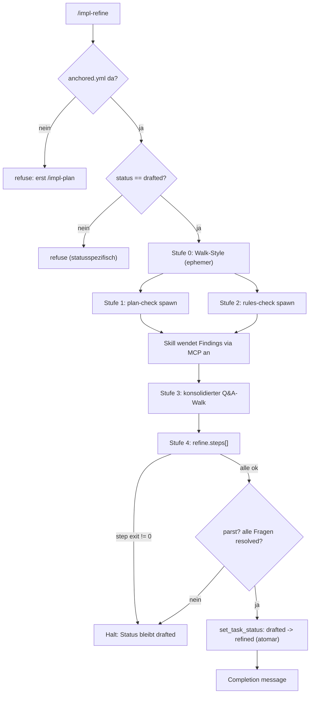
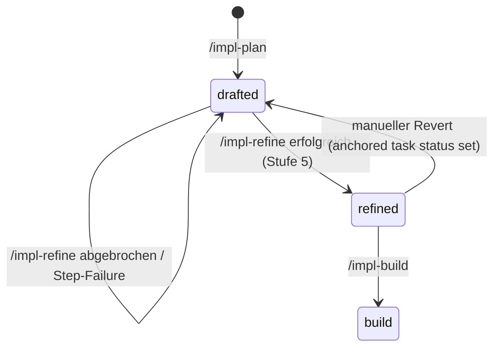

← [skills](_skills.md)

# /impl-refine — Engineering-Review

Validiert einen gedrafteten Plan gegen den aktuellen Code- und Rules-Stand, geht jede offene Frage mit dem Nutzer (oder per AI-Urteil) durch und führt nutzerdefinierte Refine-Schritte aus. Letzte Stufe zwischen [/impl-plan](./impl-plan.md) (Status `drafted`) und [/impl-build](./impl-build.md): überführt die Task von `drafted` nach `refined`.

## Was

- Explicit-only Trigger: der Nutzer tippt `/impl-refine` (optional mit Task-Slug). Kein Auto-Start.
- Pre-flight: lädt `anchored.yml` (fehlt sie → Verweigerung mit Hinweis auf `/impl-plan`), löst den Slug auf, und liest den Task-Status via `mcp__task__read`.
- State-Gate: läuft nur bei `status: drafted`. Jeder andere Status (`plan`, `refined`, `build`, `wrap`, `done`) → Verweigerung mit statusspezifischer Meldung; Re-Refine erfordert manuelles Zurücksetzen auf `drafted`.
- Die Pipeline hat 6 Stufen (0–5) in fester Reihenfolge. Stufen 0–3 sind nicht abschaltbare Framework-Gates; Stufe 4 läuft nutzerdefinierte Schritte; Stufe 5 ist der Status-Übergang.
- Stufe 0 — Walk-Style-Wahl: rein **ephemer**. Es gibt **kein** `task.autonomy`-Feld mehr; die Wahl lebt nur für diese Session, steuert nur Stufe 3 und wird **nie** in die Task-Datei geschrieben.
- Drei Walk-Styles: `AI-all` (AI entscheidet alle Fragen selbst, `source='ai'`), `high-together` (AI klärt high-Fragen mit dem Nutzer, medium + low selbst — der Default), `all-together` (jede offene Frage wird mit dem Nutzer durchgegangen).
- Bei `open.length === 0`: Walk-Style still auf `high-together` defaulten und zu Stufe 1 springen; Erwähnung in der Abschlussmeldung.
- Die `AskUserQuestion`-Optionen passen sich der Prioritätsverteilung an: nur bei gemischter Verteilung werden alle drei Styles angeboten; sind alle Fragen high (oder alle low), entfällt `high-together` als redundante Option.
- Stufe 1 — plan-check (Mandatory Gate): spawnt den `plan-check`-Agenten (`plugin/agents/plan-check.md`) als reinen Thinker; erkennt Drift, strukturelle Probleme und versteckte unilaterale Defaults.
- Stufe 2 — rules-check (Mandatory Gate): spawnt den `rules-check`-Agenten (`plugin/agents/rules-check.md`); prüft Rules-Coverage pro Phase, verwaiste Rule-Referenzen und phasenübergreifende Rule-Konflikte. DARF parallel zu Stufe 1 laufen (Cross-Process-Lock sichert die Writes).
- Beide Agenten rufen **selbst kein MCP** auf (Bug #13605 Workaround: Plugin-Subagenten haben keinen MCP-Zugriff). Der Skill liest die Task-Datei vor und übergibt den YAML-Inhalt als `TASK_FILE_CONTENT`; der Skill wendet danach alle Findings via `mcp__task__*` an.
- Jeder Agent liefert ein strukturiertes Rollup (`verdict`, `auto_fixes`, `questions_to_add`, `retags`, `partner_voice_summary`). In Stufe 1+2 gibt es **keine Q&A** — Fragen sammeln sich an.
- Jedes Gate-Rollup wird via `append_build_section` nach `context.build → plan-check` bzw. `→ rules-check` geschrieben (Audit-Trail).
- Stufe 3 — konsolidierter, prioritäts-bewusster Q&A-Walk: alle offenen Fragen (vom plan-agent + plan-check + rules-check) werden in **einem** Durchlauf aufgelöst, sortiert high → medium → low, dann nach id.
- Pro Frage entscheidet der Walk-Style die Ask-Schwelle: `all-together` → immer fragen; `AI-all` → nie fragen; `high-together` → nur bei `priority === 'high'`.
- Nutzer-Antwort → `mcp__task__question_resolve` mit `source: 'user'`. AI-Entscheidung → `source: 'ai'` plus Pflicht-Feld `reasoning` (1–3 Sätze, vom /impl-wrap-Reviewer gelesen).
- Walk-Style ist mid-walk überschreibbar ("du entscheidest den rest" / "lass mich den rest entscheiden"); der neue Wert greift ab der nächsten Iteration. Nichts wird persistiert.
- Stufe 4 — custom Steps: iteriert `anchored.yml.refine.steps[]` in Deklarations-Reihenfolge. `run:` → Bash; `use:` → benannter Tool/Agent. Output je Schritt nach `context.build → refine.<step-name>`. Bei Nicht-Null-Exit: Pipeline hält, Status bleibt `drafted`. Leer/abwesend → still überspringen.
- Stufe 5 — Status-Übergang: liest die Task-Datei ein letztes Mal (parst sauber? alle Fragen `resolved`?), ruft `mcp__task__set_task_status(..., "refined")`. Der Übergang ist **atomar** — flippt nur bei vollständigem Erfolg.
- Abort/Resume: Ctrl+C irgendwo → Status bleibt `drafted`; partielle Auto-Fixes und bereits aufgelöste Fragen bleiben erhalten (Per-Op-Atomicity). Re-Run startet wieder bei Stufe 0; Stufe 3 walkt nur noch offene Fragen.
- Task-File-Mutation-Contract: alle Mutationen laufen über MCP, nur aus dem SKILL-Kontext. Nie `Write`/`Edit` auf `.claude/tasks/<slug>.yml`.

## Wie

### Benutzung

Aufruf: `/impl-refine [<slug>]`. Der Skill ist der Orchestrator; die beiden Gate-Agenten sind reine Thinker, die Strukturen zurückgeben, die der Skill via MCP anwendet.

USER_EXTENSION-Prosa für die Agenten kommt aus `anchored.yml.refine.plan_check.instructions` bzw. `anchored.yml.refine.rules_check.instructions` (darf leer sein).

### Funktion

Stufe 1+2 laufen parallel-safe: ein Cross-Process-Lock hält die MCP-Writes sicher, während der Skill die Findings beider Gates anwendet (Stufe 1: `set_phase_context`, `set_phase_rules`, `append_plan`, `question_add`, `question_retag`; Stufe 2: `set_phase_rules`, `question_add`, `question_retag`). Erst danach folgt der einzige Q&A-Punkt der Pipeline (Stufe 3).

## Warum

- Walk-Style ist **ephemer** statt persistiert: das frühere `task.autonomy`-Feld wurde entfernt. Ein bei Refine getroffener Autonomie-Entscheid soll den späteren Build nicht beeinflussen; bei einem Re-Run wählt der Nutzer neu.
- Der Vor-Lese-und-Übergabe-Mechanismus (`TASK_FILE_CONTENT`) existiert als expliziter Workaround für Bug #13605 (Plugin-Subagenten haben keinen MCP-Zugriff). Deshalb sind plan-check/rules-check reine Thinker und der Skill ist die einzige MCP-schreibende Instanz.
- Q&A ist auf **eine** konsolidierte Stufe (3) gebündelt, statt in den Gates verteilt: alle Fragen aus drei Quellen werden prioritätsbewusst in einem Durchgang gewalkt — der Nutzer erlebt einen zusammenhängenden Walk statt verstreuter Rückfragen.
- Per-Op-Atomicity + atomarer Status-Flip machen die Pipeline abbruchsicher und idempotent re-runnable: Teilfortschritt überlebt jeden Abort, ein Re-Run walkt nur noch offene Fragen.

## Wann

- Trigger ausschließlich manuell durch `/impl-refine` nach `/impl-plan`.
- Läuft nur auf Status `drafted`; jeder andere Status wird verweigert.
- Flippt am Ende `drafted → refined` (atomar), worauf [/impl-build](./impl-build.md) aufsetzt. Re-Refine eines bereits refined/build/wrap/done-Tasks erfordert manuelles Zurücksetzen auf `drafted`.
