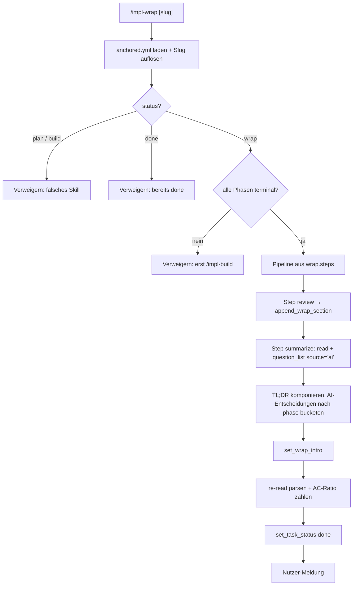
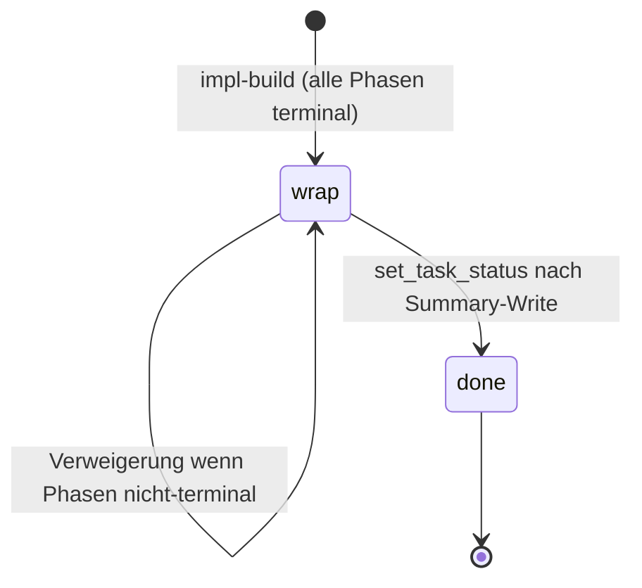

← [skills](_skills.md)

# impl-wrap

Finalisierungs-Skill für einen anchored-Task mit abgeschlossenem Build. Läuft als kurzer Orchestrator: führt die Wrap-Pipeline aus (default `review` → `summarize`), prüft alle Phasen auf Terminal-State, schreibt eine TL;DR mitsamt der autonomen AI-Entscheidungen nach `context.wrap.intro` und transitioniert den Task-Status `wrap → done`. Schließt damit die Lifecycle-Kette [impl-plan](./impl-plan.md) → [impl-refine](./impl-refine.md) → [impl-build](./impl-build.md) ab, orchestriert von [impl](./impl.md).

## Was

- Trigger ist explizit: der Nutzer tippt `/impl-wrap`, optional mit Task-Slug. Kein automatischer Aufruf.
- Pre-flight lädt `anchored.yml` aus dem Projekt-Root und löst den Task-Slug auf (gleiche Logik wie /impl-build).
- State-Gate über `mcp__task__read(slug)`:
  - `status: plan` / `build` → Verweigerung mit Hinweis, welches Skill stattdessen zu laufen ist.
  - `status: wrap` → fortfahren.
  - `status: done` → Verweigerung: Task bereits done; für Re-Wrap muss der Task-File manuell zurückgesetzt werden.
- Phasen-Terminal-Check: jede Phase muss `status` in `{done, blocked, deferred}` haben. Bei `pending` oder `in-progress` Phasen → Verweigerung mit Aufforderung, erst `/impl-build` zu laufen.
- Alle Task-File-Mutationen laufen ausschließlich über MCP (`append_wrap_section`, `set_wrap_intro`, `set_task_status`). Nie `Write`/`Edit` auf `.claude/tasks/<slug>.yml`.
- Die Pipeline-Schritte stammen aus `anchored.yml.wrap.steps` und laufen in Deklarations-Reihenfolge.
- Default-Step `review`: ruft Claude Codes eingebautes `/review`-Skill auf dem Implementierungs-Diff des Tasks auf und schreibt die wichtigsten Findings (typisch 3-10) per `append_wrap_section(project_root, slug, "review", content)` in die `review`-Subsection von `context.wrap`.
- Hat der Nutzer den review-Step durch eigenes Tooling ersetzt (eigene Linter, PR-Review via `gh pr review`, oder ganz übersprungen), gilt dessen Prosa statt des Defaults.
- Default-Step `summarize`: liest alles per `mcp__task__read` und komponiert eine TL;DR.
- Die TL;DR-Quellen: Phasen-Outcomes (status + ggf. commit), Rollups aus `context.build.task-validate` und `context.build.code-validate`, `failures`-Arrays auf ACs blockierter Phasen, die soeben geschriebenen `context.wrap.review`-Findings, AC-Zähler (`done` mit Evidence vs. `pending` ohne) und alle `source='ai'` resolved questions.
- Die autonomen AI-Entscheidungen werden programmatisch geholt: `question_list(project_root, slug, filter: { status: 'resolved' })` gefiltert auf `q.source === 'ai'`.
- Jede AI-Entscheidung trägt `answer` + `reasoning` (per `source='ai'`-Invariante garantiert nicht-leer) + optionales `phase`. Sie umfassen refine-zeitliche delegierte Q&A und build-zeitliche emergente Entscheidungen, die stop-check durchgelassen hat.
- Die Entscheidungen werden nach `phase`-Feld gebucketet: phasenlose (refine-stage) unter Überschrift „plan / refine" zuerst, danach je Phase in Deklarations-Reihenfolge, mit dem `reasoning` verbatim.
- Bei null `source='ai'`-Entscheidungen wird das explizit gesagt („Keine autonomen entscheidungen — du hast alles selbst abgesegnet.") statt die Section wegzulassen.
- Die TL;DR wird per `set_wrap_intro(project_root, slug, content)` direkt nach `context.wrap.intro` geschrieben — parallel zu den optionalen `subsections` (z. B. review).
- Zusätzliche Wünsche aus `anchored.yml.wrap.summarize`-Prosa (z. B. Token-Stats, deferred-AC-Empfehlungen) werden auf die Default-Struktur draufgelegt.
- Termination: erneuter `mcp__task__read` zur Parse-Validierung, AC-Verhältnis zählen (`done` vs. `pending`), Status per `set_task_status(project_root, slug, "done")` flippen, dann Nutzer-Meldung mit Slug, Status und AC-Ratio.
- Framework-Defaults (immer): Lauf-Verweigerung wenn status ≠ `wrap`; Terminal-State-Check aller Phasen; AC-Evidence-Zählung; Transition `wrap → done` nach dem Summary-Write.
- Was Wrap NICHT tut: kein git push, keine automatische PR-Erstellung, keine Announcement/Notification, kein Auto-Archive. All das bleibt optionalen Custom-Wrap-Steps des Nutzers überlassen.

## Wie

### Benutzung

Aufruf als Slash-Command, explizit:

```
/impl-wrap                # Slug wird aufgelöst
/impl-wrap <task-slug>    # Slug explizit
```

Voraussetzung ist ein Task mit `status: wrap` und ausschließlich terminalen Phasen. Schlägt eine der Pre-flight-Bedingungen fehl, verweigert das Skill mit einer klaren Meldung statt zu mutieren.

```mermaid
sequenceDiagram
    actor User
    participant Wrap as impl-wrap
    participant MCP as mcp__task__*
    participant Review as "/review (Claude Code)"
    User->>Wrap: /impl-wrap [slug]
    Wrap->>MCP: read(slug) — State-Gate + Phasen-Check
    Wrap->>Review: review-Step auf Implementierungs-Diff
    Review-->>Wrap: Findings
    Wrap->>MCP: append_wrap_section("review", findings)
    Wrap->>MCP: read + question_list(resolved, source='ai')
    Wrap->>MCP: set_wrap_intro(TL;DR)
    Wrap->>MCP: set_task_status("done")
    Wrap-->>User: "Wrapped <slug>. Status: done. <AC-Ratio>."
```

### Funktion



## Warum

- Die TL;DR in `context.wrap.intro` ist die Audit-Fläche, die Chat-Nachricht die Partnerschafts-Fläche — beide werden bewusst getrennt bedient.
- Die `source='ai'`-Entscheidungen werden bei Wrap gesammelt vorgelegt, weil der Nutzer die meisten davon im Moment nicht gesehen hat; Wrap ist der Punkt, an dem sie das Review bekommen.
- Der Phasen-Terminal-Check ist ein defensiver Check — sollte bei sauberem `/impl-build`-Exit nicht greifen, ist aber billig zu verifizieren.
- Der Framework-Vertrag endet bei „Task ist ehrlich als done markiert mit evidence-grade Audit-Trail"; alles darüber (push, PR, Announcement, Archive) ist Nutzer-Workflow und damit bewusst nicht eingebaut.

## Wann

- Genau dann, wenn der Build abgeschlossen ist und der Task `status: wrap` trägt — also nach erfolgreichem [impl-build](./impl-build.md), das den Status `build → wrap` setzt sobald alle Phasen terminal sind.
- Endet mit `wrap → done` und ist damit der letzte Schritt des Lifecycles.


