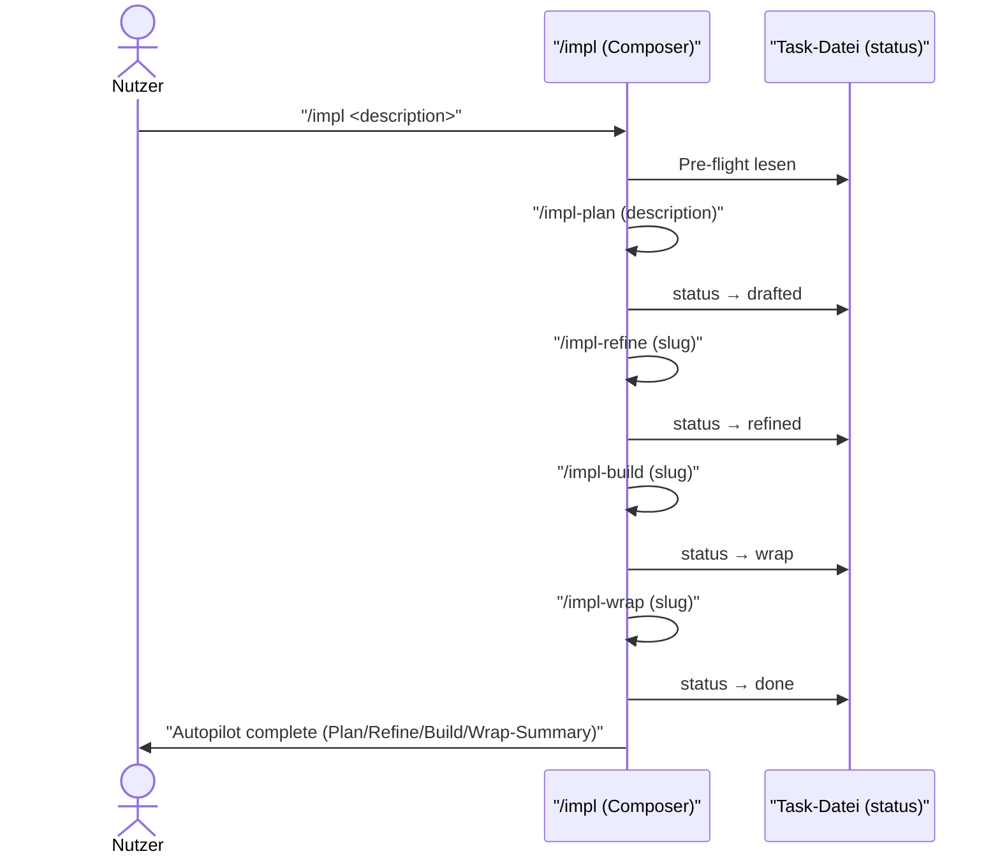
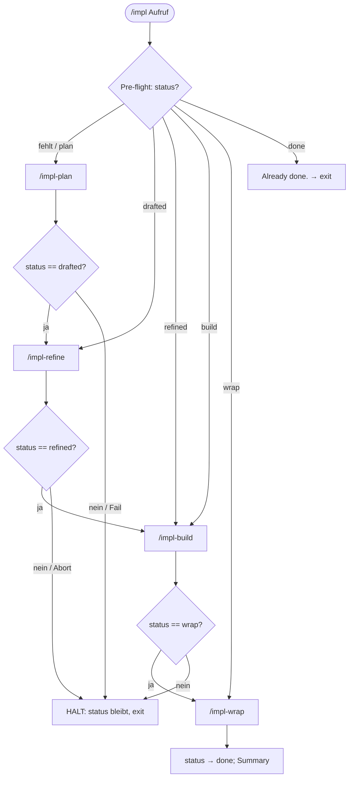
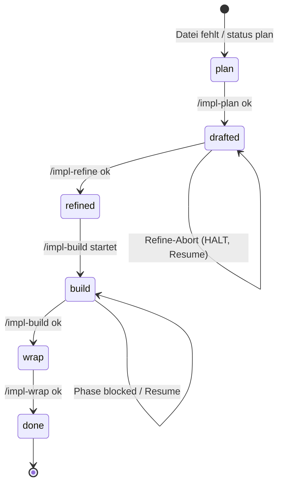

← [skills](_skills.md)

# /impl — Autopilot

Autopilot über den vollständigen anchored-Task-Lifecycle: komponiert auf einen einzigen Aufruf (`/impl <task description>`) die vier Lifecycle-Skills [plan](./impl-plan.md) → [refine](./impl-refine.md) → [build](./impl-build.md) → [wrap](./impl-wrap.md) sequenziell. `/impl` ist ein dünner Composer — die eigentliche Arbeit steckt in den Sub-Skills; die einzige eigene Logik ist die Entscheidung, ob nach jeder Phase weitergeschaltet wird. Hält bei jedem Phase-Failure oder jeder blockierenden Question und ist resume-fähig über das `status`-Feld der Task-Datei.

## Was

- `/impl` ist ein **thin composer** über die vier Lifecycle-Skills; er narriert nicht, sondern relayed die Stimme der Sub-Skills und überbrückt zwischen den Stages.
- Trigger ist **explicit-only**: der Nutzer tippt `/impl <task description>`.
- Die **Status-Gates** zwischen den Stages (das `status`-Feld der Task-Datei) erzwingen, dass jede Stage in Reihenfolge läuft. Das `status`-Feld ist die *single source of truth* — `/impl` inspiziert nicht Phase-Counts oder Evidence, um den Stand zu erraten.
- **Pre-flight Task-State-Resolution:** Bei gegebenem Slug/Pfad wird dieser genutzt; sonst wird ein Slug aus der Beschreibung abgeleitet (gleiche Logik wie `/impl-plan`).
- Pre-flight matcht genau einen von 7 Fällen aus dem gelesenen `status`:

  | Pre-flight-State    | Autopilot-Aktion                          |
  |---------------------|-------------------------------------------|
  | Task-Datei fehlt    | Start bei /impl-plan                      |
  | `status: plan`      | /impl-plan fortsetzen (Refinement-Loop)   |
  | `status: drafted`   | Start bei /impl-refine                    |
  | `status: refined`   | Start bei /impl-build                     |
  | `status: build`     | /impl-build fortsetzen (in-progress phases)|
  | `status: wrap`      | /impl-wrap fortsetzen                     |
  | `status: done`      | Nutzer "Already done." melden + exit      |

- **Plan-Stage** (bei `status: plan` oder fehlender Datei): ruft `/impl-plan` mit der Task-Beschreibung; danach sollte die Datei `status: drafted` haben — mit potenziell vielen offenen, priority-getaggten Questions in `questions[]`. /impl-plan fährt **keinen** Q&A-Loop (V0.3); offene Questions bleiben offen.
- **Refine-Stage** (bei `status: drafted`): ruft `/impl-refine` mit dem Slug; danach `status: refined` mit allen Questions resolved. Der gewählte Walk-Style ist **ephemeral** und wird nirgends persistiert.
- **Build-Stage** (bei `status: refined`): ruft `/impl-build` mit dem Slug. Build läuft **maximal autonom** über die Phasen, retried Failures selbst (bis `anchored.yml.build.retry_limit`, dann phase blocked + weiter), bewertet emergente Build-Entscheidungen gegen `anchored.yml.build.stop`. Within-plan → proceed + dokumentiert (`source='ai'`); plan-deviating → stop + Eskalation. Danach `status: wrap`.
- **Wrap-Stage** (bei `status: wrap`): ruft `/impl-wrap` mit dem Slug; läuft review + summarize, transitioniert zu `done`.
- **Done-Stage:** finale Nutzer-Message fasst Plan / Refine / Build / Wrap-Kennzahlen zusammen und verweist auf `.claude/tasks/<slug>.yml` als Audit-Trail.
- `/impl` **HÄLT** (schaltet nicht weiter) bei: (1) Nutzer-Abbruch mitten in plan/refine-Q&A, (2) Plan produziert keine valide Task-Datei, (3) Refine-Failure (Nutzer bricht Gate-Q&A ab oder ein Custom-Step exit non-zero), (4) Build erreicht wrap nicht, (5) jedem zusätzlich nötigen Nutzer-Input. In allen Halt-Fällen reflektiert `status` den real erreichten Stand → erneutes `/impl` setzt dort fort.
- `/impl` ist **NICHT** ein Weg, Quality-Gates (task-validate, code-validate pro Phase) zu umgehen, Q&A zu überspringen oder den Wrap-Review-Schritt zu skippen — es ist reiner Convenience-Composer.

## Wie

### Benutzung

Aufruf: `/impl <task description>` — optional mit Slug/Pfad statt freier Beschreibung. `/impl` liest (falls vorhanden) die Task-Datei, bestimmt den Start-/Resume-Punkt am `status` und invoket die Sub-Skills der Reihe nach (laut SKILL.md programmatisch via Lesen + Folgen der jeweiligen SKILL.md-Logik bzw. via Skill-Tool, falls Framework Skill-zu-Skill-Invocation unterstützt). Jede Stage übergibt als Input den Slug (Plan-Stage: die Nutzer-Beschreibung).

### Funktion

Nach jeder Stage prüft `/impl` den real erreichten `status` der Task-Datei und entscheidet daran, ob weitergeschaltet wird. Schlägt eine Stage fehl oder fehlt nötiger Nutzer-Input, schaltet `/impl` nicht weiter — der `status` bleibt am erreichten Stand und ein erneuter `/impl`-Aufruf nimmt dort den Faden auf.

## Warum

Die Status-Gate-Komposition macht `/impl` resume-friendly: ein erneuter Lauf auf einem teilweise fertigen Task picked exakt an der richtigen Stage wieder auf — statt von vorn zu beginnen. `status` als single source of truth verhindert, dass der Composer durch Inspizieren von Phase-Counts/Evidence eine falsche Stage rät; die State-Machine hat den Owner des Tasks bereits festgelegt. Beim Resume von refine fragt Stage 0 den Walk-Style erneut ab, damit der Nutzer anders wählen kann, falls die erste Wahl falsch war.

## Wann

Lifecycle-getrieben: `/impl` startet bzw. resumed je nach `status` der Task-Datei.

