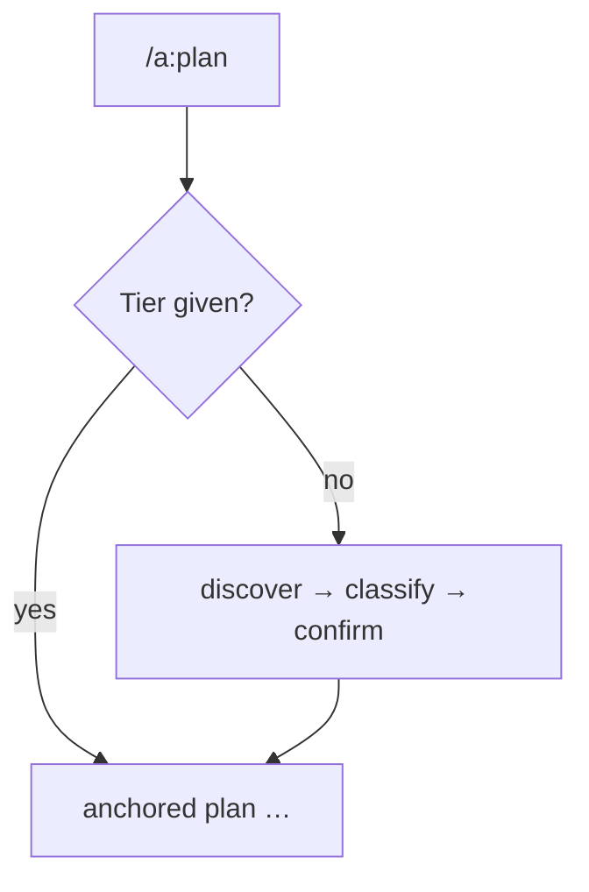

← [skills](_skills.md)

# /a:plan

Structures a unit of work (creates/updates the node). The entry point
into the lifecycle.

## What

- `/a:plan <epic|task|phase>? <prose|path>`.
- **With tier** → directly the `plan` stage of the tier (epic→scaffold, task→decompose).
- **Without tier** → probe `discover`, then **classify** (recommendation epic|task;
  thresholds: <5 phases task / 5–9 independence test / ≥10 epic), user confirms.
- Calls `anchored plan …`; all mutations via the CLI, never direct file editing.

## How

