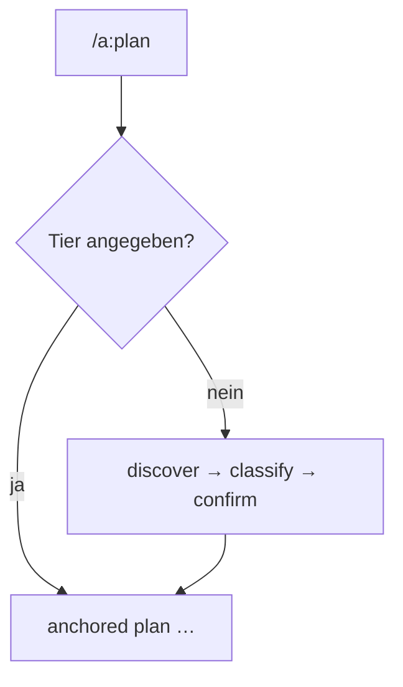

← [skills](_skills.md)

# /a:plan

Strukturiert eine Arbeitseinheit (erzeugt/aktualisiert den Node). Der Entry-Punkt
in den Lifecycle.

## Was

- `/a:plan <epic|task|phase>? <prosa|path>`.
- **Mit Tier** → direkt die `plan`-Stage des Tiers (epic→scaffold, task→decompose).
- **Ohne Tier** → `discover` sondieren, dann **classify** (Empfehlung epic|task;
  Schwellen: <5 Phasen task / 5–9 Unabhängigkeits-Test / ≥10 epic), User bestätigt.
- Ruft `anchored plan …`; alle Mutationen über die CLI, nie direktes File-Edit.

## Wie

