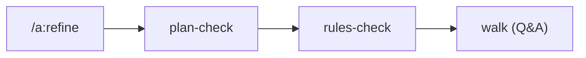

← [skills](_skills.md)

# /a:refine

Refines an existing node against the current state. `/a:refine <slug>` —
the tier is derived from the node.

## What

- Runs the `refine` stage: `plan-check` → `rules-check` → `walk`.
- `walk` resolves open questions priority-aware (`involve: all|high-only|none`).
- Calls `anchored refine <slug>`.

## How

