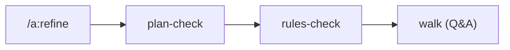

← [skills](_skills.md)

# /a:refine

Verfeinert einen bestehenden Node gegen den aktuellen Stand. `/a:refine <slug>` —
der Tier wird aus dem Node abgeleitet.

## Was

- Fährt die `refine`-Stage: `plan-check` → `rules-check` → `walk`.
- `walk` klärt offene Fragen priority-aware (`involve: all|high-only|none`).
- Ruft `anchored refine <slug>`.

## Wie

