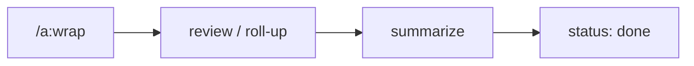

← [skills](_skills.md)

# /a:wrap

Schließt einen Node ab. `/a:wrap <slug>` — Tier aus dem Node.

## Was

- **task/phase**: `review` → `summarize`.
- **epic**: `roll-up` — Definition-of-Done gegen `epic.acceptance` + Retro ins `log`.
- Ruft `anchored wrap <slug>`; Transition auf `done`.

## Wie

