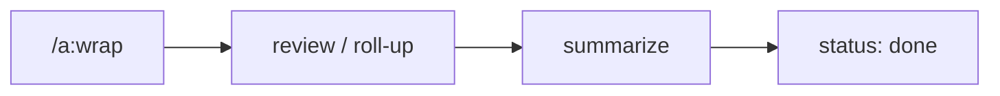

← [skills](_skills.md)

# /a:wrap

Completes a node. `/a:wrap <slug>` — tier from the node.

## What

- **task/phase**: `review` → `summarize`.
- **epic**: `roll-up` — definition of done against `epic.acceptance` + retro into the `log`.
- Calls `anchored wrap <slug>`; transition to `done`.

## How

