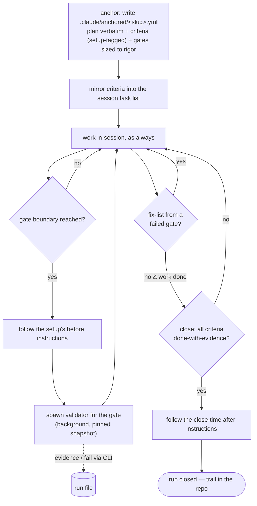

← [docs](_docs.md)

# Run

Run is the one execution skill of anchored v3. It anchors a goal into a run
file, lets the session work exactly the way it always works, spawns one
independent validator per gate (in the background, snapshot-bound), and closes
the run only when every criterion is `done` with evidence. It replaces v2's
entire plan → refine → build → wrap pipeline.



## What you can do

- **Start working in seconds** — one sentence from you becomes a run file:
  goal, testable criteria, gate layout. No planning ceremony, no questions
  walk.
- **Plan exactly the way you always do** — plan mode, a spec, or plain chat;
  anchored never shapes your planning. On acceptance the plan is copied
  **verbatim** into the run file and the criteria are derived from it, so the
  repo keeps a persistent log of what you asked for next to what you got.
- **Never think about granularity** — the AI sizes the gates itself,
  automatically, to satisfy the run's `rigor` (the quality bar). Rigor is set
  from your own words at anchor time: "keep it simple" → `light`, "this
  feature must be clean" → `high`, "release-critical" → `max`.
- **Watch the run in your task list** — the session tasks mirror the criteria
  (`[<slug>/<id>] …`) and a task is checked off only when its criterion is
  `done`-with-evidence: **a checkbox means proven, not claimed.** Pure
  display — the run file stays the SSOT.
- **Proven means executed** — `done` requires evidence grounded in a real
  command. A criterion that nothing can be run against (the copy reads calm, the
  solution follows the pattern) is marked `judgment: true` when it is written,
  before anyone tries to prove it — that declaration is the only licence for a
  prose verdict, and it stands visible in the run file. The validator cannot
  grant it to itself.
- **Course changes stay honest** — when the AI must rethink mid-run it never
  edits the plan; it appends an amendment with the reason, adds new criteria,
  and flips obsolete ones to `superseded`/`rejected` (never deleted).
  Validation and log at once.
- **Work however you want** — the skill never sequences your work. Main
  session, subagents, manual edits — anchored only sees claims and gates.
- **Validate in parallel** — validators run in the background against a pinned
  snapshot while the session keeps working; failures queue up as a fix-list
  instead of blocking.
- **Trust the close** — `anchored close` is refused while any criterion is
  open or failed. Done means proven done, same invariant as v2.
- **See how tightly the run controlled itself** — the chosen rigor and the
  gate slicing derived from it sit in the run file, visible in the diff and
  the trail.
- **Verify anything** — criteria and validators are not code-specific; a docs
  task or an infra change runs through the identical loop.

## How to run it

```
/a:run <setup>? <description>
```

Examples:

```
/a:run frontend fix the navbar overflow on mobile
/a:run quick typo sweep over docs/        ← falls back to the default setup
```

The optional setup argument is only a tagging hint: at anchor time the skill
tags **each criterion** with the setup that knows how to verify it (there is
no run-level setup; untagged criteria use `defaults`). An existing slug
resumes: the loop re-reads the run file from disk and continues at the open
criteria.

In plan mode, anchoring is always on offer at acceptance (an `ExitPlanMode`
hook — no config): say "yes, with anchored" and the accepted plan lands
verbatim in the run file. No plan mode? The plan comes from wherever it lives
— spec, ticket, chat.

## Steps under the hood

1. **Anchor** — write the run file through the CLI: the plan **verbatim**
   (from plan mode, a spec, or the chat), the goal, the criteria derived from
   the plan (each tagged with its setup), and the gate layout the skill sized
   to satisfy the `rigor` it read from the user's words.
2. **Mirror** — create session tasks from the criteria (`[<slug>/<id>]
   <text>`); the link is by name and self-heals across resumes. Skipped
   silently where no task list exists (headless, CI).
3. **Work** — implement in-session. Optionally record `anchored claim <slug>
   "<one-liner>"` at meaningful moments; claims are trail, never gates.
4. **Gate** — when the work behind a gate label is complete: follow the
   gate's setup's `before` instructions (agent-executed, e.g. "run `bun run
   typecheck`, red = failed gate"), then `anchored validate <slug> --gate <g>`
   for the validation packet (criteria, snapshot ref, that setup's validator
   instructions), and spawn **one background validator** with it. Gates are
   setup-homogeneous by construction.
5. **Validator** — independently re-verifies each criterion of the gate
   against the snapshot: executes what is executable (tests, lint, build,
   curl) and attaches the output as evidence (`anchored evidence`), judges
   only what cannot be executed, checks `.claude/rules/`, and fails criteria
   with a reasoned rejection (`anchored fail`). On evidence, the mirrored
   task gets its checkmark.
6. **Fix-list loop** — failed criteria surface in the session as a queue; fix
   and re-`validate`. Nothing blocks mid-run.
7. **Amend on course change** — if the work reveals the plan was wrong, the
   skill calls `anchored amend`: an amendment (reason, timestamp) is appended
   under the immutable plan block, new criteria are added, obsolete ones flip
   to `superseded`/`rejected`. The mirror is updated; the loop continues.
8. **Close** — `anchored close <slug>`: refused unless every **active**
   criterion is done-with-evidence. On green, follow the setups' / defaults'
   `after` instructions (commit + `anchored set … commit=<sha>`, PR, notify —
   whatever the user wired; anchored has no git built-ins) and report the run
   in plain words.

## Configure it

Nothing is configured on the skill itself. Everything lives in
[`anchored.yml`](examples/anchored.yml) — each criterion's setup supplies
`validator.instructions` and the `before`/`after` instruction hooks for its
gates; top-level `fields` (`name: type`) declare custom criterion fields for
all setups; `defaults` covers untagged criteria and the close-time `after`.
`rigor` is **not** config: it lives in the run file, set from the user's
words at anchor time.
