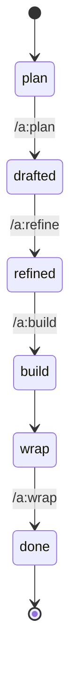

← [docs](../_docs.md)

# stages

anchored drives every node through **one fractal lifecycle** — these are its stages. **Setup** stands apart: it is the pre-lifecycle configuration skill that lands your automation intent into `anchored.yml`. The lifecycle proper is **plan → refine → build → wrap**, carrying a node through the statuses `plan → drafted → refined → build → wrap → done`.

| Stage | Responsibility (scope boundary) |
| --- | --- |
| [setup](setup.md) | The config editor for `anchored.yml` — lands your stated automation intent (steps, gates, stop-conditions, fields, branch/commit/PR or methodology wiring) into the right schema-valid slot, and nothing more. It never runs a lifecycle stage and never edits node-files. |
| [plan](plan.md) | Turns a raw description into a *drafted* node — codebase discovery, rules scan, decomposition into phases + testable acceptance criteria — surfacing every ambiguity as a priority-tagged question instead of a silent decision. It drafts, it never decides. |
| [refine](refine.md) | The engineering-review stage — pressure-tests a drafted plan against the real code and the project's rules, then settles every open question with you (or hands the small ones to the AI) before any code gets built. Transitions the work from *drafted* to talked-through / ready to build. |
| [build](build.md) | Executes the planned work — loops over every child to completion in-session (task → phases, epic → tasks), runs the per-phase implement + the two always-on validation gates, drives the bounded re-do loop, and never lets an acceptance criterion reach *done* without independently-authored evidence. |
| [wrap](wrap.md) | Finalizes a built node — a task gets a final review pass + a written summary; an epic gets rolled up against its definition of done + a retro — then the node transitions *wrap → done*. It does no new work and changes no scope: it certifies and closes what build produced. |
