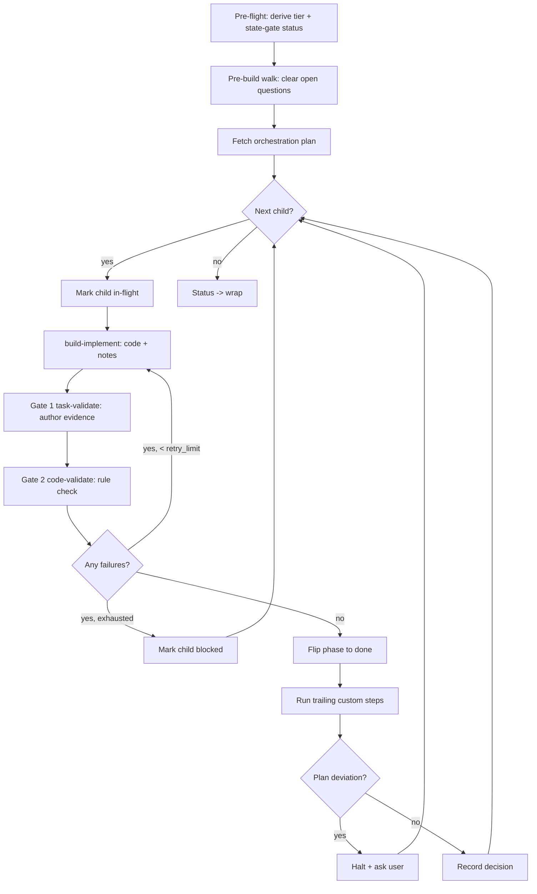

← [stages](_stages.md)

# Build

Build turns a refined plan into proven, working code. It loops over every child of a node in-session (a task's phases, an epic's tasks), runs the implementer plus two always-on gates per phase, auto-retries failures, and — guaranteed by a schema invariant — never marks an acceptance criterion done without independently-authored evidence. When all children are terminal, it hands the node on to **wrap**.



## What you can do

- **Turn a refined plan into working code, hands-off** — the skill walks every phase from start to green by itself.
- **Trust nothing on faith** — a separate checker re-verifies each acceptance criterion against the real code and writes the proof, so "done" always means "proven done".
- **Enforce your rules** — a second checker vetoes code that violates the project's rules, and can bounce a criterion that was already evidenced.
- **Auto-retry failures** — each failure becomes a fix-list fed back to the implementer, retried up to a configurable limit before the phase is marked blocked and the run moves on.
- **Stay in the loop only when it matters** — within-plan decisions are documented automatically onto the record; a genuine plan or architecture deviation halts and asks you.
- **Resume safely after a crash or context compaction** — the loop re-reads state from disk and only re-does unfinished work.
- **Speed up wide work via fan-out** — independent acceptance criteria of a phase (or independent child-tasks of an epic) build in parallel, each in its own isolated git worktree.
- **Wire in custom trailing steps per phase** — commit, push, or a coverage gate that fires only once a phase is green.
- **Clear leftover plan questions up front** — a pre-build walk resolves open questions before the long run begins.

## How to run it

```
/a:build <slug>
```

The slug is optional — omit it to use the node already in context. Run it **after** `/a:plan` and `/a:refine` have brought the node to `refined`.

| Node status | What `/a:build` does |
|---|---|
| `refined` | Flips to `build` and runs |
| `build` | Resumes the loop where it left off |
| `plan` / `drafted` | Stops and tells you to plan + refine first |
| `wrap` / `done` | Already past build |

This is an **explicit-only** trigger — it will not fire on a generic "build the app" request. Under the hood it consults `anchored <tier> build <slug>` for the deterministic, config-driven step plan and spawns each worker itself.

## Steps under the hood

1. **Pre-flight** — derive the tier and state-gate the status (refined flips to build; build resumes; plan/drafted stop; wrap/done are past build).
2. **Pre-build walk** — if open questions remain, clear them at the chosen threshold before the long run; skipped silently when there are none.
3. **Fetch the plan** — `anchored <tier> build <slug>` returns the stage, tier, node and steps, plus the intrinsic recursion edge, the stop-conditions and the retry limit. The CLI never spawns; the skill does.
4. **Loop over children** — while the parent yields a next child, mark it in-flight (a phase goes `in-progress`, a task-stub goes `active`).
5. **Implement** — per leaf phase, spawn `build-implement`: it writes code and a build-note per criterion anchored on the symbol, authors **no** evidence, and flips nothing.
6. **Gate 1 — task-validate** — the evidence author independently re-verifies each criterion against the real code, runs the named gate, then records evidence (criterion to done) on pass or marks it failed (back to pending) on fail.
7. **Gate 2 — code-validate** — the rule inspector checks the code against the phase rules and fails any violation, possibly vetoing a criterion task-validate just evidenced.
8. **Re-do loop** — for every criterion still carrying failures, re-spawn the implementer with those failures as the fix-list, then re-run both gates; retry up to the limit. On exhaustion, mark the child **blocked** and continue.
9. **Advance** — only when every criterion is done-with-evidence and both gates pass does the orchestrator flip the phase to done. This is the one and only place a phase reaches done — never the implementer.
10. **Trailing steps** — run the phase's custom steps (commit/push/coverage) on the now-green phase, with `TASK_SLUG` / `PHASE_SLUG` / `PHASE_NAME` / `EPIC_SLUG` available as env vars. A failed custom-step command stops the loop.
11. **Decision stop-check** — for each implementer-reported decision: if no stop-condition matches, proceed and mint an ai-sourced question for the record; if one matches, halt, escalate to you, walk it, then continue.
12. **Terminate** — when no child remains, set the node status to `wrap` and tell you in plain words that build is done and `/a:wrap` is next.

## Configure it

All of these live under the tier in `anchored.yml` (for example `task.build.*` or `epic.build.*`):

| Knob | Effect |
|---|---|
| `build.retry_limit` (default `3`) | How many fix-list re-do passes a criterion gets before the child is marked blocked. |
| `build.stop` | The stop-conditions that escalate a decision to you. Task default: *a decision deviates from the plan*. Epic default: *an architectural boundary is crossed (a layer, the task dependency order, a contract)*. |
| `phase.build.steps` | The worker pipeline. Shipped default: implement → task-validate → code-validate, fully overridable and replaceable (no built-ins). |
| `execute: sequential \| workflow` on the `implement` step | The project-wide fan-out default for a phase's acceptance criteria. |
| per-phase `execute` field | Overrides the step default so one task fans out while another stays sequential (set at planning via `anchored phase set-execute <task>/<phase> workflow`). |
| custom trailing build steps | Instructions-only or `use:` an agent/skill — e.g. per-phase commit, push, coverage gate. |
| the gate workers | `build-task-validate` and `build-code-validate` are template steps and can be re-instructed or swapped via config. |

**Note:** `build.each` (the recursion edge: task → phase, epic → task) is fixed per tier and is **not** user-configurable.

Two guarantees hold no matter how you configure the above:

- An acceptance criterion only reaches `done` when non-empty evidence is present — a schema rule the store enforces on every write, so it is unskippable.
- Only the independent checker may author that evidence; the implementer writes code and notes only. This separation of duties is what makes "done" trustworthy.

For wide work, fan-out runs each independent unit in its own git worktree and falls back to the sequential path if the worktree tooling is unavailable (it never hard-errors). Any background fan-out requires `Bash(anchored *)` to be pre-approved on the allowlist.
