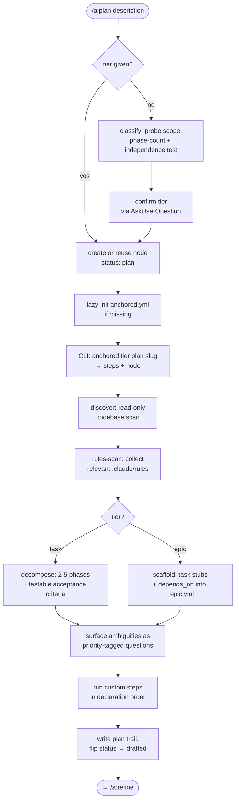

← [stages](_stages.md)

# Plan

The **Plan** stage turns a raw one-line description into a *drafted* node — codebase discovery, a conventions scan, and decomposition into phases with testable acceptance criteria — while surfacing every ambiguity as a priority-tagged question instead of a silent decision. It **drafts, it never decides**: it is the opening stage of the lifecycle, exiting at `status: drafted` for [`/a:refine`](refine.md) to walk.



## What you can do

- Hand anchored a one-line raw description and get back a structured draft — phases, testable acceptance criteria, and a list of open questions, with **no work started yet**.
- Let anchored **pick the tier for you** (epic vs. task) when you don't say — it probes scope and confirms its recommendation before proceeding.
- Plan at the level you choose: `/a:plan epic <goal>` for a multi-task body of work, `/a:plan task <description>` for a single focused change.
- **Re-plan an existing node by slug** to refine the brief without losing its history (log, questions, created date) — re-running plan reuses the same node.
- Start on a **fresh project with no setup**: a missing `anchored.yml` is lazy-created on defaults so planning proceeds immediately, with a one-line offer to tailor it.
- Review every ambiguity the input left open as a **priority-tagged question** — each with a recommendation and 1-3 implication bullets — to walk later in `/a:refine`.
- **Extend the stage with your own steps** (e.g. a web-research step writing into a custom field) that run in declaration order alongside the built-in discovery/decompose.

## How to run it

```
/a:plan <epic|task|phase>? <description>
```

The tier argument is **optional**. Omit it and the skill classifies for you, then confirms before proceeding:

| Phase count | Classification |
|---|---|
| under 5 | task |
| 5-9 | independence test (then epic or task) |
| 10+ | epic |

| When | Command |
|---|---|
| A single focused change | `/a:plan task add OAuth device flow` |
| A multi-task body of work | `/a:plan epic <goal>` |
| Unsure of the size | `/a:plan <description>` (skill classifies + confirms) |
| Re-draft an existing node | `/a:plan <slug>` (reuses the node, keeps its history) |

Plan is an **explicit-only** trigger — it fires only on the typed command, never on planning chatter.

## Steps under the hood

1. **Classify the tier** when omitted — probe scope, apply the phase-count tripwire + independence test, recommend epic/task, confirm via AskUserQuestion.
2. **Create the node** with a short deliberate 2-3-word kebab slug (`status: plan`) — or, when re-planning, reuse the existing slug instead of recreating.
3. **Lazy-init** a minimal `anchored.yml` + the `Bash(anchored *)` allowlist if none exists, and (first time only) offer to tailor it.
4. **Fetch the step-plan** — `anchored <tier> plan <slug>` returns `{ steps, node }` (task: `[discover, rules-scan, decompose]`; epic: `[discover, scaffold]`). The CLI returns the plan; it never spawns.
5. **Discover** — a read-only codebase scan that logs the affected paths and patterns.
6. **Rules-scan** — collect the relevant `.claude/rules/` so phases inherit project conventions.
7. **Decompose** (task) — into 2-5 phases with testable acceptance criteria (`status: pending`, **no pre-filled evidence**), attach applicable rules per phase, and record the build-mode levers (sequential by default, per-phase fan-out, real inter-phase dependencies only).
8. **Scaffold** (epic) — instead write coarse task stubs with goal + `depends_on` edges into `_epic.yml` — never task files (those appear lazily at `task.plan`).
9. **Surface ambiguities** — every open question is priority-tagged and carries a recommendation + implications, never a silent default.
10. **Dispatch custom steps** — any `run`/`use` config steps run in declaration order at their position in the plan.
11. **Finish** — write the plan-trail prose to `context.plan`, flip `status: plan → drafted`, report N phases / M acceptance criteria / K open questions, and point to `/a:refine`.

> **Questions over silent decisions.** Over-surfacing is the safe default; "I'll just pick X" *is* a question (X becomes the recommendation). Priority is tagged by impact, not difficulty — when in doubt, tag higher. Every question is stated in plain language with framework jargon and internal ids stripped out.

> **Substrate guarantee, visible at plan time.** Acceptance criteria are authored *testable* (concrete evidence producible) and start `pending` with no pre-filled evidence — the implement step fills evidence atomically later. The no-evidence-no-done rule is enforced in the substrate.

> **Failure handling.** If a step returns nothing or errors, the stage does **not** flip to `drafted` — it surfaces the failure and lets you re-run. Status flips only once the structure is actually written; a non-zero custom `run` step is a real failure and stops the flow.

> **Designed, not yet shipped: history-aware planning.** The intended behavior is for discovery to also scan the `_archive` and surface prior attempts into the plan trail ("this was already attempted in `<archived-epic>`; the decision was X because Y"). Today discovery scans only the **live codebase** — the archive scan is designed but not yet shipped.

## Configure it

Tune these in `anchored.yml`:

| Knob | Default | What it does |
|---|---|---|
| `task.plan.steps` | `[discover, rules-scan, decompose]` | The task plan pipeline — reorder, drop, or add your own `run`/`use` steps. |
| `epic.plan.steps` | `[discover, scaffold]` | The epic plan pipeline — writes stubs only, no task files. |
| `task.fields` / `epic.fields` | — | Declare custom fields (e.g. a `research` field) that custom plan steps can write into via the CLI. |
| tier classification thresholds | under 5 / 5-9 / 10+ | Live in the template, not hardcoded — adjustable alongside the involve policy on downstream walk steps. |

A custom `kind: 'run'` step receives `TASK_SLUG` and `EPIC_SLUG` as environment variables (the plan run-step variable contract).
