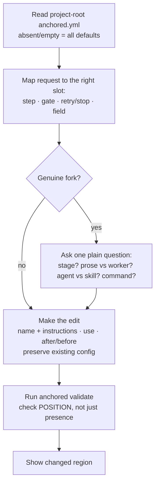

← [stages](_stages.md)

# Setup

`/a:setup` is the consult-and-edit config skill for your `anchored.yml`. It translates a plain automation request — "commit each phase", "run my linter", "open a PR when the task is done", "add a research agent to plan" — into a schema-valid config delta, placing a custom step, gate, stop-condition, retry limit, or field into exactly the right `tier × stage` slot and validating the result. It edits **only** `anchored.yml`; it never runs a lifecycle stage and never touches node-files.



## What you can do

| You want to… | Setup does |
| --- | --- |
| Add a **custom step** to any stage | Writes a prose-only step (`name` + `instructions`, with any shell command living inside the instructions prose) or a delegated worker step (`use: { type: agent\|skill, name }`) under `<tier>.<stage>.steps`. |
| **Steer a built-in step** | Appends an instruction onto a default worker — e.g. a TDD / red-green-refactor note on `implement`. Built-in steps are extend-only: not removable, not reorderable. |
| **Position** a custom step precisely | Anchors it with `after: <step>` / `before: <step>` relative to a built-in — e.g. a commit step after `code-validate`, a lint gate before `task-validate`. |
| Wire in an **agent or skill** | Plugs an isolated subagent (`type: agent`) or an in-session skill (`type: skill`) into any stage — a researcher in plan, a security/dependency audit in refine, a doc step in wrap. |
| Tune the **build loop** | Sets `build.retry_limit` (how many times a failing unit re-runs) and `build.stop` (natural-language halt conditions; halts on the first match). |
| Add **custom data-model fields** | Adds additive `phase`/`task`/`epic` fields in record form `name: type` (`string`/`number`/`boolean`) — e.g. `coverage_pct`, `commit_sha`, `merge_commit`, `ticket_url`. Set/read at runtime via `anchored <tier> set`. |
| Set up **git / PR / methodology automation** | Lands commit-per-phase, HEAD-SHA capture into a field, `--no-ff` task-branch merge, or an audit-trail commit — entirely as step instructions. Git stays yours; the framework only writes the task-file via the CLI the step calls. |
| **Fan out** a step | Marks a single step `execute: workflow` (the only parallelism knob in config). |
| **Onboard from scratch** | When a `/a:*` skill finds no `anchored.yml`, optionally tailor the lazy-init defaults (test/lint command, commit-per-phase) — or keep the essentials and defer. |
| **Reuse steps** | Defines YAML anchors under `_lib` (allowed only on the `anchored.yml` path). |

## How to run it

```
/a:setup
```

Use it **whenever** you want to create, change, extend, or tidy `anchored.yml` in any way — even when you never say "anchored.yml" or "setup". Phrasings that trigger it: *"run my linter after each phase"*, *"open a PR when the task is done"*, *"commit each phase"*, *"add a doc step to wrap"*, *"always TDD"*. It is also the onboarding entry when a lifecycle skill finds no config.

The final validation gate is the CLI meta-verb, run over Bash:

```
anchored validate
```

It parses, merges, and validates the whole file, then reports the resolved per-`tier × stage` step order and the declared custom fields.

> **Note — invocation naming.** Per the design (CLAUDE.md namespace `a`), the invocation is `/a:setup`. Be aware that the currently shipped lifecycle skills are namespaced `/impl-*` (`/impl-plan`, `/impl-refine`, `/impl-build`, `/impl-wrap`) rather than the design-doc aliases `/a:plan` etc. — a known divergence between the design names and the shipped registry.

## Steps under the hood

1. **Read** the project-root `anchored.yml` (absent or empty = use all defaults; the file is deltas only, layered over the merged `anchored.default.yml` base).
2. **Map** the request to the right slot — a custom step under `<tier>.<stage>.steps`, a gate instruction, `build.retry_limit` / `build.stop`, or a custom field under `<tier>.fields`.
3. **Clarify** only genuine forks (which stage? prose-only vs. use-a-worker? agent vs. skill? the exact toolchain command?) — one plain question, never a funnel.
4. **Edit** — write `name` + `instructions` on every custom step, add `use: { type, name }` when it delegates, position with `after:` / `before:`, preserve existing config, touch only what the request implies.
5. **Validate** — run `anchored validate` as the final check and verify the new step/field appears at the **intended position**. A mis-anchored `after:`/`before:` silently appends to the end with `ok: true`, so this checks order, not just presence. Then show the changed region; never leave the file invalid.

## Configure it

| Knob | What it does |
| --- | --- |
| `<tier>.<stage>.steps[]` | Custom step: `{ name, instructions?, use?: { type: agent\|skill, name }, execute?, after?/before? }`. |
| `instructions:` | Prose the main thread follows; a shell command / CLI call lives **here** (there is no `run:` key). Runtime vars: `${TASK_SLUG}`, `${PHASE_SLUG}`, `${PHASE_NAME}` (phase.build only), `${EPIC_SLUG}` — there is no `$SLUG`. |
| `use: { type, name }` | Delegate a step to an isolated subagent (`agent`) or an in-session `skill`. |
| `execute:` | `sequential` (default) or `workflow` for per-step fan-out — the only parallelism knob in config. |
| `involve:` | `all` / `high-only` / `none` — on the `walk` step only. |
| `build.retry_limit` | Integer — re-runs of a failing unit. |
| `build.stop` | List of natural-language halt conditions; halts on first match. |
| `<tier>.fields` | Additive custom fields in **record** form `name: type` (`string`/`number`/`boolean`; otherwise passes through as unknown). E.g. `commit_sha`, `merge_commit`, `coverage_pct`, `ticket_url`. |
| `after: <step>` / `before: <step>` | Position relative to a built-in step. No anchor = append to the end. |
| `_lib` with YAML anchors (`&name` / `*name`) | Reusable steps — `anchored.yml` path only. |

### Good to know

- **Built-in steps are reserved and extend-only.** You cannot remove or reorder them — only append instructions. Reserved per stage: plan (`discover`/`rules-scan`/`decompose`; epic: `discover`/`scaffold`), refine (`plan-check`/`rules-check`/`walk`), build (`implement`/`task-validate`/`code-validate`, or `each:`), wrap (`review`/`summarize`; epic: `roll-up`).
- **Never name a custom worker `plan` or `explore`** — those are Claude Code internal agent types.
- **The hard invariant is not switchable.** An `ac` reaches `status: done` only when `evidence` is present — this lives in the schema, not a step. Setup can configure *how* evidence is produced, never disable the rule.
- **Git is entirely yours.** The framework never runs git and never auto-fills SHA fields. Commit / branch / PR / merge logic and any `anchored task set <field> "$(git rev-parse HEAD)"` write-back live in the step's instructions prose. Two-anchor pattern: `commit_sha` is the interim per-phase anchor (can be pruned by a `--no-ff` wrap merge), `merge_commit` is the durable surviving merge commit.
- **branch-per-task gotcha.** Epic-child slugs are nested (`myepic/core-list`); a raw `task/<slug>` branch collides (git ref dir/file). Flatten slashes to `-` in the branch name — spell this out in instructions.
- **Fields use record form** (`commit_sha: string`), not list form — list form is rejected. Fields are additive (defaults are not repeated), but undeclared keys are still rejected on write.
- **Build-loop parallelism is not a config flag.** Running children in parallel is plugin orchestration via `depends_on`; config only declares per-step `execute: workflow`.
- **Setup is consult, not sell.** It implements only what you ask, suggests at most a one-liner you can decline, and never edits anything outside the project-root `anchored.yml` (or, only on explicit request, related `.claude/` files).
