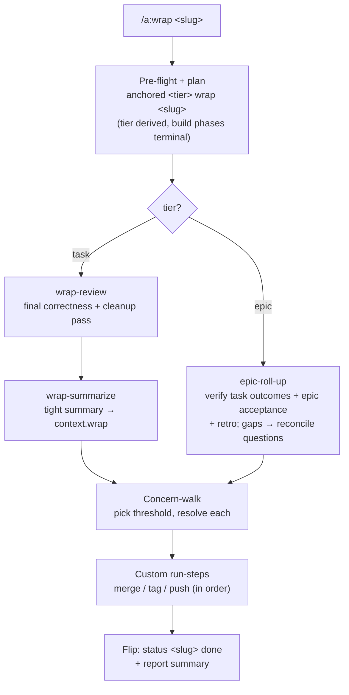

← [stages](_stages.md)

# Wrap

Wrap certifies and closes a built node: a **task** gets a final review pass plus a written summary; an **epic** gets rolled up against its definition of done plus a retro. Then the node transitions `wrap → done`. Wrap does **not** do new work or change scope — it closes out what build produced, and only once every open concern and contract gap is cleared.

## What you can do

- **Close out a finished task with one command.** anchored re-reviews the whole built node, writes a tight summary of what shipped and why, and flips it to `done`.
- **Close out a whole epic.** anchored checks that every child task actually delivered the outcome it promised (the epic→task contract) plus the epic's own definition of done, writes a retro, then flips the epic to `done`.
- **Get a final correctness + cleanup review pass** (`wrap-review`) over everything that was built, with findings recorded in the node's learning log.
- **Have a say in the loose-end concerns raised during build.** A concern-walk lets you pick a threshold — *just important* / *important + medium* / *all* / *none* — and resolve each one before close.
- **See a real blocker instead of a false "done".** Open concerns, gaps in the epic contract, or a failing trailing step (e.g. a merge conflict) keep the node pre-`done` — nothing slips through.
- **Run custom closing steps you configured** (merge the task branch to develop, tag, push, open a PR) at their declared position in the wrap pipeline.

## How to run it

| | |
|---|---|
| **Command** | `/a:wrap <slug>` (fallback `/anc:wrap <slug>`) |
| **Trigger** | Explicit-only — it runs **only** on the typed command, never on a general "wrap up" request. |
| **When** | Once a node's build phases are all terminal (`build → wrap` reached). |
| **Tier** | Derived from the slug — task vs. epic, no separate command. |

Under the hood the skill drives the `anchored <tier> wrap <slug>` CLI plan over Bash (no MCP).

## Steps under the hood

1. **Pre-flight + plan** — call `anchored <tier> wrap <slug>`, which returns the stage, tier, node, and steps. The tier is derived and the call is state-gated on the build phases being terminal.
2. **Resolve the pipeline** — task → `[review, summarize]`; epic → `[roll-up]`, plus any custom `run`/`use` steps the config adds.
3. **Task path — review** — spawn the `wrap-review` agent for a final correctness/cleanup pass; it self-writes findings into the node's learning log.
4. **Task path — summarize** — spawn the `wrap-summarize` agent, which writes a tight summary into `context.wrap`, preserving the plan/refine/build siblings.
5. **Epic path — roll-up** — spawn the `epic-roll-up` agent: verify each task-stub's outcome criteria were delivered, validate each epic acceptance criterion, write the verdict to `context.wrap` plus a retro to the log. Gaps surface as reconcile questions — never silent passes.
6. **Concern-walk** — list open concerns, pick a threshold, and resolve each (at-or-above the threshold → you decide, below → AI) with reasoning.
7. **Custom run-steps** — run any trailing `run`/`use` steps (merge/tag/push) in declaration order per their instructions. A failing gating step keeps the node pre-`done`.
8. **Flip** — `anchored <tier> status <slug> done`, the same `wrap → done` transition on every tier, then report the summary to you.

### What the substrate enforces

These guarantees live in the data model, not in the skill — they cannot be skipped:

- **No `done` while any concern is open** — the concern-walk must clear first.
- **No acceptance criterion to `done` without evidence** — epic roll-up must supply a provenance pointer (`<task>/<phase> <ac> — delivered`); it can't stamp delivery on a hunch.
- **Epic roll-up is hard** — a stub outcome not covered by the built task does not silently pass; it surfaces as a high-priority reconcile question (re-open / revise / accept) and blocks the epic until resolved.
- **Tier symmetry** — `wrap → done` is the identical transition on every tier; no epic-special casing in the flip.

> The designed *archive-on-done* step (moving a `done` node into `.claude/anchored/_archive/`) is specified but **not yet wired** into the shipped wrap skill — the skill currently ends at the `done` flip.

## Configure it

All wrap behavior is policy you can tune in `anchored.yml`:

| Knob | What it does |
|---|---|
| `task.wrap.steps` | The task wrap pipeline. Default `[review (wrap-review agent), summarize (wrap-summarize agent)]` — fully overridable/replaceable. |
| `epic.wrap.steps` | The epic wrap pipeline. Default `[roll-up (epic-roll-up agent)]` — the definition-of-done + retro step. |
| Custom `run`/`use` steps in `*.wrap.steps` | Add closing steps, e.g. a task-tier `merge`/`tag`/`push`. A `run:` step executes via Bash; a `use:` step spawns a named agent/skill. Each may carry `instructions:` prose (ordering, error handling, run-after-done). |
| `task.fields.context.wrap` / `epic.fields.context.wrap` | The markdown field the summary/verdict is written into. |
| `phase.fields.context.wrap` | The per-phase wrap context field in the data model. |

**Run-step variable contract:** `${TASK_SLUG}` and `${EPIC_SLUG}` are exported as real environment variables for your custom run steps.
