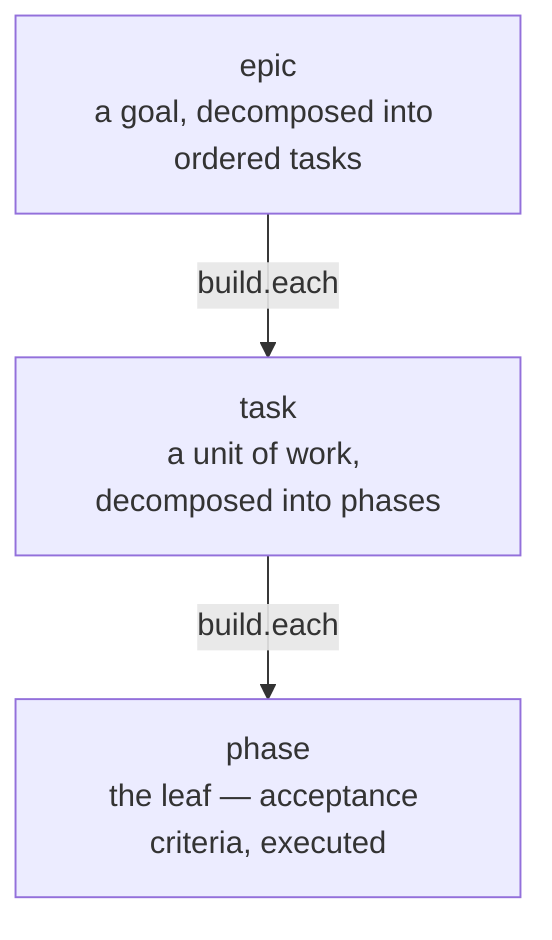

← [docs](_docs.md)

# anchored — tiers

anchored nests work in three tiers — **epic ▸ task ▸ phase** — and runs the *same* four-stage lifecycle (**plan → refine → build → wrap**) on each. That is the fractal: one form, three scales. These pages explain what each tier is *for* and what it can do; for the commands themselves see [api](../api.md), where the one grammar (`anchored <tier> <verb> [slug]`) covers every tier uniformly.

## The tiers

| Tier | What it is | Decomposes into |
| --- | --- | --- |
| [epic](epic.md) | A larger goal that spans several tasks, run as a rolling wave with a dependency order and a roll-up at the end. | tasks (`build.each: task`) |
| [task](task.md) | A single unit of work that runs the full lifecycle on its own and breaks down into a handful of phases. | phases (`build.each: phase`) |
| [phase](phase.md) | The leaf — a set of evidence-gated acceptance criteria that get implemented and verified directly. | nothing (leaf) |

Nesting lives entirely in the **slug**: a phase is addressed as `my-epic/login/setup`, a task as `my-epic/login`, an epic as `my-epic`. The recursion edge `build.each` (epic→task, task→phase) is intrinsic and **not** user-configurable.
