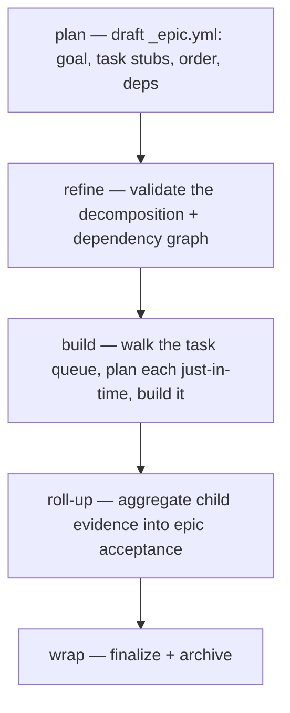

← [tiers](_tier.md)

# Epic

An epic is the **top tier** — a larger goal that doesn't fit in one task. It groups several tasks under one outcome, holds them in a dependency order, and runs them as a *rolling wave*: tasks are planned just-in-time rather than all up front, and when the last one is green their evidence rolls up into the epic's own acceptance criteria. An epic decomposes into tasks (`build.each: task`); it is the only tier with no parent.



## What an epic can do

- **Group related tasks under one goal** — the epic is the unit you reach for when the work needs several coordinated tasks rather than a single one.
- **Order the work by dependency** — child task stubs carry a goal and dependencies; the epic serves the next *ready* task from the queue (`epic child next`/`ready`), so the build loop respects the dependency graph rather than a fixed numbering.
- **Plan as a rolling wave** — `epic plan` writes *only* the `_epic.yml` (the living source of truth): the goal, the task stubs, their order and dependencies. It does **not** write the task-files. Each task-file is created just-in-time when `task plan` runs for it during build, so later tasks benefit from what earlier tasks revealed, and the `_epic.yml` is re-synced between tasks.
- **Build its children hands-off** — `epic build` is the recursion edge `build.each: task`: it walks the ready queue, plans/refines/builds each child task in turn (the orchestrating skill calls `anchored task build <child>`), and only advances when a child reaches a terminal state.
- **Roll up the result** — when every child task is terminal, the epic reads its children's evidence and aggregates it into the epic's own acceptance criteria, so the epic's "done" is grounded in its tasks' proven work, not asserted on top of it.
- **Enforce its own stage steps** — like a task, an epic receipts every executed stage step (`epic step done|skip`), and each stage-closing transition is blocked until the served steps are receipted (plan: discover/scaffold; wrap: roll-up).
- **Hold epic-level acceptance, questions, and concerns** — collections `acceptance · question · concern` capture outcomes and open issues that belong to the whole goal rather than to a single task.

## Collections

`child` · `acceptance` · `question` · `concern` — see [api](../api.md) for the exact `anchored epic <collection> <op>` commands. The epic owns its children's *existence and order* (`child add/next/ready`); each child task owns its own content and lifecycle.

## How you reach it

```
/a:plan epic "auth system"
/a:refine my-epic
/a:build my-epic
/a:wrap my-epic
```

The tier is an argument of `plan` — there is no separate `epic` command. See [stages](../stages/_stages.md) for what each stage does, and [task](task.md) for the tier one level down.
