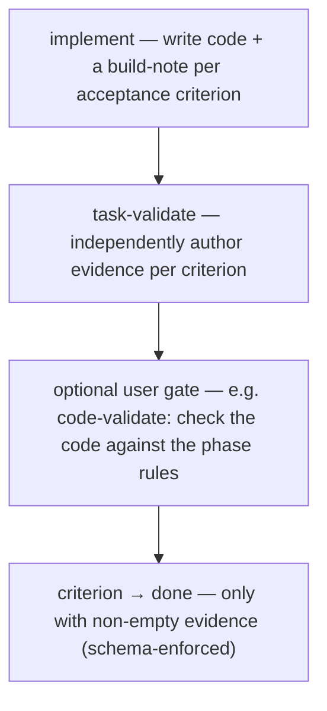

← [tiers](_tier.md)

# Phase

A phase is the **leaf** — the smallest tier, where code actually gets written and proven. It is `build` without `each`: there is no tier beneath it to recurse into. A phase has no lifecycle of its own — it isn't planned, refined, or wrapped on its own; it is authored as part of its [task](task.md)'s plan and executed directly when that task's build loop reaches it. What a phase carries is a set of **acceptance criteria** (each gated by the evidence invariant) and the **rules** that apply to it.



## What a phase can do

- **Hold evidence-gated acceptance criteria** — the phase is where criteria live, and a criterion only reaches `status: done` when non-empty evidence is present. This is the one hard invariant of anchored, enforced in the schema on *every* write — so it is unskippable, and "done" always means "proven done".
- **Get executed as the leaf** — `phase build <slug>` is the innermost execution the task's build loop drives: implement the code, have an independent checker author the evidence, then verify against the phase rules. The implementer writes code and notes only; only the checker may author evidence — that separation is what makes the evidence trustworthy.
- **Carry the rules that apply to it** — collection `rule` holds the per-phase rules distributed during planning; the implementer follows them, and an optional user-wired rule gate (e.g. the shipped `build-code-validate` agent) checks the implementation against them and can bounce a criterion that was otherwise evidenced.
- **Receipt every pipeline step** — collection `step` (`step done` / `step skip` with a reason) records that each served build step actually ran; `phase status done` is blocked until every step of the leaf pipeline carries a receipt. Step enforcement is the second substrate gate next to the evidence invariant.
- **Choose its execution mode** — a phase's `execute` field (`sequential | workflow`) decides whether its independent acceptance criteria build one at a time or fan out in parallel, each in its own isolated git worktree.
- **Be read and nudged directly** — `get · set · status` work on a phase like any node; its slug carries the full nesting, e.g. `my-epic/login/setup`.

## Collections

`ac` · `rule` — see [api](../api.md) for the exact `anchored phase <collection> <op>` commands (`ac add/done/evidence/fail`, `rule …`). The `ac → done` write is the one gated by the evidence invariant.

## How you reach it

A phase is not planned on its own — it comes into being when its task is planned, and it is built when the task's build loop reaches it. You address it directly only for inspection or a targeted fix:

```
anchored phase get      my-epic/login/setup
anchored phase ac add    my-epic/login/setup "…"
anchored phase build     my-epic/login/setup
```

See [task](task.md) for the tier above (which owns the phase's existence and order) and [stages](../stages/_stages.md) → build for how the leaf is executed.
