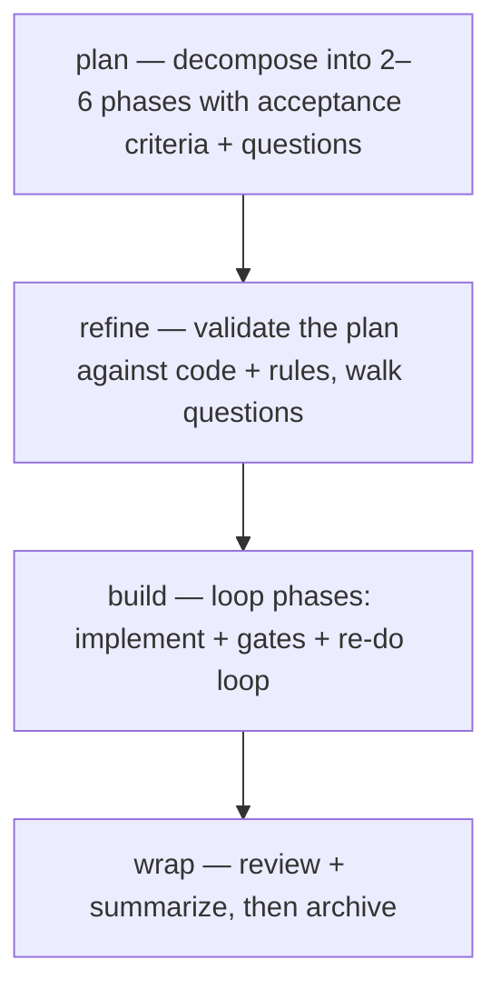

← [tiers](_tier.md)

# Task

A task is the **middle tier** — one unit of work that runs the full lifecycle on its own. It is the tier you use most: a self-contained piece of work that gets planned into a handful of phases, each with testable acceptance criteria, and then built phase by phase. A task decomposes into phases (`build.each: phase`). It can stand alone, or be a child of an [epic](epic.md).



## What a task can do

- **Run the full four-stage lifecycle standalone** — `plan → refine → build → wrap` all apply to a task directly; you don't need an epic around it to do real work.
- **Decompose into phases** — `task plan` breaks the work into a small number of phases (typically 2–6), each carrying its own acceptance criteria and the rules that apply to it. The task owns its phases' *existence and order* (`task phase add/list/move`).
- **Build phase by phase, hands-off** — `task build` is the recursion edge `build.each: phase`: it walks each phase from start to green, running the implementer plus the always-on evidence gate (task-validate; further gates are user-wired), with a failures-driven re-do loop bounded by `retry_limit`. The plan also serves the leaf pipeline as `each_steps`, so the orchestrator reads the steps from the CLI, never from memory.
- **Enforce that every stage step actually ran** — each executed template step gets a receipt (`task step done|skip`), and the transition that closes a stage (`drafted`, `refined`, `wrap`, `done`) is blocked until every served step carries one. A skip is documented with a reason, never silent.
- **Surface ambiguity instead of guessing** — open questions raised during planning are walked with you at refine; build-time decisions are either documented automatically or escalated, never decided silently.
- **Fan out wide work** — a task can run its phases' acceptance criteria in parallel (workflow mode) when they are independent, each unit in its own isolated git worktree, falling back to sequential when the tooling is unavailable.
- **Hold its own questions and concerns** — collections `question · concern` track open issues scoped to the task.

## Collections

`phase` · `question` · `concern` — see [api](../api.md) for the exact `anchored task <collection> <op>` commands. The task owns the existence and order of its phases; each phase owns its own acceptance criteria and rules.

## How you reach it

```
/a:plan task "add password reset"
/a:refine my-task
/a:build my-task
/a:wrap my-task
```

`task` is the default tier when you omit it from `/a:plan`. See [stages](../stages/_stages.md) for what each stage does, [epic](epic.md) for the tier above, and [phase](phase.md) for the leaf below.
