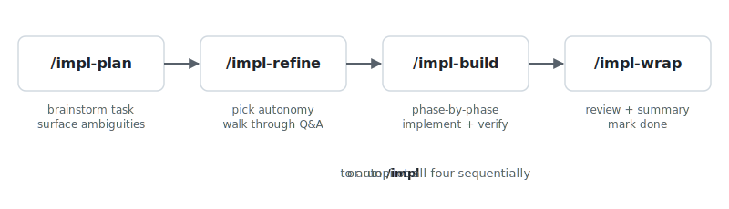

# anchored

> Long autonomous AI coding runs you can actually trust.
> Every claim has proof. Every decision is on the record. Every step is configurable.

## What it does

anchored is a configurable orchestration framework for AI coding runs. Ship complete epics autonomously with engineering discipline built in.

AI writes. anchored verifies. The classic implement, verify, proof cycle, baked into every phase of the run. With a self-documenting pipeline that captures plans, decisions, and outcomes in on document.

Minimise hallucinations on long runs, maximise output quality and speed.

setup. run. ship.

## How it works



## Quick start

In Claude Code, install and activate:

```
/plugin install anchored
/reload-plugins
```

Then, inside any project's Claude Code session:

```
/impl <describe a complex feature>
```

That runs the full plan → refine → build → wrap lifecycle for you.

Prefer step-by-step control? Run each command individually:

```
/impl-plan <description>   # brainstorm + surface ambiguities
/impl-refine               # autonomy + Q&A walk
/impl-build                # implement + verify per phase
/impl-wrap                 # review + summary
```

You can stop at any stage and pick up later — the task-file holds the
state, so re-running any command resumes where you left off.

## Configuration

Customize via `anchored.yml` at your project root. The file ships empty
(defaults documented inline); uncomment + edit only the slots you want.

Each stage (plan / refine / build / wrap) ships with default agents
but is fully extensible with custom steps or agents (per-phase commits,
lint/test runs, PR creation, Slack notify, deploy triggers, custom
validators).

See [`references/default-config.yml`](./references/default-config.yml)
for the full slot list with inline docs.

## License

MIT — see [LICENSE](./LICENSE).
